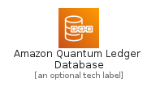
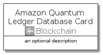
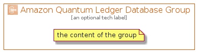

# AmazonQuantumLedgerDatabase


```text
aws-20210730/Architecture/Blockchain/AmazonQuantumLedgerDatabase
```

```text
include('aws-20210730/Architecture/Blockchain/AmazonQuantumLedgerDatabase')
```


| Illustration | AmazonQuantumLedgerDatabase | AmazonQuantumLedgerDatabaseCard | AmazonQuantumLedgerDatabaseGroup |
| :---: | :---: | :---: | :---: |
|  |  |  |  |


## AmazonQuantumLedgerDatabase

### Load remotely
```plantuml
@startuml
' configures the library
!global $LIB_BASE_LOCATION="https://github.com/tmorin/plantuml-libs/distribution"

' loads the library's bootstrap
!include $LIB_BASE_LOCATION/bootstrap.puml

' loads the package bootstrap
include('aws-20210730/bootstrap')

' loads the Item which embeds the element AmazonQuantumLedgerDatabase
include('aws-20210730/Architecture/Blockchain/AmazonQuantumLedgerDatabase')

' renders the element
AmazonQuantumLedgerDatabase('AmazonQuantumLedgerDatabase', 'Amazon Quantum Ledger Database', 'an optional tech label')
@enduml
```

### Load locally
```plantuml
@startuml
' configures the library
!global $INCLUSION_MODE="local"
!global $LIB_BASE_LOCATION="../../.."

' loads the library's bootstrap
!include $LIB_BASE_LOCATION/bootstrap.puml

' loads the package bootstrap
include('aws-20210730/bootstrap')

' loads the Item which embeds the element AmazonQuantumLedgerDatabase
include('aws-20210730/Architecture/Blockchain/AmazonQuantumLedgerDatabase')

' renders the element
AmazonQuantumLedgerDatabase('AmazonQuantumLedgerDatabase', 'Amazon Quantum Ledger Database', 'an optional tech label')
@enduml
```

## AmazonQuantumLedgerDatabaseCard

### Load remotely
```plantuml
@startuml
' configures the library
!global $LIB_BASE_LOCATION="https://github.com/tmorin/plantuml-libs/distribution"

' loads the library's bootstrap
!include $LIB_BASE_LOCATION/bootstrap.puml

' loads the package bootstrap
include('aws-20210730/bootstrap')

' loads the Item which embeds the element AmazonQuantumLedgerDatabaseCard
include('aws-20210730/Architecture/Blockchain/AmazonQuantumLedgerDatabase')

' renders the element
AmazonQuantumLedgerDatabaseCard('AmazonQuantumLedgerDatabaseCard', 'Amazon Quantum Ledger Database Card', 'an optional description')
@enduml
```

### Load locally
```plantuml
@startuml
' configures the library
!global $INCLUSION_MODE="local"
!global $LIB_BASE_LOCATION="../../.."

' loads the library's bootstrap
!include $LIB_BASE_LOCATION/bootstrap.puml

' loads the package bootstrap
include('aws-20210730/bootstrap')

' loads the Item which embeds the element AmazonQuantumLedgerDatabaseCard
include('aws-20210730/Architecture/Blockchain/AmazonQuantumLedgerDatabase')

' renders the element
AmazonQuantumLedgerDatabaseCard('AmazonQuantumLedgerDatabaseCard', 'Amazon Quantum Ledger Database Card', 'an optional description')
@enduml
```

## AmazonQuantumLedgerDatabaseGroup

### Load remotely
```plantuml
@startuml
' configures the library
!global $LIB_BASE_LOCATION="https://github.com/tmorin/plantuml-libs/distribution"

' loads the library's bootstrap
!include $LIB_BASE_LOCATION/bootstrap.puml

' loads the package bootstrap
include('aws-20210730/bootstrap')

' loads the Item which embeds the element AmazonQuantumLedgerDatabaseGroup
include('aws-20210730/Architecture/Blockchain/AmazonQuantumLedgerDatabase')

' renders the element
AmazonQuantumLedgerDatabaseGroup('AmazonQuantumLedgerDatabaseGroup', 'Amazon Quantum Ledger Database Group', 'an optional tech label') {
    note as note
        the content of the group
    end note
}
@enduml
```

### Load locally
```plantuml
@startuml
' configures the library
!global $INCLUSION_MODE="local"
!global $LIB_BASE_LOCATION="../../.."

' loads the library's bootstrap
!include $LIB_BASE_LOCATION/bootstrap.puml

' loads the package bootstrap
include('aws-20210730/bootstrap')

' loads the Item which embeds the element AmazonQuantumLedgerDatabaseGroup
include('aws-20210730/Architecture/Blockchain/AmazonQuantumLedgerDatabase')

' renders the element
AmazonQuantumLedgerDatabaseGroup('AmazonQuantumLedgerDatabaseGroup', 'Amazon Quantum Ledger Database Group', 'an optional tech label') {
    note as note
        the content of the group
    end note
}
@enduml
```

