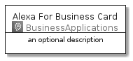
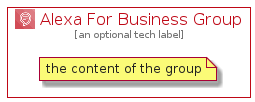

# AlexaForBusiness


```text
aws-20210730/Architecture/BusinessApplications/AlexaForBusiness
```

```text
include('aws-20210730/Architecture/BusinessApplications/AlexaForBusiness')
```


| Illustration | AlexaForBusiness | AlexaForBusinessCard | AlexaForBusinessGroup |
| :---: | :---: | :---: | :---: |
|  |  |  |  |


## AlexaForBusiness

### Load remotely
```plantuml
@startuml
' configures the library
!global $LIB_BASE_LOCATION="https://github.com/tmorin/plantuml-libs/distribution"

' loads the library's bootstrap
!include $LIB_BASE_LOCATION/bootstrap.puml

' loads the package bootstrap
include('aws-20210730/bootstrap')

' loads the Item which embeds the element AlexaForBusiness
include('aws-20210730/Architecture/BusinessApplications/AlexaForBusiness')

' renders the element
AlexaForBusiness('AlexaForBusiness', 'Alexa For Business', 'an optional tech label')
@enduml
```

### Load locally
```plantuml
@startuml
' configures the library
!global $INCLUSION_MODE="local"
!global $LIB_BASE_LOCATION="../../.."

' loads the library's bootstrap
!include $LIB_BASE_LOCATION/bootstrap.puml

' loads the package bootstrap
include('aws-20210730/bootstrap')

' loads the Item which embeds the element AlexaForBusiness
include('aws-20210730/Architecture/BusinessApplications/AlexaForBusiness')

' renders the element
AlexaForBusiness('AlexaForBusiness', 'Alexa For Business', 'an optional tech label')
@enduml
```

## AlexaForBusinessCard

### Load remotely
```plantuml
@startuml
' configures the library
!global $LIB_BASE_LOCATION="https://github.com/tmorin/plantuml-libs/distribution"

' loads the library's bootstrap
!include $LIB_BASE_LOCATION/bootstrap.puml

' loads the package bootstrap
include('aws-20210730/bootstrap')

' loads the Item which embeds the element AlexaForBusinessCard
include('aws-20210730/Architecture/BusinessApplications/AlexaForBusiness')

' renders the element
AlexaForBusinessCard('AlexaForBusinessCard', 'Alexa For Business Card', 'an optional description')
@enduml
```

### Load locally
```plantuml
@startuml
' configures the library
!global $INCLUSION_MODE="local"
!global $LIB_BASE_LOCATION="../../.."

' loads the library's bootstrap
!include $LIB_BASE_LOCATION/bootstrap.puml

' loads the package bootstrap
include('aws-20210730/bootstrap')

' loads the Item which embeds the element AlexaForBusinessCard
include('aws-20210730/Architecture/BusinessApplications/AlexaForBusiness')

' renders the element
AlexaForBusinessCard('AlexaForBusinessCard', 'Alexa For Business Card', 'an optional description')
@enduml
```

## AlexaForBusinessGroup

### Load remotely
```plantuml
@startuml
' configures the library
!global $LIB_BASE_LOCATION="https://github.com/tmorin/plantuml-libs/distribution"

' loads the library's bootstrap
!include $LIB_BASE_LOCATION/bootstrap.puml

' loads the package bootstrap
include('aws-20210730/bootstrap')

' loads the Item which embeds the element AlexaForBusinessGroup
include('aws-20210730/Architecture/BusinessApplications/AlexaForBusiness')

' renders the element
AlexaForBusinessGroup('AlexaForBusinessGroup', 'Alexa For Business Group', 'an optional tech label') {
    note as note
        the content of the group
    end note
}
@enduml
```

### Load locally
```plantuml
@startuml
' configures the library
!global $INCLUSION_MODE="local"
!global $LIB_BASE_LOCATION="../../.."

' loads the library's bootstrap
!include $LIB_BASE_LOCATION/bootstrap.puml

' loads the package bootstrap
include('aws-20210730/bootstrap')

' loads the Item which embeds the element AlexaForBusinessGroup
include('aws-20210730/Architecture/BusinessApplications/AlexaForBusiness')

' renders the element
AlexaForBusinessGroup('AlexaForBusinessGroup', 'Alexa For Business Group', 'an optional tech label') {
    note as note
        the content of the group
    end note
}
@enduml
```

