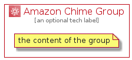

# AmazonChime


```text
aws-20210730/Architecture/BusinessApplications/AmazonChime
```

```text
include('aws-20210730/Architecture/BusinessApplications/AmazonChime')
```


| Illustration | AmazonChime | AmazonChimeCard | AmazonChimeGroup |
| :---: | :---: | :---: | :---: |
|  |  |  |  |


## AmazonChime

### Load remotely
```plantuml
@startuml
' configures the library
!global $LIB_BASE_LOCATION="https://raw.githubusercontent.com/tmorin/plantuml-libs/master/distribution"

' loads the library's bootstrap
!include $LIB_BASE_LOCATION/bootstrap.puml

' loads the package bootstrap
include('aws-20210730/bootstrap')

' loads the Item which embeds the element AmazonChime
include('aws-20210730/Architecture/BusinessApplications/AmazonChime')

' renders the element
AmazonChime('AmazonChime', 'Amazon Chime', 'an optional tech label')
@enduml
```

### Load locally
```plantuml
@startuml
' configures the library
!global $INCLUSION_MODE="local"
!global $LIB_BASE_LOCATION="../../.."

' loads the library's bootstrap
!include $LIB_BASE_LOCATION/bootstrap.puml

' loads the package bootstrap
include('aws-20210730/bootstrap')

' loads the Item which embeds the element AmazonChime
include('aws-20210730/Architecture/BusinessApplications/AmazonChime')

' renders the element
AmazonChime('AmazonChime', 'Amazon Chime', 'an optional tech label')
@enduml
```

## AmazonChimeCard

### Load remotely
```plantuml
@startuml
' configures the library
!global $LIB_BASE_LOCATION="https://raw.githubusercontent.com/tmorin/plantuml-libs/master/distribution"

' loads the library's bootstrap
!include $LIB_BASE_LOCATION/bootstrap.puml

' loads the package bootstrap
include('aws-20210730/bootstrap')

' loads the Item which embeds the element AmazonChimeCard
include('aws-20210730/Architecture/BusinessApplications/AmazonChime')

' renders the element
AmazonChimeCard('AmazonChimeCard', 'Amazon Chime Card', 'an optional description')
@enduml
```

### Load locally
```plantuml
@startuml
' configures the library
!global $INCLUSION_MODE="local"
!global $LIB_BASE_LOCATION="../../.."

' loads the library's bootstrap
!include $LIB_BASE_LOCATION/bootstrap.puml

' loads the package bootstrap
include('aws-20210730/bootstrap')

' loads the Item which embeds the element AmazonChimeCard
include('aws-20210730/Architecture/BusinessApplications/AmazonChime')

' renders the element
AmazonChimeCard('AmazonChimeCard', 'Amazon Chime Card', 'an optional description')
@enduml
```

## AmazonChimeGroup

### Load remotely
```plantuml
@startuml
' configures the library
!global $LIB_BASE_LOCATION="https://raw.githubusercontent.com/tmorin/plantuml-libs/master/distribution"

' loads the library's bootstrap
!include $LIB_BASE_LOCATION/bootstrap.puml

' loads the package bootstrap
include('aws-20210730/bootstrap')

' loads the Item which embeds the element AmazonChimeGroup
include('aws-20210730/Architecture/BusinessApplications/AmazonChime')

' renders the element
AmazonChimeGroup('AmazonChimeGroup', 'Amazon Chime Group', 'an optional tech label') {
    note as note
        the content of the group
    end note
}
@enduml
```

### Load locally
```plantuml
@startuml
' configures the library
!global $INCLUSION_MODE="local"
!global $LIB_BASE_LOCATION="../../.."

' loads the library's bootstrap
!include $LIB_BASE_LOCATION/bootstrap.puml

' loads the package bootstrap
include('aws-20210730/bootstrap')

' loads the Item which embeds the element AmazonChimeGroup
include('aws-20210730/Architecture/BusinessApplications/AmazonChime')

' renders the element
AmazonChimeGroup('AmazonChimeGroup', 'Amazon Chime Group', 'an optional tech label') {
    note as note
        the content of the group
    end note
}
@enduml
```

