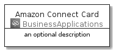
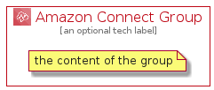

# AmazonConnect


```text
aws-20210730/Architecture/BusinessApplications/AmazonConnect
```

```text
include('aws-20210730/Architecture/BusinessApplications/AmazonConnect')
```


| Illustration | AmazonConnect | AmazonConnectCard | AmazonConnectGroup |
| :---: | :---: | :---: | :---: |
|  |  |  |  |


## AmazonConnect

### Load remotely
```plantuml
@startuml
' configures the library
!global $LIB_BASE_LOCATION="https://raw.githubusercontent.com/tmorin/plantuml-libs/master/distribution"

' loads the library's bootstrap
!include $LIB_BASE_LOCATION/bootstrap.puml

' loads the package bootstrap
include('aws-20210730/bootstrap')

' loads the Item which embeds the element AmazonConnect
include('aws-20210730/Architecture/BusinessApplications/AmazonConnect')

' renders the element
AmazonConnect('AmazonConnect', 'Amazon Connect', 'an optional tech label')
@enduml
```

### Load locally
```plantuml
@startuml
' configures the library
!global $INCLUSION_MODE="local"
!global $LIB_BASE_LOCATION="../../.."

' loads the library's bootstrap
!include $LIB_BASE_LOCATION/bootstrap.puml

' loads the package bootstrap
include('aws-20210730/bootstrap')

' loads the Item which embeds the element AmazonConnect
include('aws-20210730/Architecture/BusinessApplications/AmazonConnect')

' renders the element
AmazonConnect('AmazonConnect', 'Amazon Connect', 'an optional tech label')
@enduml
```

## AmazonConnectCard

### Load remotely
```plantuml
@startuml
' configures the library
!global $LIB_BASE_LOCATION="https://raw.githubusercontent.com/tmorin/plantuml-libs/master/distribution"

' loads the library's bootstrap
!include $LIB_BASE_LOCATION/bootstrap.puml

' loads the package bootstrap
include('aws-20210730/bootstrap')

' loads the Item which embeds the element AmazonConnectCard
include('aws-20210730/Architecture/BusinessApplications/AmazonConnect')

' renders the element
AmazonConnectCard('AmazonConnectCard', 'Amazon Connect Card', 'an optional description')
@enduml
```

### Load locally
```plantuml
@startuml
' configures the library
!global $INCLUSION_MODE="local"
!global $LIB_BASE_LOCATION="../../.."

' loads the library's bootstrap
!include $LIB_BASE_LOCATION/bootstrap.puml

' loads the package bootstrap
include('aws-20210730/bootstrap')

' loads the Item which embeds the element AmazonConnectCard
include('aws-20210730/Architecture/BusinessApplications/AmazonConnect')

' renders the element
AmazonConnectCard('AmazonConnectCard', 'Amazon Connect Card', 'an optional description')
@enduml
```

## AmazonConnectGroup

### Load remotely
```plantuml
@startuml
' configures the library
!global $LIB_BASE_LOCATION="https://raw.githubusercontent.com/tmorin/plantuml-libs/master/distribution"

' loads the library's bootstrap
!include $LIB_BASE_LOCATION/bootstrap.puml

' loads the package bootstrap
include('aws-20210730/bootstrap')

' loads the Item which embeds the element AmazonConnectGroup
include('aws-20210730/Architecture/BusinessApplications/AmazonConnect')

' renders the element
AmazonConnectGroup('AmazonConnectGroup', 'Amazon Connect Group', 'an optional tech label') {
    note as note
        the content of the group
    end note
}
@enduml
```

### Load locally
```plantuml
@startuml
' configures the library
!global $INCLUSION_MODE="local"
!global $LIB_BASE_LOCATION="../../.."

' loads the library's bootstrap
!include $LIB_BASE_LOCATION/bootstrap.puml

' loads the package bootstrap
include('aws-20210730/bootstrap')

' loads the Item which embeds the element AmazonConnectGroup
include('aws-20210730/Architecture/BusinessApplications/AmazonConnect')

' renders the element
AmazonConnectGroup('AmazonConnectGroup', 'Amazon Connect Group', 'an optional tech label') {
    note as note
        the content of the group
    end note
}
@enduml
```

