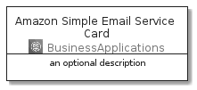
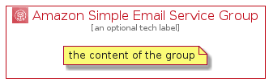

# AmazonSimpleEmailService


```text
aws-20210730/Architecture/BusinessApplications/AmazonSimpleEmailService
```

```text
include('aws-20210730/Architecture/BusinessApplications/AmazonSimpleEmailService')
```


| Illustration | AmazonSimpleEmailService | AmazonSimpleEmailServiceCard | AmazonSimpleEmailServiceGroup |
| :---: | :---: | :---: | :---: |
|  |  |  |  |


## AmazonSimpleEmailService

### Load remotely
```plantuml
@startuml
' configures the library
!global $LIB_BASE_LOCATION="https://github.com/tmorin/plantuml-libs/distribution"

' loads the library's bootstrap
!include $LIB_BASE_LOCATION/bootstrap.puml

' loads the package bootstrap
include('aws-20210730/bootstrap')

' loads the Item which embeds the element AmazonSimpleEmailService
include('aws-20210730/Architecture/BusinessApplications/AmazonSimpleEmailService')

' renders the element
AmazonSimpleEmailService('AmazonSimpleEmailService', 'Amazon Simple Email Service', 'an optional tech label')
@enduml
```

### Load locally
```plantuml
@startuml
' configures the library
!global $INCLUSION_MODE="local"
!global $LIB_BASE_LOCATION="../../.."

' loads the library's bootstrap
!include $LIB_BASE_LOCATION/bootstrap.puml

' loads the package bootstrap
include('aws-20210730/bootstrap')

' loads the Item which embeds the element AmazonSimpleEmailService
include('aws-20210730/Architecture/BusinessApplications/AmazonSimpleEmailService')

' renders the element
AmazonSimpleEmailService('AmazonSimpleEmailService', 'Amazon Simple Email Service', 'an optional tech label')
@enduml
```

## AmazonSimpleEmailServiceCard

### Load remotely
```plantuml
@startuml
' configures the library
!global $LIB_BASE_LOCATION="https://github.com/tmorin/plantuml-libs/distribution"

' loads the library's bootstrap
!include $LIB_BASE_LOCATION/bootstrap.puml

' loads the package bootstrap
include('aws-20210730/bootstrap')

' loads the Item which embeds the element AmazonSimpleEmailServiceCard
include('aws-20210730/Architecture/BusinessApplications/AmazonSimpleEmailService')

' renders the element
AmazonSimpleEmailServiceCard('AmazonSimpleEmailServiceCard', 'Amazon Simple Email Service Card', 'an optional description')
@enduml
```

### Load locally
```plantuml
@startuml
' configures the library
!global $INCLUSION_MODE="local"
!global $LIB_BASE_LOCATION="../../.."

' loads the library's bootstrap
!include $LIB_BASE_LOCATION/bootstrap.puml

' loads the package bootstrap
include('aws-20210730/bootstrap')

' loads the Item which embeds the element AmazonSimpleEmailServiceCard
include('aws-20210730/Architecture/BusinessApplications/AmazonSimpleEmailService')

' renders the element
AmazonSimpleEmailServiceCard('AmazonSimpleEmailServiceCard', 'Amazon Simple Email Service Card', 'an optional description')
@enduml
```

## AmazonSimpleEmailServiceGroup

### Load remotely
```plantuml
@startuml
' configures the library
!global $LIB_BASE_LOCATION="https://github.com/tmorin/plantuml-libs/distribution"

' loads the library's bootstrap
!include $LIB_BASE_LOCATION/bootstrap.puml

' loads the package bootstrap
include('aws-20210730/bootstrap')

' loads the Item which embeds the element AmazonSimpleEmailServiceGroup
include('aws-20210730/Architecture/BusinessApplications/AmazonSimpleEmailService')

' renders the element
AmazonSimpleEmailServiceGroup('AmazonSimpleEmailServiceGroup', 'Amazon Simple Email Service Group', 'an optional tech label') {
    note as note
        the content of the group
    end note
}
@enduml
```

### Load locally
```plantuml
@startuml
' configures the library
!global $INCLUSION_MODE="local"
!global $LIB_BASE_LOCATION="../../.."

' loads the library's bootstrap
!include $LIB_BASE_LOCATION/bootstrap.puml

' loads the package bootstrap
include('aws-20210730/bootstrap')

' loads the Item which embeds the element AmazonSimpleEmailServiceGroup
include('aws-20210730/Architecture/BusinessApplications/AmazonSimpleEmailService')

' renders the element
AmazonSimpleEmailServiceGroup('AmazonSimpleEmailServiceGroup', 'Amazon Simple Email Service Group', 'an optional tech label') {
    note as note
        the content of the group
    end note
}
@enduml
```

