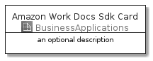
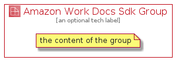

# AmazonWorkDocsSdk


```text
aws-20210730/Architecture/BusinessApplications/AmazonWorkDocsSdk
```

```text
include('aws-20210730/Architecture/BusinessApplications/AmazonWorkDocsSdk')
```


| Illustration | AmazonWorkDocsSdk | AmazonWorkDocsSdkCard | AmazonWorkDocsSdkGroup |
| :---: | :---: | :---: | :---: |
|  |  |  |  |


## AmazonWorkDocsSdk

### Load remotely
```plantuml
@startuml
' configures the library
!global $LIB_BASE_LOCATION="https://github.com/tmorin/plantuml-libs/distribution"

' loads the library's bootstrap
!include $LIB_BASE_LOCATION/bootstrap.puml

' loads the package bootstrap
include('aws-20210730/bootstrap')

' loads the Item which embeds the element AmazonWorkDocsSdk
include('aws-20210730/Architecture/BusinessApplications/AmazonWorkDocsSdk')

' renders the element
AmazonWorkDocsSdk('AmazonWorkDocsSdk', 'Amazon Work Docs Sdk', 'an optional tech label')
@enduml
```

### Load locally
```plantuml
@startuml
' configures the library
!global $INCLUSION_MODE="local"
!global $LIB_BASE_LOCATION="../../.."

' loads the library's bootstrap
!include $LIB_BASE_LOCATION/bootstrap.puml

' loads the package bootstrap
include('aws-20210730/bootstrap')

' loads the Item which embeds the element AmazonWorkDocsSdk
include('aws-20210730/Architecture/BusinessApplications/AmazonWorkDocsSdk')

' renders the element
AmazonWorkDocsSdk('AmazonWorkDocsSdk', 'Amazon Work Docs Sdk', 'an optional tech label')
@enduml
```

## AmazonWorkDocsSdkCard

### Load remotely
```plantuml
@startuml
' configures the library
!global $LIB_BASE_LOCATION="https://github.com/tmorin/plantuml-libs/distribution"

' loads the library's bootstrap
!include $LIB_BASE_LOCATION/bootstrap.puml

' loads the package bootstrap
include('aws-20210730/bootstrap')

' loads the Item which embeds the element AmazonWorkDocsSdkCard
include('aws-20210730/Architecture/BusinessApplications/AmazonWorkDocsSdk')

' renders the element
AmazonWorkDocsSdkCard('AmazonWorkDocsSdkCard', 'Amazon Work Docs Sdk Card', 'an optional description')
@enduml
```

### Load locally
```plantuml
@startuml
' configures the library
!global $INCLUSION_MODE="local"
!global $LIB_BASE_LOCATION="../../.."

' loads the library's bootstrap
!include $LIB_BASE_LOCATION/bootstrap.puml

' loads the package bootstrap
include('aws-20210730/bootstrap')

' loads the Item which embeds the element AmazonWorkDocsSdkCard
include('aws-20210730/Architecture/BusinessApplications/AmazonWorkDocsSdk')

' renders the element
AmazonWorkDocsSdkCard('AmazonWorkDocsSdkCard', 'Amazon Work Docs Sdk Card', 'an optional description')
@enduml
```

## AmazonWorkDocsSdkGroup

### Load remotely
```plantuml
@startuml
' configures the library
!global $LIB_BASE_LOCATION="https://github.com/tmorin/plantuml-libs/distribution"

' loads the library's bootstrap
!include $LIB_BASE_LOCATION/bootstrap.puml

' loads the package bootstrap
include('aws-20210730/bootstrap')

' loads the Item which embeds the element AmazonWorkDocsSdkGroup
include('aws-20210730/Architecture/BusinessApplications/AmazonWorkDocsSdk')

' renders the element
AmazonWorkDocsSdkGroup('AmazonWorkDocsSdkGroup', 'Amazon Work Docs Sdk Group', 'an optional tech label') {
    note as note
        the content of the group
    end note
}
@enduml
```

### Load locally
```plantuml
@startuml
' configures the library
!global $INCLUSION_MODE="local"
!global $LIB_BASE_LOCATION="../../.."

' loads the library's bootstrap
!include $LIB_BASE_LOCATION/bootstrap.puml

' loads the package bootstrap
include('aws-20210730/bootstrap')

' loads the Item which embeds the element AmazonWorkDocsSdkGroup
include('aws-20210730/Architecture/BusinessApplications/AmazonWorkDocsSdk')

' renders the element
AmazonWorkDocsSdkGroup('AmazonWorkDocsSdkGroup', 'Amazon Work Docs Sdk Group', 'an optional tech label') {
    note as note
        the content of the group
    end note
}
@enduml
```

