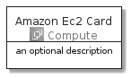
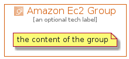

# AmazonEc2


```text
aws-20210730/Architecture/Compute/AmazonEc2
```

```text
include('aws-20210730/Architecture/Compute/AmazonEc2')
```


| Illustration | AmazonEc2 | AmazonEc2Card | AmazonEc2Group |
| :---: | :---: | :---: | :---: |
|  |  |  |  |


## AmazonEc2

### Load remotely
```plantuml
@startuml
' configures the library
!global $LIB_BASE_LOCATION="https://github.com/tmorin/plantuml-libs/distribution"

' loads the library's bootstrap
!include $LIB_BASE_LOCATION/bootstrap.puml

' loads the package bootstrap
include('aws-20210730/bootstrap')

' loads the Item which embeds the element AmazonEc2
include('aws-20210730/Architecture/Compute/AmazonEc2')

' renders the element
AmazonEc2('AmazonEc2', 'Amazon Ec2', 'an optional tech label')
@enduml
```

### Load locally
```plantuml
@startuml
' configures the library
!global $INCLUSION_MODE="local"
!global $LIB_BASE_LOCATION="../../.."

' loads the library's bootstrap
!include $LIB_BASE_LOCATION/bootstrap.puml

' loads the package bootstrap
include('aws-20210730/bootstrap')

' loads the Item which embeds the element AmazonEc2
include('aws-20210730/Architecture/Compute/AmazonEc2')

' renders the element
AmazonEc2('AmazonEc2', 'Amazon Ec2', 'an optional tech label')
@enduml
```

## AmazonEc2Card

### Load remotely
```plantuml
@startuml
' configures the library
!global $LIB_BASE_LOCATION="https://github.com/tmorin/plantuml-libs/distribution"

' loads the library's bootstrap
!include $LIB_BASE_LOCATION/bootstrap.puml

' loads the package bootstrap
include('aws-20210730/bootstrap')

' loads the Item which embeds the element AmazonEc2Card
include('aws-20210730/Architecture/Compute/AmazonEc2')

' renders the element
AmazonEc2Card('AmazonEc2Card', 'Amazon Ec2 Card', 'an optional description')
@enduml
```

### Load locally
```plantuml
@startuml
' configures the library
!global $INCLUSION_MODE="local"
!global $LIB_BASE_LOCATION="../../.."

' loads the library's bootstrap
!include $LIB_BASE_LOCATION/bootstrap.puml

' loads the package bootstrap
include('aws-20210730/bootstrap')

' loads the Item which embeds the element AmazonEc2Card
include('aws-20210730/Architecture/Compute/AmazonEc2')

' renders the element
AmazonEc2Card('AmazonEc2Card', 'Amazon Ec2 Card', 'an optional description')
@enduml
```

## AmazonEc2Group

### Load remotely
```plantuml
@startuml
' configures the library
!global $LIB_BASE_LOCATION="https://github.com/tmorin/plantuml-libs/distribution"

' loads the library's bootstrap
!include $LIB_BASE_LOCATION/bootstrap.puml

' loads the package bootstrap
include('aws-20210730/bootstrap')

' loads the Item which embeds the element AmazonEc2Group
include('aws-20210730/Architecture/Compute/AmazonEc2')

' renders the element
AmazonEc2Group('AmazonEc2Group', 'Amazon Ec2 Group', 'an optional tech label') {
    note as note
        the content of the group
    end note
}
@enduml
```

### Load locally
```plantuml
@startuml
' configures the library
!global $INCLUSION_MODE="local"
!global $LIB_BASE_LOCATION="../../.."

' loads the library's bootstrap
!include $LIB_BASE_LOCATION/bootstrap.puml

' loads the package bootstrap
include('aws-20210730/bootstrap')

' loads the Item which embeds the element AmazonEc2Group
include('aws-20210730/Architecture/Compute/AmazonEc2')

' renders the element
AmazonEc2Group('AmazonEc2Group', 'Amazon Ec2 Group', 'an optional tech label') {
    note as note
        the content of the group
    end note
}
@enduml
```

