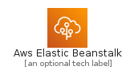
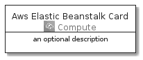
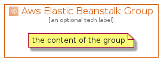

# AwsElasticBeanstalk


```text
aws-20210730/Architecture/Compute/AwsElasticBeanstalk
```

```text
include('aws-20210730/Architecture/Compute/AwsElasticBeanstalk')
```


| Illustration | AwsElasticBeanstalk | AwsElasticBeanstalkCard | AwsElasticBeanstalkGroup |
| :---: | :---: | :---: | :---: |
|  |  |  |  |


## AwsElasticBeanstalk

### Load remotely
```plantuml
@startuml
' configures the library
!global $LIB_BASE_LOCATION="https://github.com/tmorin/plantuml-libs/distribution"

' loads the library's bootstrap
!include $LIB_BASE_LOCATION/bootstrap.puml

' loads the package bootstrap
include('aws-20210730/bootstrap')

' loads the Item which embeds the element AwsElasticBeanstalk
include('aws-20210730/Architecture/Compute/AwsElasticBeanstalk')

' renders the element
AwsElasticBeanstalk('AwsElasticBeanstalk', 'Aws Elastic Beanstalk', 'an optional tech label')
@enduml
```

### Load locally
```plantuml
@startuml
' configures the library
!global $INCLUSION_MODE="local"
!global $LIB_BASE_LOCATION="../../.."

' loads the library's bootstrap
!include $LIB_BASE_LOCATION/bootstrap.puml

' loads the package bootstrap
include('aws-20210730/bootstrap')

' loads the Item which embeds the element AwsElasticBeanstalk
include('aws-20210730/Architecture/Compute/AwsElasticBeanstalk')

' renders the element
AwsElasticBeanstalk('AwsElasticBeanstalk', 'Aws Elastic Beanstalk', 'an optional tech label')
@enduml
```

## AwsElasticBeanstalkCard

### Load remotely
```plantuml
@startuml
' configures the library
!global $LIB_BASE_LOCATION="https://github.com/tmorin/plantuml-libs/distribution"

' loads the library's bootstrap
!include $LIB_BASE_LOCATION/bootstrap.puml

' loads the package bootstrap
include('aws-20210730/bootstrap')

' loads the Item which embeds the element AwsElasticBeanstalkCard
include('aws-20210730/Architecture/Compute/AwsElasticBeanstalk')

' renders the element
AwsElasticBeanstalkCard('AwsElasticBeanstalkCard', 'Aws Elastic Beanstalk Card', 'an optional description')
@enduml
```

### Load locally
```plantuml
@startuml
' configures the library
!global $INCLUSION_MODE="local"
!global $LIB_BASE_LOCATION="../../.."

' loads the library's bootstrap
!include $LIB_BASE_LOCATION/bootstrap.puml

' loads the package bootstrap
include('aws-20210730/bootstrap')

' loads the Item which embeds the element AwsElasticBeanstalkCard
include('aws-20210730/Architecture/Compute/AwsElasticBeanstalk')

' renders the element
AwsElasticBeanstalkCard('AwsElasticBeanstalkCard', 'Aws Elastic Beanstalk Card', 'an optional description')
@enduml
```

## AwsElasticBeanstalkGroup

### Load remotely
```plantuml
@startuml
' configures the library
!global $LIB_BASE_LOCATION="https://github.com/tmorin/plantuml-libs/distribution"

' loads the library's bootstrap
!include $LIB_BASE_LOCATION/bootstrap.puml

' loads the package bootstrap
include('aws-20210730/bootstrap')

' loads the Item which embeds the element AwsElasticBeanstalkGroup
include('aws-20210730/Architecture/Compute/AwsElasticBeanstalk')

' renders the element
AwsElasticBeanstalkGroup('AwsElasticBeanstalkGroup', 'Aws Elastic Beanstalk Group', 'an optional tech label') {
    note as note
        the content of the group
    end note
}
@enduml
```

### Load locally
```plantuml
@startuml
' configures the library
!global $INCLUSION_MODE="local"
!global $LIB_BASE_LOCATION="../../.."

' loads the library's bootstrap
!include $LIB_BASE_LOCATION/bootstrap.puml

' loads the package bootstrap
include('aws-20210730/bootstrap')

' loads the Item which embeds the element AwsElasticBeanstalkGroup
include('aws-20210730/Architecture/Compute/AwsElasticBeanstalk')

' renders the element
AwsElasticBeanstalkGroup('AwsElasticBeanstalkGroup', 'Aws Elastic Beanstalk Group', 'an optional tech label') {
    note as note
        the content of the group
    end note
}
@enduml
```

