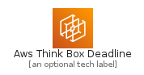
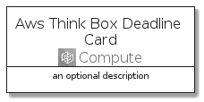
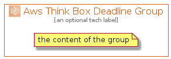

# AwsThinkBoxDeadline


```text
aws-20210730/Architecture/Compute/AwsThinkBoxDeadline
```

```text
include('aws-20210730/Architecture/Compute/AwsThinkBoxDeadline')
```


| Illustration | AwsThinkBoxDeadline | AwsThinkBoxDeadlineCard | AwsThinkBoxDeadlineGroup |
| :---: | :---: | :---: | :---: |
|  |  |  |  |


## AwsThinkBoxDeadline

### Load remotely
```plantuml
@startuml
' configures the library
!global $LIB_BASE_LOCATION="https://raw.githubusercontent.com/tmorin/plantuml-libs/master/distribution"

' loads the library's bootstrap
!include $LIB_BASE_LOCATION/bootstrap.puml

' loads the package bootstrap
include('aws-20210730/bootstrap')

' loads the Item which embeds the element AwsThinkBoxDeadline
include('aws-20210730/Architecture/Compute/AwsThinkBoxDeadline')

' renders the element
AwsThinkBoxDeadline('AwsThinkBoxDeadline', 'Aws Think Box Deadline', 'an optional tech label')
@enduml
```

### Load locally
```plantuml
@startuml
' configures the library
!global $INCLUSION_MODE="local"
!global $LIB_BASE_LOCATION="../../.."

' loads the library's bootstrap
!include $LIB_BASE_LOCATION/bootstrap.puml

' loads the package bootstrap
include('aws-20210730/bootstrap')

' loads the Item which embeds the element AwsThinkBoxDeadline
include('aws-20210730/Architecture/Compute/AwsThinkBoxDeadline')

' renders the element
AwsThinkBoxDeadline('AwsThinkBoxDeadline', 'Aws Think Box Deadline', 'an optional tech label')
@enduml
```

## AwsThinkBoxDeadlineCard

### Load remotely
```plantuml
@startuml
' configures the library
!global $LIB_BASE_LOCATION="https://raw.githubusercontent.com/tmorin/plantuml-libs/master/distribution"

' loads the library's bootstrap
!include $LIB_BASE_LOCATION/bootstrap.puml

' loads the package bootstrap
include('aws-20210730/bootstrap')

' loads the Item which embeds the element AwsThinkBoxDeadlineCard
include('aws-20210730/Architecture/Compute/AwsThinkBoxDeadline')

' renders the element
AwsThinkBoxDeadlineCard('AwsThinkBoxDeadlineCard', 'Aws Think Box Deadline Card', 'an optional description')
@enduml
```

### Load locally
```plantuml
@startuml
' configures the library
!global $INCLUSION_MODE="local"
!global $LIB_BASE_LOCATION="../../.."

' loads the library's bootstrap
!include $LIB_BASE_LOCATION/bootstrap.puml

' loads the package bootstrap
include('aws-20210730/bootstrap')

' loads the Item which embeds the element AwsThinkBoxDeadlineCard
include('aws-20210730/Architecture/Compute/AwsThinkBoxDeadline')

' renders the element
AwsThinkBoxDeadlineCard('AwsThinkBoxDeadlineCard', 'Aws Think Box Deadline Card', 'an optional description')
@enduml
```

## AwsThinkBoxDeadlineGroup

### Load remotely
```plantuml
@startuml
' configures the library
!global $LIB_BASE_LOCATION="https://raw.githubusercontent.com/tmorin/plantuml-libs/master/distribution"

' loads the library's bootstrap
!include $LIB_BASE_LOCATION/bootstrap.puml

' loads the package bootstrap
include('aws-20210730/bootstrap')

' loads the Item which embeds the element AwsThinkBoxDeadlineGroup
include('aws-20210730/Architecture/Compute/AwsThinkBoxDeadline')

' renders the element
AwsThinkBoxDeadlineGroup('AwsThinkBoxDeadlineGroup', 'Aws Think Box Deadline Group', 'an optional tech label') {
    note as note
        the content of the group
    end note
}
@enduml
```

### Load locally
```plantuml
@startuml
' configures the library
!global $INCLUSION_MODE="local"
!global $LIB_BASE_LOCATION="../../.."

' loads the library's bootstrap
!include $LIB_BASE_LOCATION/bootstrap.puml

' loads the package bootstrap
include('aws-20210730/bootstrap')

' loads the Item which embeds the element AwsThinkBoxDeadlineGroup
include('aws-20210730/Architecture/Compute/AwsThinkBoxDeadline')

' renders the element
AwsThinkBoxDeadlineGroup('AwsThinkBoxDeadlineGroup', 'Aws Think Box Deadline Group', 'an optional tech label') {
    note as note
        the content of the group
    end note
}
@enduml
```

