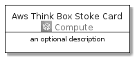
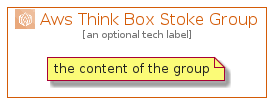

# AwsThinkBoxStoke


```text
aws-20210730/Architecture/Compute/AwsThinkBoxStoke
```

```text
include('aws-20210730/Architecture/Compute/AwsThinkBoxStoke')
```


| Illustration | AwsThinkBoxStoke | AwsThinkBoxStokeCard | AwsThinkBoxStokeGroup |
| :---: | :---: | :---: | :---: |
|  |  |  |  |


## AwsThinkBoxStoke

### Load remotely
```plantuml
@startuml
' configures the library
!global $LIB_BASE_LOCATION="https://github.com/tmorin/plantuml-libs/distribution"

' loads the library's bootstrap
!include $LIB_BASE_LOCATION/bootstrap.puml

' loads the package bootstrap
include('aws-20210730/bootstrap')

' loads the Item which embeds the element AwsThinkBoxStoke
include('aws-20210730/Architecture/Compute/AwsThinkBoxStoke')

' renders the element
AwsThinkBoxStoke('AwsThinkBoxStoke', 'Aws Think Box Stoke', 'an optional tech label')
@enduml
```

### Load locally
```plantuml
@startuml
' configures the library
!global $INCLUSION_MODE="local"
!global $LIB_BASE_LOCATION="../../.."

' loads the library's bootstrap
!include $LIB_BASE_LOCATION/bootstrap.puml

' loads the package bootstrap
include('aws-20210730/bootstrap')

' loads the Item which embeds the element AwsThinkBoxStoke
include('aws-20210730/Architecture/Compute/AwsThinkBoxStoke')

' renders the element
AwsThinkBoxStoke('AwsThinkBoxStoke', 'Aws Think Box Stoke', 'an optional tech label')
@enduml
```

## AwsThinkBoxStokeCard

### Load remotely
```plantuml
@startuml
' configures the library
!global $LIB_BASE_LOCATION="https://github.com/tmorin/plantuml-libs/distribution"

' loads the library's bootstrap
!include $LIB_BASE_LOCATION/bootstrap.puml

' loads the package bootstrap
include('aws-20210730/bootstrap')

' loads the Item which embeds the element AwsThinkBoxStokeCard
include('aws-20210730/Architecture/Compute/AwsThinkBoxStoke')

' renders the element
AwsThinkBoxStokeCard('AwsThinkBoxStokeCard', 'Aws Think Box Stoke Card', 'an optional description')
@enduml
```

### Load locally
```plantuml
@startuml
' configures the library
!global $INCLUSION_MODE="local"
!global $LIB_BASE_LOCATION="../../.."

' loads the library's bootstrap
!include $LIB_BASE_LOCATION/bootstrap.puml

' loads the package bootstrap
include('aws-20210730/bootstrap')

' loads the Item which embeds the element AwsThinkBoxStokeCard
include('aws-20210730/Architecture/Compute/AwsThinkBoxStoke')

' renders the element
AwsThinkBoxStokeCard('AwsThinkBoxStokeCard', 'Aws Think Box Stoke Card', 'an optional description')
@enduml
```

## AwsThinkBoxStokeGroup

### Load remotely
```plantuml
@startuml
' configures the library
!global $LIB_BASE_LOCATION="https://github.com/tmorin/plantuml-libs/distribution"

' loads the library's bootstrap
!include $LIB_BASE_LOCATION/bootstrap.puml

' loads the package bootstrap
include('aws-20210730/bootstrap')

' loads the Item which embeds the element AwsThinkBoxStokeGroup
include('aws-20210730/Architecture/Compute/AwsThinkBoxStoke')

' renders the element
AwsThinkBoxStokeGroup('AwsThinkBoxStokeGroup', 'Aws Think Box Stoke Group', 'an optional tech label') {
    note as note
        the content of the group
    end note
}
@enduml
```

### Load locally
```plantuml
@startuml
' configures the library
!global $INCLUSION_MODE="local"
!global $LIB_BASE_LOCATION="../../.."

' loads the library's bootstrap
!include $LIB_BASE_LOCATION/bootstrap.puml

' loads the package bootstrap
include('aws-20210730/bootstrap')

' loads the Item which embeds the element AwsThinkBoxStokeGroup
include('aws-20210730/Architecture/Compute/AwsThinkBoxStoke')

' renders the element
AwsThinkBoxStokeGroup('AwsThinkBoxStokeGroup', 'Aws Think Box Stoke Group', 'an optional tech label') {
    note as note
        the content of the group
    end note
}
@enduml
```

