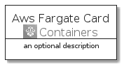
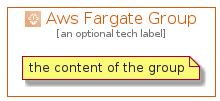

# AwsFargate


```text
aws-20210730/Architecture/Containers/AwsFargate
```

```text
include('aws-20210730/Architecture/Containers/AwsFargate')
```


| Illustration | AwsFargate | AwsFargateCard | AwsFargateGroup |
| :---: | :---: | :---: | :---: |
|  |  |  |  |


## AwsFargate

### Load remotely
```plantuml
@startuml
' configures the library
!global $LIB_BASE_LOCATION="https://raw.githubusercontent.com/tmorin/plantuml-libs/master/distribution"

' loads the library's bootstrap
!include $LIB_BASE_LOCATION/bootstrap.puml

' loads the package bootstrap
include('aws-20210730/bootstrap')

' loads the Item which embeds the element AwsFargate
include('aws-20210730/Architecture/Containers/AwsFargate')

' renders the element
AwsFargate('AwsFargate', 'Aws Fargate', 'an optional tech label')
@enduml
```

### Load locally
```plantuml
@startuml
' configures the library
!global $INCLUSION_MODE="local"
!global $LIB_BASE_LOCATION="../../.."

' loads the library's bootstrap
!include $LIB_BASE_LOCATION/bootstrap.puml

' loads the package bootstrap
include('aws-20210730/bootstrap')

' loads the Item which embeds the element AwsFargate
include('aws-20210730/Architecture/Containers/AwsFargate')

' renders the element
AwsFargate('AwsFargate', 'Aws Fargate', 'an optional tech label')
@enduml
```

## AwsFargateCard

### Load remotely
```plantuml
@startuml
' configures the library
!global $LIB_BASE_LOCATION="https://raw.githubusercontent.com/tmorin/plantuml-libs/master/distribution"

' loads the library's bootstrap
!include $LIB_BASE_LOCATION/bootstrap.puml

' loads the package bootstrap
include('aws-20210730/bootstrap')

' loads the Item which embeds the element AwsFargateCard
include('aws-20210730/Architecture/Containers/AwsFargate')

' renders the element
AwsFargateCard('AwsFargateCard', 'Aws Fargate Card', 'an optional description')
@enduml
```

### Load locally
```plantuml
@startuml
' configures the library
!global $INCLUSION_MODE="local"
!global $LIB_BASE_LOCATION="../../.."

' loads the library's bootstrap
!include $LIB_BASE_LOCATION/bootstrap.puml

' loads the package bootstrap
include('aws-20210730/bootstrap')

' loads the Item which embeds the element AwsFargateCard
include('aws-20210730/Architecture/Containers/AwsFargate')

' renders the element
AwsFargateCard('AwsFargateCard', 'Aws Fargate Card', 'an optional description')
@enduml
```

## AwsFargateGroup

### Load remotely
```plantuml
@startuml
' configures the library
!global $LIB_BASE_LOCATION="https://raw.githubusercontent.com/tmorin/plantuml-libs/master/distribution"

' loads the library's bootstrap
!include $LIB_BASE_LOCATION/bootstrap.puml

' loads the package bootstrap
include('aws-20210730/bootstrap')

' loads the Item which embeds the element AwsFargateGroup
include('aws-20210730/Architecture/Containers/AwsFargate')

' renders the element
AwsFargateGroup('AwsFargateGroup', 'Aws Fargate Group', 'an optional tech label') {
    note as note
        the content of the group
    end note
}
@enduml
```

### Load locally
```plantuml
@startuml
' configures the library
!global $INCLUSION_MODE="local"
!global $LIB_BASE_LOCATION="../../.."

' loads the library's bootstrap
!include $LIB_BASE_LOCATION/bootstrap.puml

' loads the package bootstrap
include('aws-20210730/bootstrap')

' loads the Item which embeds the element AwsFargateGroup
include('aws-20210730/Architecture/Containers/AwsFargate')

' renders the element
AwsFargateGroup('AwsFargateGroup', 'Aws Fargate Group', 'an optional tech label') {
    note as note
        the content of the group
    end note
}
@enduml
```

