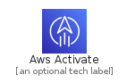
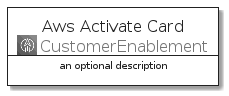
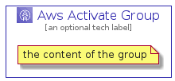

# AwsActivate


```text
aws-20210730/Architecture/CustomerEnablement/AwsActivate
```

```text
include('aws-20210730/Architecture/CustomerEnablement/AwsActivate')
```


| Illustration | AwsActivate | AwsActivateCard | AwsActivateGroup |
| :---: | :---: | :---: | :---: |
|  |  |  |  |


## AwsActivate

### Load remotely
```plantuml
@startuml
' configures the library
!global $LIB_BASE_LOCATION="https://raw.githubusercontent.com/tmorin/plantuml-libs/master/distribution"

' loads the library's bootstrap
!include $LIB_BASE_LOCATION/bootstrap.puml

' loads the package bootstrap
include('aws-20210730/bootstrap')

' loads the Item which embeds the element AwsActivate
include('aws-20210730/Architecture/CustomerEnablement/AwsActivate')

' renders the element
AwsActivate('AwsActivate', 'Aws Activate', 'an optional tech label')
@enduml
```

### Load locally
```plantuml
@startuml
' configures the library
!global $INCLUSION_MODE="local"
!global $LIB_BASE_LOCATION="../../.."

' loads the library's bootstrap
!include $LIB_BASE_LOCATION/bootstrap.puml

' loads the package bootstrap
include('aws-20210730/bootstrap')

' loads the Item which embeds the element AwsActivate
include('aws-20210730/Architecture/CustomerEnablement/AwsActivate')

' renders the element
AwsActivate('AwsActivate', 'Aws Activate', 'an optional tech label')
@enduml
```

## AwsActivateCard

### Load remotely
```plantuml
@startuml
' configures the library
!global $LIB_BASE_LOCATION="https://raw.githubusercontent.com/tmorin/plantuml-libs/master/distribution"

' loads the library's bootstrap
!include $LIB_BASE_LOCATION/bootstrap.puml

' loads the package bootstrap
include('aws-20210730/bootstrap')

' loads the Item which embeds the element AwsActivateCard
include('aws-20210730/Architecture/CustomerEnablement/AwsActivate')

' renders the element
AwsActivateCard('AwsActivateCard', 'Aws Activate Card', 'an optional description')
@enduml
```

### Load locally
```plantuml
@startuml
' configures the library
!global $INCLUSION_MODE="local"
!global $LIB_BASE_LOCATION="../../.."

' loads the library's bootstrap
!include $LIB_BASE_LOCATION/bootstrap.puml

' loads the package bootstrap
include('aws-20210730/bootstrap')

' loads the Item which embeds the element AwsActivateCard
include('aws-20210730/Architecture/CustomerEnablement/AwsActivate')

' renders the element
AwsActivateCard('AwsActivateCard', 'Aws Activate Card', 'an optional description')
@enduml
```

## AwsActivateGroup

### Load remotely
```plantuml
@startuml
' configures the library
!global $LIB_BASE_LOCATION="https://raw.githubusercontent.com/tmorin/plantuml-libs/master/distribution"

' loads the library's bootstrap
!include $LIB_BASE_LOCATION/bootstrap.puml

' loads the package bootstrap
include('aws-20210730/bootstrap')

' loads the Item which embeds the element AwsActivateGroup
include('aws-20210730/Architecture/CustomerEnablement/AwsActivate')

' renders the element
AwsActivateGroup('AwsActivateGroup', 'Aws Activate Group', 'an optional tech label') {
    note as note
        the content of the group
    end note
}
@enduml
```

### Load locally
```plantuml
@startuml
' configures the library
!global $INCLUSION_MODE="local"
!global $LIB_BASE_LOCATION="../../.."

' loads the library's bootstrap
!include $LIB_BASE_LOCATION/bootstrap.puml

' loads the package bootstrap
include('aws-20210730/bootstrap')

' loads the Item which embeds the element AwsActivateGroup
include('aws-20210730/Architecture/CustomerEnablement/AwsActivate')

' renders the element
AwsActivateGroup('AwsActivateGroup', 'Aws Activate Group', 'an optional tech label') {
    note as note
        the content of the group
    end note
}
@enduml
```

