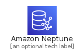
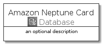
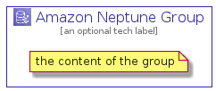

# AmazonNeptune


```text
aws-20210730/Architecture/Database/AmazonNeptune
```

```text
include('aws-20210730/Architecture/Database/AmazonNeptune')
```


| Illustration | AmazonNeptune | AmazonNeptuneCard | AmazonNeptuneGroup |
| :---: | :---: | :---: | :---: |
|  |  |  |  |


## AmazonNeptune

### Load remotely
```plantuml
@startuml
' configures the library
!global $LIB_BASE_LOCATION="https://github.com/tmorin/plantuml-libs/distribution"

' loads the library's bootstrap
!include $LIB_BASE_LOCATION/bootstrap.puml

' loads the package bootstrap
include('aws-20210730/bootstrap')

' loads the Item which embeds the element AmazonNeptune
include('aws-20210730/Architecture/Database/AmazonNeptune')

' renders the element
AmazonNeptune('AmazonNeptune', 'Amazon Neptune', 'an optional tech label')
@enduml
```

### Load locally
```plantuml
@startuml
' configures the library
!global $INCLUSION_MODE="local"
!global $LIB_BASE_LOCATION="../../.."

' loads the library's bootstrap
!include $LIB_BASE_LOCATION/bootstrap.puml

' loads the package bootstrap
include('aws-20210730/bootstrap')

' loads the Item which embeds the element AmazonNeptune
include('aws-20210730/Architecture/Database/AmazonNeptune')

' renders the element
AmazonNeptune('AmazonNeptune', 'Amazon Neptune', 'an optional tech label')
@enduml
```

## AmazonNeptuneCard

### Load remotely
```plantuml
@startuml
' configures the library
!global $LIB_BASE_LOCATION="https://github.com/tmorin/plantuml-libs/distribution"

' loads the library's bootstrap
!include $LIB_BASE_LOCATION/bootstrap.puml

' loads the package bootstrap
include('aws-20210730/bootstrap')

' loads the Item which embeds the element AmazonNeptuneCard
include('aws-20210730/Architecture/Database/AmazonNeptune')

' renders the element
AmazonNeptuneCard('AmazonNeptuneCard', 'Amazon Neptune Card', 'an optional description')
@enduml
```

### Load locally
```plantuml
@startuml
' configures the library
!global $INCLUSION_MODE="local"
!global $LIB_BASE_LOCATION="../../.."

' loads the library's bootstrap
!include $LIB_BASE_LOCATION/bootstrap.puml

' loads the package bootstrap
include('aws-20210730/bootstrap')

' loads the Item which embeds the element AmazonNeptuneCard
include('aws-20210730/Architecture/Database/AmazonNeptune')

' renders the element
AmazonNeptuneCard('AmazonNeptuneCard', 'Amazon Neptune Card', 'an optional description')
@enduml
```

## AmazonNeptuneGroup

### Load remotely
```plantuml
@startuml
' configures the library
!global $LIB_BASE_LOCATION="https://github.com/tmorin/plantuml-libs/distribution"

' loads the library's bootstrap
!include $LIB_BASE_LOCATION/bootstrap.puml

' loads the package bootstrap
include('aws-20210730/bootstrap')

' loads the Item which embeds the element AmazonNeptuneGroup
include('aws-20210730/Architecture/Database/AmazonNeptune')

' renders the element
AmazonNeptuneGroup('AmazonNeptuneGroup', 'Amazon Neptune Group', 'an optional tech label') {
    note as note
        the content of the group
    end note
}
@enduml
```

### Load locally
```plantuml
@startuml
' configures the library
!global $INCLUSION_MODE="local"
!global $LIB_BASE_LOCATION="../../.."

' loads the library's bootstrap
!include $LIB_BASE_LOCATION/bootstrap.puml

' loads the package bootstrap
include('aws-20210730/bootstrap')

' loads the Item which embeds the element AmazonNeptuneGroup
include('aws-20210730/Architecture/Database/AmazonNeptune')

' renders the element
AmazonNeptuneGroup('AmazonNeptuneGroup', 'Amazon Neptune Group', 'an optional tech label') {
    note as note
        the content of the group
    end note
}
@enduml
```

