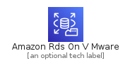
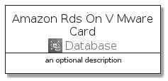
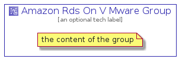

# AmazonRdsOnVMware


```text
aws-20210730/Architecture/Database/AmazonRdsOnVMware
```

```text
include('aws-20210730/Architecture/Database/AmazonRdsOnVMware')
```


| Illustration | AmazonRdsOnVMware | AmazonRdsOnVMwareCard | AmazonRdsOnVMwareGroup |
| :---: | :---: | :---: | :---: |
|  |  |  |  |


## AmazonRdsOnVMware

### Load remotely
```plantuml
@startuml
' configures the library
!global $LIB_BASE_LOCATION="https://github.com/tmorin/plantuml-libs/distribution"

' loads the library's bootstrap
!include $LIB_BASE_LOCATION/bootstrap.puml

' loads the package bootstrap
include('aws-20210730/bootstrap')

' loads the Item which embeds the element AmazonRdsOnVMware
include('aws-20210730/Architecture/Database/AmazonRdsOnVMware')

' renders the element
AmazonRdsOnVMware('AmazonRdsOnVMware', 'Amazon Rds On V Mware', 'an optional tech label')
@enduml
```

### Load locally
```plantuml
@startuml
' configures the library
!global $INCLUSION_MODE="local"
!global $LIB_BASE_LOCATION="../../.."

' loads the library's bootstrap
!include $LIB_BASE_LOCATION/bootstrap.puml

' loads the package bootstrap
include('aws-20210730/bootstrap')

' loads the Item which embeds the element AmazonRdsOnVMware
include('aws-20210730/Architecture/Database/AmazonRdsOnVMware')

' renders the element
AmazonRdsOnVMware('AmazonRdsOnVMware', 'Amazon Rds On V Mware', 'an optional tech label')
@enduml
```

## AmazonRdsOnVMwareCard

### Load remotely
```plantuml
@startuml
' configures the library
!global $LIB_BASE_LOCATION="https://github.com/tmorin/plantuml-libs/distribution"

' loads the library's bootstrap
!include $LIB_BASE_LOCATION/bootstrap.puml

' loads the package bootstrap
include('aws-20210730/bootstrap')

' loads the Item which embeds the element AmazonRdsOnVMwareCard
include('aws-20210730/Architecture/Database/AmazonRdsOnVMware')

' renders the element
AmazonRdsOnVMwareCard('AmazonRdsOnVMwareCard', 'Amazon Rds On V Mware Card', 'an optional description')
@enduml
```

### Load locally
```plantuml
@startuml
' configures the library
!global $INCLUSION_MODE="local"
!global $LIB_BASE_LOCATION="../../.."

' loads the library's bootstrap
!include $LIB_BASE_LOCATION/bootstrap.puml

' loads the package bootstrap
include('aws-20210730/bootstrap')

' loads the Item which embeds the element AmazonRdsOnVMwareCard
include('aws-20210730/Architecture/Database/AmazonRdsOnVMware')

' renders the element
AmazonRdsOnVMwareCard('AmazonRdsOnVMwareCard', 'Amazon Rds On V Mware Card', 'an optional description')
@enduml
```

## AmazonRdsOnVMwareGroup

### Load remotely
```plantuml
@startuml
' configures the library
!global $LIB_BASE_LOCATION="https://github.com/tmorin/plantuml-libs/distribution"

' loads the library's bootstrap
!include $LIB_BASE_LOCATION/bootstrap.puml

' loads the package bootstrap
include('aws-20210730/bootstrap')

' loads the Item which embeds the element AmazonRdsOnVMwareGroup
include('aws-20210730/Architecture/Database/AmazonRdsOnVMware')

' renders the element
AmazonRdsOnVMwareGroup('AmazonRdsOnVMwareGroup', 'Amazon Rds On V Mware Group', 'an optional tech label') {
    note as note
        the content of the group
    end note
}
@enduml
```

### Load locally
```plantuml
@startuml
' configures the library
!global $INCLUSION_MODE="local"
!global $LIB_BASE_LOCATION="../../.."

' loads the library's bootstrap
!include $LIB_BASE_LOCATION/bootstrap.puml

' loads the package bootstrap
include('aws-20210730/bootstrap')

' loads the Item which embeds the element AmazonRdsOnVMwareGroup
include('aws-20210730/Architecture/Database/AmazonRdsOnVMware')

' renders the element
AmazonRdsOnVMwareGroup('AmazonRdsOnVMwareGroup', 'Amazon Rds On V Mware Group', 'an optional tech label') {
    note as note
        the content of the group
    end note
}
@enduml
```

