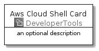
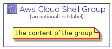

# AwsCloudShell


```text
aws-20210730/Architecture/DeveloperTools/AwsCloudShell
```

```text
include('aws-20210730/Architecture/DeveloperTools/AwsCloudShell')
```


| Illustration | AwsCloudShell | AwsCloudShellCard | AwsCloudShellGroup |
| :---: | :---: | :---: | :---: |
|  |  |  |  |


## AwsCloudShell

### Load remotely
```plantuml
@startuml
' configures the library
!global $LIB_BASE_LOCATION="https://github.com/tmorin/plantuml-libs/distribution"

' loads the library's bootstrap
!include $LIB_BASE_LOCATION/bootstrap.puml

' loads the package bootstrap
include('aws-20210730/bootstrap')

' loads the Item which embeds the element AwsCloudShell
include('aws-20210730/Architecture/DeveloperTools/AwsCloudShell')

' renders the element
AwsCloudShell('AwsCloudShell', 'Aws Cloud Shell', 'an optional tech label')
@enduml
```

### Load locally
```plantuml
@startuml
' configures the library
!global $INCLUSION_MODE="local"
!global $LIB_BASE_LOCATION="../../.."

' loads the library's bootstrap
!include $LIB_BASE_LOCATION/bootstrap.puml

' loads the package bootstrap
include('aws-20210730/bootstrap')

' loads the Item which embeds the element AwsCloudShell
include('aws-20210730/Architecture/DeveloperTools/AwsCloudShell')

' renders the element
AwsCloudShell('AwsCloudShell', 'Aws Cloud Shell', 'an optional tech label')
@enduml
```

## AwsCloudShellCard

### Load remotely
```plantuml
@startuml
' configures the library
!global $LIB_BASE_LOCATION="https://github.com/tmorin/plantuml-libs/distribution"

' loads the library's bootstrap
!include $LIB_BASE_LOCATION/bootstrap.puml

' loads the package bootstrap
include('aws-20210730/bootstrap')

' loads the Item which embeds the element AwsCloudShellCard
include('aws-20210730/Architecture/DeveloperTools/AwsCloudShell')

' renders the element
AwsCloudShellCard('AwsCloudShellCard', 'Aws Cloud Shell Card', 'an optional description')
@enduml
```

### Load locally
```plantuml
@startuml
' configures the library
!global $INCLUSION_MODE="local"
!global $LIB_BASE_LOCATION="../../.."

' loads the library's bootstrap
!include $LIB_BASE_LOCATION/bootstrap.puml

' loads the package bootstrap
include('aws-20210730/bootstrap')

' loads the Item which embeds the element AwsCloudShellCard
include('aws-20210730/Architecture/DeveloperTools/AwsCloudShell')

' renders the element
AwsCloudShellCard('AwsCloudShellCard', 'Aws Cloud Shell Card', 'an optional description')
@enduml
```

## AwsCloudShellGroup

### Load remotely
```plantuml
@startuml
' configures the library
!global $LIB_BASE_LOCATION="https://github.com/tmorin/plantuml-libs/distribution"

' loads the library's bootstrap
!include $LIB_BASE_LOCATION/bootstrap.puml

' loads the package bootstrap
include('aws-20210730/bootstrap')

' loads the Item which embeds the element AwsCloudShellGroup
include('aws-20210730/Architecture/DeveloperTools/AwsCloudShell')

' renders the element
AwsCloudShellGroup('AwsCloudShellGroup', 'Aws Cloud Shell Group', 'an optional tech label') {
    note as note
        the content of the group
    end note
}
@enduml
```

### Load locally
```plantuml
@startuml
' configures the library
!global $INCLUSION_MODE="local"
!global $LIB_BASE_LOCATION="../../.."

' loads the library's bootstrap
!include $LIB_BASE_LOCATION/bootstrap.puml

' loads the package bootstrap
include('aws-20210730/bootstrap')

' loads the Item which embeds the element AwsCloudShellGroup
include('aws-20210730/Architecture/DeveloperTools/AwsCloudShell')

' renders the element
AwsCloudShellGroup('AwsCloudShellGroup', 'Aws Cloud Shell Group', 'an optional tech label') {
    note as note
        the content of the group
    end note
}
@enduml
```

