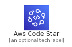
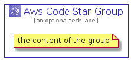

# AwsCodeStar


```text
aws-20210730/Architecture/DeveloperTools/AwsCodeStar
```

```text
include('aws-20210730/Architecture/DeveloperTools/AwsCodeStar')
```


| Illustration | AwsCodeStar | AwsCodeStarCard | AwsCodeStarGroup |
| :---: | :---: | :---: | :---: |
|  |  |  |  |


## AwsCodeStar

### Load remotely
```plantuml
@startuml
' configures the library
!global $LIB_BASE_LOCATION="https://raw.githubusercontent.com/tmorin/plantuml-libs/master/distribution"

' loads the library's bootstrap
!include $LIB_BASE_LOCATION/bootstrap.puml

' loads the package bootstrap
include('aws-20210730/bootstrap')

' loads the Item which embeds the element AwsCodeStar
include('aws-20210730/Architecture/DeveloperTools/AwsCodeStar')

' renders the element
AwsCodeStar('AwsCodeStar', 'Aws Code Star', 'an optional tech label')
@enduml
```

### Load locally
```plantuml
@startuml
' configures the library
!global $INCLUSION_MODE="local"
!global $LIB_BASE_LOCATION="../../.."

' loads the library's bootstrap
!include $LIB_BASE_LOCATION/bootstrap.puml

' loads the package bootstrap
include('aws-20210730/bootstrap')

' loads the Item which embeds the element AwsCodeStar
include('aws-20210730/Architecture/DeveloperTools/AwsCodeStar')

' renders the element
AwsCodeStar('AwsCodeStar', 'Aws Code Star', 'an optional tech label')
@enduml
```

## AwsCodeStarCard

### Load remotely
```plantuml
@startuml
' configures the library
!global $LIB_BASE_LOCATION="https://raw.githubusercontent.com/tmorin/plantuml-libs/master/distribution"

' loads the library's bootstrap
!include $LIB_BASE_LOCATION/bootstrap.puml

' loads the package bootstrap
include('aws-20210730/bootstrap')

' loads the Item which embeds the element AwsCodeStarCard
include('aws-20210730/Architecture/DeveloperTools/AwsCodeStar')

' renders the element
AwsCodeStarCard('AwsCodeStarCard', 'Aws Code Star Card', 'an optional description')
@enduml
```

### Load locally
```plantuml
@startuml
' configures the library
!global $INCLUSION_MODE="local"
!global $LIB_BASE_LOCATION="../../.."

' loads the library's bootstrap
!include $LIB_BASE_LOCATION/bootstrap.puml

' loads the package bootstrap
include('aws-20210730/bootstrap')

' loads the Item which embeds the element AwsCodeStarCard
include('aws-20210730/Architecture/DeveloperTools/AwsCodeStar')

' renders the element
AwsCodeStarCard('AwsCodeStarCard', 'Aws Code Star Card', 'an optional description')
@enduml
```

## AwsCodeStarGroup

### Load remotely
```plantuml
@startuml
' configures the library
!global $LIB_BASE_LOCATION="https://raw.githubusercontent.com/tmorin/plantuml-libs/master/distribution"

' loads the library's bootstrap
!include $LIB_BASE_LOCATION/bootstrap.puml

' loads the package bootstrap
include('aws-20210730/bootstrap')

' loads the Item which embeds the element AwsCodeStarGroup
include('aws-20210730/Architecture/DeveloperTools/AwsCodeStar')

' renders the element
AwsCodeStarGroup('AwsCodeStarGroup', 'Aws Code Star Group', 'an optional tech label') {
    note as note
        the content of the group
    end note
}
@enduml
```

### Load locally
```plantuml
@startuml
' configures the library
!global $INCLUSION_MODE="local"
!global $LIB_BASE_LOCATION="../../.."

' loads the library's bootstrap
!include $LIB_BASE_LOCATION/bootstrap.puml

' loads the package bootstrap
include('aws-20210730/bootstrap')

' loads the Item which embeds the element AwsCodeStarGroup
include('aws-20210730/Architecture/DeveloperTools/AwsCodeStar')

' renders the element
AwsCodeStarGroup('AwsCodeStarGroup', 'Aws Code Star Group', 'an optional tech label') {
    note as note
        the content of the group
    end note
}
@enduml
```

