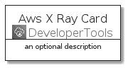
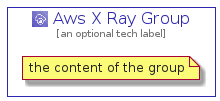

# AwsXRay


```text
aws-20210730/Architecture/DeveloperTools/AwsXRay
```

```text
include('aws-20210730/Architecture/DeveloperTools/AwsXRay')
```


| Illustration | AwsXRay | AwsXRayCard | AwsXRayGroup |
| :---: | :---: | :---: | :---: |
|  |  |  |  |


## AwsXRay

### Load remotely
```plantuml
@startuml
' configures the library
!global $LIB_BASE_LOCATION="https://github.com/tmorin/plantuml-libs/distribution"

' loads the library's bootstrap
!include $LIB_BASE_LOCATION/bootstrap.puml

' loads the package bootstrap
include('aws-20210730/bootstrap')

' loads the Item which embeds the element AwsXRay
include('aws-20210730/Architecture/DeveloperTools/AwsXRay')

' renders the element
AwsXRay('AwsXRay', 'Aws X Ray', 'an optional tech label')
@enduml
```

### Load locally
```plantuml
@startuml
' configures the library
!global $INCLUSION_MODE="local"
!global $LIB_BASE_LOCATION="../../.."

' loads the library's bootstrap
!include $LIB_BASE_LOCATION/bootstrap.puml

' loads the package bootstrap
include('aws-20210730/bootstrap')

' loads the Item which embeds the element AwsXRay
include('aws-20210730/Architecture/DeveloperTools/AwsXRay')

' renders the element
AwsXRay('AwsXRay', 'Aws X Ray', 'an optional tech label')
@enduml
```

## AwsXRayCard

### Load remotely
```plantuml
@startuml
' configures the library
!global $LIB_BASE_LOCATION="https://github.com/tmorin/plantuml-libs/distribution"

' loads the library's bootstrap
!include $LIB_BASE_LOCATION/bootstrap.puml

' loads the package bootstrap
include('aws-20210730/bootstrap')

' loads the Item which embeds the element AwsXRayCard
include('aws-20210730/Architecture/DeveloperTools/AwsXRay')

' renders the element
AwsXRayCard('AwsXRayCard', 'Aws X Ray Card', 'an optional description')
@enduml
```

### Load locally
```plantuml
@startuml
' configures the library
!global $INCLUSION_MODE="local"
!global $LIB_BASE_LOCATION="../../.."

' loads the library's bootstrap
!include $LIB_BASE_LOCATION/bootstrap.puml

' loads the package bootstrap
include('aws-20210730/bootstrap')

' loads the Item which embeds the element AwsXRayCard
include('aws-20210730/Architecture/DeveloperTools/AwsXRay')

' renders the element
AwsXRayCard('AwsXRayCard', 'Aws X Ray Card', 'an optional description')
@enduml
```

## AwsXRayGroup

### Load remotely
```plantuml
@startuml
' configures the library
!global $LIB_BASE_LOCATION="https://github.com/tmorin/plantuml-libs/distribution"

' loads the library's bootstrap
!include $LIB_BASE_LOCATION/bootstrap.puml

' loads the package bootstrap
include('aws-20210730/bootstrap')

' loads the Item which embeds the element AwsXRayGroup
include('aws-20210730/Architecture/DeveloperTools/AwsXRay')

' renders the element
AwsXRayGroup('AwsXRayGroup', 'Aws X Ray Group', 'an optional tech label') {
    note as note
        the content of the group
    end note
}
@enduml
```

### Load locally
```plantuml
@startuml
' configures the library
!global $INCLUSION_MODE="local"
!global $LIB_BASE_LOCATION="../../.."

' loads the library's bootstrap
!include $LIB_BASE_LOCATION/bootstrap.puml

' loads the package bootstrap
include('aws-20210730/bootstrap')

' loads the Item which embeds the element AwsXRayGroup
include('aws-20210730/Architecture/DeveloperTools/AwsXRay')

' renders the element
AwsXRayGroup('AwsXRayGroup', 'Aws X Ray Group', 'an optional tech label') {
    note as note
        the content of the group
    end note
}
@enduml
```

