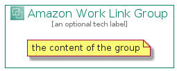

# AmazonWorkLink


```text
aws-20210730/Architecture/EndUserComputing/AmazonWorkLink
```

```text
include('aws-20210730/Architecture/EndUserComputing/AmazonWorkLink')
```


| Illustration | AmazonWorkLink | AmazonWorkLinkCard | AmazonWorkLinkGroup |
| :---: | :---: | :---: | :---: |
|  |  |  |  |


## AmazonWorkLink

### Load remotely
```plantuml
@startuml
' configures the library
!global $LIB_BASE_LOCATION="https://github.com/tmorin/plantuml-libs/distribution"

' loads the library's bootstrap
!include $LIB_BASE_LOCATION/bootstrap.puml

' loads the package bootstrap
include('aws-20210730/bootstrap')

' loads the Item which embeds the element AmazonWorkLink
include('aws-20210730/Architecture/EndUserComputing/AmazonWorkLink')

' renders the element
AmazonWorkLink('AmazonWorkLink', 'Amazon Work Link', 'an optional tech label')
@enduml
```

### Load locally
```plantuml
@startuml
' configures the library
!global $INCLUSION_MODE="local"
!global $LIB_BASE_LOCATION="../../.."

' loads the library's bootstrap
!include $LIB_BASE_LOCATION/bootstrap.puml

' loads the package bootstrap
include('aws-20210730/bootstrap')

' loads the Item which embeds the element AmazonWorkLink
include('aws-20210730/Architecture/EndUserComputing/AmazonWorkLink')

' renders the element
AmazonWorkLink('AmazonWorkLink', 'Amazon Work Link', 'an optional tech label')
@enduml
```

## AmazonWorkLinkCard

### Load remotely
```plantuml
@startuml
' configures the library
!global $LIB_BASE_LOCATION="https://github.com/tmorin/plantuml-libs/distribution"

' loads the library's bootstrap
!include $LIB_BASE_LOCATION/bootstrap.puml

' loads the package bootstrap
include('aws-20210730/bootstrap')

' loads the Item which embeds the element AmazonWorkLinkCard
include('aws-20210730/Architecture/EndUserComputing/AmazonWorkLink')

' renders the element
AmazonWorkLinkCard('AmazonWorkLinkCard', 'Amazon Work Link Card', 'an optional description')
@enduml
```

### Load locally
```plantuml
@startuml
' configures the library
!global $INCLUSION_MODE="local"
!global $LIB_BASE_LOCATION="../../.."

' loads the library's bootstrap
!include $LIB_BASE_LOCATION/bootstrap.puml

' loads the package bootstrap
include('aws-20210730/bootstrap')

' loads the Item which embeds the element AmazonWorkLinkCard
include('aws-20210730/Architecture/EndUserComputing/AmazonWorkLink')

' renders the element
AmazonWorkLinkCard('AmazonWorkLinkCard', 'Amazon Work Link Card', 'an optional description')
@enduml
```

## AmazonWorkLinkGroup

### Load remotely
```plantuml
@startuml
' configures the library
!global $LIB_BASE_LOCATION="https://github.com/tmorin/plantuml-libs/distribution"

' loads the library's bootstrap
!include $LIB_BASE_LOCATION/bootstrap.puml

' loads the package bootstrap
include('aws-20210730/bootstrap')

' loads the Item which embeds the element AmazonWorkLinkGroup
include('aws-20210730/Architecture/EndUserComputing/AmazonWorkLink')

' renders the element
AmazonWorkLinkGroup('AmazonWorkLinkGroup', 'Amazon Work Link Group', 'an optional tech label') {
    note as note
        the content of the group
    end note
}
@enduml
```

### Load locally
```plantuml
@startuml
' configures the library
!global $INCLUSION_MODE="local"
!global $LIB_BASE_LOCATION="../../.."

' loads the library's bootstrap
!include $LIB_BASE_LOCATION/bootstrap.puml

' loads the package bootstrap
include('aws-20210730/bootstrap')

' loads the Item which embeds the element AmazonWorkLinkGroup
include('aws-20210730/Architecture/EndUserComputing/AmazonWorkLink')

' renders the element
AmazonWorkLinkGroup('AmazonWorkLinkGroup', 'Amazon Work Link Group', 'an optional tech label') {
    note as note
        the content of the group
    end note
}
@enduml
```

