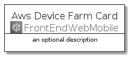
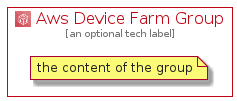

# AwsDeviceFarm


```text
aws-20210730/Architecture/FrontEndWebMobile/AwsDeviceFarm
```

```text
include('aws-20210730/Architecture/FrontEndWebMobile/AwsDeviceFarm')
```


| Illustration | AwsDeviceFarm | AwsDeviceFarmCard | AwsDeviceFarmGroup |
| :---: | :---: | :---: | :---: |
|  |  |  |  |


## AwsDeviceFarm

### Load remotely
```plantuml
@startuml
' configures the library
!global $LIB_BASE_LOCATION="https://github.com/tmorin/plantuml-libs/distribution"

' loads the library's bootstrap
!include $LIB_BASE_LOCATION/bootstrap.puml

' loads the package bootstrap
include('aws-20210730/bootstrap')

' loads the Item which embeds the element AwsDeviceFarm
include('aws-20210730/Architecture/FrontEndWebMobile/AwsDeviceFarm')

' renders the element
AwsDeviceFarm('AwsDeviceFarm', 'Aws Device Farm', 'an optional tech label')
@enduml
```

### Load locally
```plantuml
@startuml
' configures the library
!global $INCLUSION_MODE="local"
!global $LIB_BASE_LOCATION="../../.."

' loads the library's bootstrap
!include $LIB_BASE_LOCATION/bootstrap.puml

' loads the package bootstrap
include('aws-20210730/bootstrap')

' loads the Item which embeds the element AwsDeviceFarm
include('aws-20210730/Architecture/FrontEndWebMobile/AwsDeviceFarm')

' renders the element
AwsDeviceFarm('AwsDeviceFarm', 'Aws Device Farm', 'an optional tech label')
@enduml
```

## AwsDeviceFarmCard

### Load remotely
```plantuml
@startuml
' configures the library
!global $LIB_BASE_LOCATION="https://github.com/tmorin/plantuml-libs/distribution"

' loads the library's bootstrap
!include $LIB_BASE_LOCATION/bootstrap.puml

' loads the package bootstrap
include('aws-20210730/bootstrap')

' loads the Item which embeds the element AwsDeviceFarmCard
include('aws-20210730/Architecture/FrontEndWebMobile/AwsDeviceFarm')

' renders the element
AwsDeviceFarmCard('AwsDeviceFarmCard', 'Aws Device Farm Card', 'an optional description')
@enduml
```

### Load locally
```plantuml
@startuml
' configures the library
!global $INCLUSION_MODE="local"
!global $LIB_BASE_LOCATION="../../.."

' loads the library's bootstrap
!include $LIB_BASE_LOCATION/bootstrap.puml

' loads the package bootstrap
include('aws-20210730/bootstrap')

' loads the Item which embeds the element AwsDeviceFarmCard
include('aws-20210730/Architecture/FrontEndWebMobile/AwsDeviceFarm')

' renders the element
AwsDeviceFarmCard('AwsDeviceFarmCard', 'Aws Device Farm Card', 'an optional description')
@enduml
```

## AwsDeviceFarmGroup

### Load remotely
```plantuml
@startuml
' configures the library
!global $LIB_BASE_LOCATION="https://github.com/tmorin/plantuml-libs/distribution"

' loads the library's bootstrap
!include $LIB_BASE_LOCATION/bootstrap.puml

' loads the package bootstrap
include('aws-20210730/bootstrap')

' loads the Item which embeds the element AwsDeviceFarmGroup
include('aws-20210730/Architecture/FrontEndWebMobile/AwsDeviceFarm')

' renders the element
AwsDeviceFarmGroup('AwsDeviceFarmGroup', 'Aws Device Farm Group', 'an optional tech label') {
    note as note
        the content of the group
    end note
}
@enduml
```

### Load locally
```plantuml
@startuml
' configures the library
!global $INCLUSION_MODE="local"
!global $LIB_BASE_LOCATION="../../.."

' loads the library's bootstrap
!include $LIB_BASE_LOCATION/bootstrap.puml

' loads the package bootstrap
include('aws-20210730/bootstrap')

' loads the Item which embeds the element AwsDeviceFarmGroup
include('aws-20210730/Architecture/FrontEndWebMobile/AwsDeviceFarm')

' renders the element
AwsDeviceFarmGroup('AwsDeviceFarmGroup', 'Aws Device Farm Group', 'an optional tech label') {
    note as note
        the content of the group
    end note
}
@enduml
```

