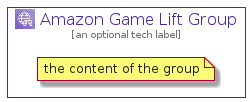

# AmazonGameLift


```text
aws-20210730/Architecture/GameTech/AmazonGameLift
```

```text
include('aws-20210730/Architecture/GameTech/AmazonGameLift')
```


| Illustration | AmazonGameLift | AmazonGameLiftCard | AmazonGameLiftGroup |
| :---: | :---: | :---: | :---: |
|  |  |  |  |


## AmazonGameLift

### Load remotely
```plantuml
@startuml
' configures the library
!global $LIB_BASE_LOCATION="https://raw.githubusercontent.com/tmorin/plantuml-libs/master/distribution"

' loads the library's bootstrap
!include $LIB_BASE_LOCATION/bootstrap.puml

' loads the package bootstrap
include('aws-20210730/bootstrap')

' loads the Item which embeds the element AmazonGameLift
include('aws-20210730/Architecture/GameTech/AmazonGameLift')

' renders the element
AmazonGameLift('AmazonGameLift', 'Amazon Game Lift', 'an optional tech label')
@enduml
```

### Load locally
```plantuml
@startuml
' configures the library
!global $INCLUSION_MODE="local"
!global $LIB_BASE_LOCATION="../../.."

' loads the library's bootstrap
!include $LIB_BASE_LOCATION/bootstrap.puml

' loads the package bootstrap
include('aws-20210730/bootstrap')

' loads the Item which embeds the element AmazonGameLift
include('aws-20210730/Architecture/GameTech/AmazonGameLift')

' renders the element
AmazonGameLift('AmazonGameLift', 'Amazon Game Lift', 'an optional tech label')
@enduml
```

## AmazonGameLiftCard

### Load remotely
```plantuml
@startuml
' configures the library
!global $LIB_BASE_LOCATION="https://raw.githubusercontent.com/tmorin/plantuml-libs/master/distribution"

' loads the library's bootstrap
!include $LIB_BASE_LOCATION/bootstrap.puml

' loads the package bootstrap
include('aws-20210730/bootstrap')

' loads the Item which embeds the element AmazonGameLiftCard
include('aws-20210730/Architecture/GameTech/AmazonGameLift')

' renders the element
AmazonGameLiftCard('AmazonGameLiftCard', 'Amazon Game Lift Card', 'an optional description')
@enduml
```

### Load locally
```plantuml
@startuml
' configures the library
!global $INCLUSION_MODE="local"
!global $LIB_BASE_LOCATION="../../.."

' loads the library's bootstrap
!include $LIB_BASE_LOCATION/bootstrap.puml

' loads the package bootstrap
include('aws-20210730/bootstrap')

' loads the Item which embeds the element AmazonGameLiftCard
include('aws-20210730/Architecture/GameTech/AmazonGameLift')

' renders the element
AmazonGameLiftCard('AmazonGameLiftCard', 'Amazon Game Lift Card', 'an optional description')
@enduml
```

## AmazonGameLiftGroup

### Load remotely
```plantuml
@startuml
' configures the library
!global $LIB_BASE_LOCATION="https://raw.githubusercontent.com/tmorin/plantuml-libs/master/distribution"

' loads the library's bootstrap
!include $LIB_BASE_LOCATION/bootstrap.puml

' loads the package bootstrap
include('aws-20210730/bootstrap')

' loads the Item which embeds the element AmazonGameLiftGroup
include('aws-20210730/Architecture/GameTech/AmazonGameLift')

' renders the element
AmazonGameLiftGroup('AmazonGameLiftGroup', 'Amazon Game Lift Group', 'an optional tech label') {
    note as note
        the content of the group
    end note
}
@enduml
```

### Load locally
```plantuml
@startuml
' configures the library
!global $INCLUSION_MODE="local"
!global $LIB_BASE_LOCATION="../../.."

' loads the library's bootstrap
!include $LIB_BASE_LOCATION/bootstrap.puml

' loads the package bootstrap
include('aws-20210730/bootstrap')

' loads the Item which embeds the element AmazonGameLiftGroup
include('aws-20210730/Architecture/GameTech/AmazonGameLift')

' renders the element
AmazonGameLiftGroup('AmazonGameLiftGroup', 'Amazon Game Lift Group', 'an optional tech label') {
    note as note
        the content of the group
    end note
}
@enduml
```

