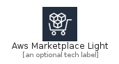
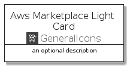
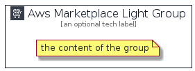

# AwsMarketplaceLight


```text
aws-20210730/Architecture/GeneralIcons/AwsMarketplaceLight
```

```text
include('aws-20210730/Architecture/GeneralIcons/AwsMarketplaceLight')
```


| Illustration | AwsMarketplaceLight | AwsMarketplaceLightCard | AwsMarketplaceLightGroup |
| :---: | :---: | :---: | :---: |
|  |  |  |  |


## AwsMarketplaceLight

### Load remotely
```plantuml
@startuml
' configures the library
!global $LIB_BASE_LOCATION="https://github.com/tmorin/plantuml-libs/distribution"

' loads the library's bootstrap
!include $LIB_BASE_LOCATION/bootstrap.puml

' loads the package bootstrap
include('aws-20210730/bootstrap')

' loads the Item which embeds the element AwsMarketplaceLight
include('aws-20210730/Architecture/GeneralIcons/AwsMarketplaceLight')

' renders the element
AwsMarketplaceLight('AwsMarketplaceLight', 'Aws Marketplace Light', 'an optional tech label')
@enduml
```

### Load locally
```plantuml
@startuml
' configures the library
!global $INCLUSION_MODE="local"
!global $LIB_BASE_LOCATION="../../.."

' loads the library's bootstrap
!include $LIB_BASE_LOCATION/bootstrap.puml

' loads the package bootstrap
include('aws-20210730/bootstrap')

' loads the Item which embeds the element AwsMarketplaceLight
include('aws-20210730/Architecture/GeneralIcons/AwsMarketplaceLight')

' renders the element
AwsMarketplaceLight('AwsMarketplaceLight', 'Aws Marketplace Light', 'an optional tech label')
@enduml
```

## AwsMarketplaceLightCard

### Load remotely
```plantuml
@startuml
' configures the library
!global $LIB_BASE_LOCATION="https://github.com/tmorin/plantuml-libs/distribution"

' loads the library's bootstrap
!include $LIB_BASE_LOCATION/bootstrap.puml

' loads the package bootstrap
include('aws-20210730/bootstrap')

' loads the Item which embeds the element AwsMarketplaceLightCard
include('aws-20210730/Architecture/GeneralIcons/AwsMarketplaceLight')

' renders the element
AwsMarketplaceLightCard('AwsMarketplaceLightCard', 'Aws Marketplace Light Card', 'an optional description')
@enduml
```

### Load locally
```plantuml
@startuml
' configures the library
!global $INCLUSION_MODE="local"
!global $LIB_BASE_LOCATION="../../.."

' loads the library's bootstrap
!include $LIB_BASE_LOCATION/bootstrap.puml

' loads the package bootstrap
include('aws-20210730/bootstrap')

' loads the Item which embeds the element AwsMarketplaceLightCard
include('aws-20210730/Architecture/GeneralIcons/AwsMarketplaceLight')

' renders the element
AwsMarketplaceLightCard('AwsMarketplaceLightCard', 'Aws Marketplace Light Card', 'an optional description')
@enduml
```

## AwsMarketplaceLightGroup

### Load remotely
```plantuml
@startuml
' configures the library
!global $LIB_BASE_LOCATION="https://github.com/tmorin/plantuml-libs/distribution"

' loads the library's bootstrap
!include $LIB_BASE_LOCATION/bootstrap.puml

' loads the package bootstrap
include('aws-20210730/bootstrap')

' loads the Item which embeds the element AwsMarketplaceLightGroup
include('aws-20210730/Architecture/GeneralIcons/AwsMarketplaceLight')

' renders the element
AwsMarketplaceLightGroup('AwsMarketplaceLightGroup', 'Aws Marketplace Light Group', 'an optional tech label') {
    note as note
        the content of the group
    end note
}
@enduml
```

### Load locally
```plantuml
@startuml
' configures the library
!global $INCLUSION_MODE="local"
!global $LIB_BASE_LOCATION="../../.."

' loads the library's bootstrap
!include $LIB_BASE_LOCATION/bootstrap.puml

' loads the package bootstrap
include('aws-20210730/bootstrap')

' loads the Item which embeds the element AwsMarketplaceLightGroup
include('aws-20210730/Architecture/GeneralIcons/AwsMarketplaceLight')

' renders the element
AwsMarketplaceLightGroup('AwsMarketplaceLightGroup', 'Aws Marketplace Light Group', 'an optional tech label') {
    note as note
        the content of the group
    end note
}
@enduml
```

