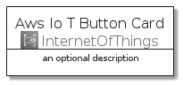
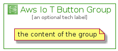

# AwsIoTButton


```text
aws-20210730/Architecture/InternetOfThings/AwsIoTButton
```

```text
include('aws-20210730/Architecture/InternetOfThings/AwsIoTButton')
```


| Illustration | AwsIoTButton | AwsIoTButtonCard | AwsIoTButtonGroup |
| :---: | :---: | :---: | :---: |
|  |  |  |  |


## AwsIoTButton

### Load remotely
```plantuml
@startuml
' configures the library
!global $LIB_BASE_LOCATION="https://github.com/tmorin/plantuml-libs/distribution"

' loads the library's bootstrap
!include $LIB_BASE_LOCATION/bootstrap.puml

' loads the package bootstrap
include('aws-20210730/bootstrap')

' loads the Item which embeds the element AwsIoTButton
include('aws-20210730/Architecture/InternetOfThings/AwsIoTButton')

' renders the element
AwsIoTButton('AwsIoTButton', 'Aws Io T Button', 'an optional tech label')
@enduml
```

### Load locally
```plantuml
@startuml
' configures the library
!global $INCLUSION_MODE="local"
!global $LIB_BASE_LOCATION="../../.."

' loads the library's bootstrap
!include $LIB_BASE_LOCATION/bootstrap.puml

' loads the package bootstrap
include('aws-20210730/bootstrap')

' loads the Item which embeds the element AwsIoTButton
include('aws-20210730/Architecture/InternetOfThings/AwsIoTButton')

' renders the element
AwsIoTButton('AwsIoTButton', 'Aws Io T Button', 'an optional tech label')
@enduml
```

## AwsIoTButtonCard

### Load remotely
```plantuml
@startuml
' configures the library
!global $LIB_BASE_LOCATION="https://github.com/tmorin/plantuml-libs/distribution"

' loads the library's bootstrap
!include $LIB_BASE_LOCATION/bootstrap.puml

' loads the package bootstrap
include('aws-20210730/bootstrap')

' loads the Item which embeds the element AwsIoTButtonCard
include('aws-20210730/Architecture/InternetOfThings/AwsIoTButton')

' renders the element
AwsIoTButtonCard('AwsIoTButtonCard', 'Aws Io T Button Card', 'an optional description')
@enduml
```

### Load locally
```plantuml
@startuml
' configures the library
!global $INCLUSION_MODE="local"
!global $LIB_BASE_LOCATION="../../.."

' loads the library's bootstrap
!include $LIB_BASE_LOCATION/bootstrap.puml

' loads the package bootstrap
include('aws-20210730/bootstrap')

' loads the Item which embeds the element AwsIoTButtonCard
include('aws-20210730/Architecture/InternetOfThings/AwsIoTButton')

' renders the element
AwsIoTButtonCard('AwsIoTButtonCard', 'Aws Io T Button Card', 'an optional description')
@enduml
```

## AwsIoTButtonGroup

### Load remotely
```plantuml
@startuml
' configures the library
!global $LIB_BASE_LOCATION="https://github.com/tmorin/plantuml-libs/distribution"

' loads the library's bootstrap
!include $LIB_BASE_LOCATION/bootstrap.puml

' loads the package bootstrap
include('aws-20210730/bootstrap')

' loads the Item which embeds the element AwsIoTButtonGroup
include('aws-20210730/Architecture/InternetOfThings/AwsIoTButton')

' renders the element
AwsIoTButtonGroup('AwsIoTButtonGroup', 'Aws Io T Button Group', 'an optional tech label') {
    note as note
        the content of the group
    end note
}
@enduml
```

### Load locally
```plantuml
@startuml
' configures the library
!global $INCLUSION_MODE="local"
!global $LIB_BASE_LOCATION="../../.."

' loads the library's bootstrap
!include $LIB_BASE_LOCATION/bootstrap.puml

' loads the package bootstrap
include('aws-20210730/bootstrap')

' loads the Item which embeds the element AwsIoTButtonGroup
include('aws-20210730/Architecture/InternetOfThings/AwsIoTButton')

' renders the element
AwsIoTButtonGroup('AwsIoTButtonGroup', 'Aws Io T Button Group', 'an optional tech label') {
    note as note
        the content of the group
    end note
}
@enduml
```

