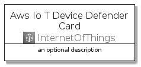
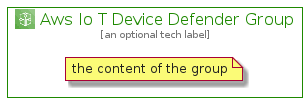

# AwsIoTDeviceDefender


```text
aws-20210730/Architecture/InternetOfThings/AwsIoTDeviceDefender
```

```text
include('aws-20210730/Architecture/InternetOfThings/AwsIoTDeviceDefender')
```


| Illustration | AwsIoTDeviceDefender | AwsIoTDeviceDefenderCard | AwsIoTDeviceDefenderGroup |
| :---: | :---: | :---: | :---: |
|  |  |  |  |


## AwsIoTDeviceDefender

### Load remotely
```plantuml
@startuml
' configures the library
!global $LIB_BASE_LOCATION="https://github.com/tmorin/plantuml-libs/distribution"

' loads the library's bootstrap
!include $LIB_BASE_LOCATION/bootstrap.puml

' loads the package bootstrap
include('aws-20210730/bootstrap')

' loads the Item which embeds the element AwsIoTDeviceDefender
include('aws-20210730/Architecture/InternetOfThings/AwsIoTDeviceDefender')

' renders the element
AwsIoTDeviceDefender('AwsIoTDeviceDefender', 'Aws Io T Device Defender', 'an optional tech label')
@enduml
```

### Load locally
```plantuml
@startuml
' configures the library
!global $INCLUSION_MODE="local"
!global $LIB_BASE_LOCATION="../../.."

' loads the library's bootstrap
!include $LIB_BASE_LOCATION/bootstrap.puml

' loads the package bootstrap
include('aws-20210730/bootstrap')

' loads the Item which embeds the element AwsIoTDeviceDefender
include('aws-20210730/Architecture/InternetOfThings/AwsIoTDeviceDefender')

' renders the element
AwsIoTDeviceDefender('AwsIoTDeviceDefender', 'Aws Io T Device Defender', 'an optional tech label')
@enduml
```

## AwsIoTDeviceDefenderCard

### Load remotely
```plantuml
@startuml
' configures the library
!global $LIB_BASE_LOCATION="https://github.com/tmorin/plantuml-libs/distribution"

' loads the library's bootstrap
!include $LIB_BASE_LOCATION/bootstrap.puml

' loads the package bootstrap
include('aws-20210730/bootstrap')

' loads the Item which embeds the element AwsIoTDeviceDefenderCard
include('aws-20210730/Architecture/InternetOfThings/AwsIoTDeviceDefender')

' renders the element
AwsIoTDeviceDefenderCard('AwsIoTDeviceDefenderCard', 'Aws Io T Device Defender Card', 'an optional description')
@enduml
```

### Load locally
```plantuml
@startuml
' configures the library
!global $INCLUSION_MODE="local"
!global $LIB_BASE_LOCATION="../../.."

' loads the library's bootstrap
!include $LIB_BASE_LOCATION/bootstrap.puml

' loads the package bootstrap
include('aws-20210730/bootstrap')

' loads the Item which embeds the element AwsIoTDeviceDefenderCard
include('aws-20210730/Architecture/InternetOfThings/AwsIoTDeviceDefender')

' renders the element
AwsIoTDeviceDefenderCard('AwsIoTDeviceDefenderCard', 'Aws Io T Device Defender Card', 'an optional description')
@enduml
```

## AwsIoTDeviceDefenderGroup

### Load remotely
```plantuml
@startuml
' configures the library
!global $LIB_BASE_LOCATION="https://github.com/tmorin/plantuml-libs/distribution"

' loads the library's bootstrap
!include $LIB_BASE_LOCATION/bootstrap.puml

' loads the package bootstrap
include('aws-20210730/bootstrap')

' loads the Item which embeds the element AwsIoTDeviceDefenderGroup
include('aws-20210730/Architecture/InternetOfThings/AwsIoTDeviceDefender')

' renders the element
AwsIoTDeviceDefenderGroup('AwsIoTDeviceDefenderGroup', 'Aws Io T Device Defender Group', 'an optional tech label') {
    note as note
        the content of the group
    end note
}
@enduml
```

### Load locally
```plantuml
@startuml
' configures the library
!global $INCLUSION_MODE="local"
!global $LIB_BASE_LOCATION="../../.."

' loads the library's bootstrap
!include $LIB_BASE_LOCATION/bootstrap.puml

' loads the package bootstrap
include('aws-20210730/bootstrap')

' loads the Item which embeds the element AwsIoTDeviceDefenderGroup
include('aws-20210730/Architecture/InternetOfThings/AwsIoTDeviceDefender')

' renders the element
AwsIoTDeviceDefenderGroup('AwsIoTDeviceDefenderGroup', 'Aws Io T Device Defender Group', 'an optional tech label') {
    note as note
        the content of the group
    end note
}
@enduml
```

