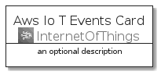
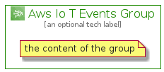

# AwsIoTEvents


```text
aws-20210730/Architecture/InternetOfThings/AwsIoTEvents
```

```text
include('aws-20210730/Architecture/InternetOfThings/AwsIoTEvents')
```


| Illustration | AwsIoTEvents | AwsIoTEventsCard | AwsIoTEventsGroup |
| :---: | :---: | :---: | :---: |
|  |  |  |  |


## AwsIoTEvents

### Load remotely
```plantuml
@startuml
' configures the library
!global $LIB_BASE_LOCATION="https://raw.githubusercontent.com/tmorin/plantuml-libs/master/distribution"

' loads the library's bootstrap
!include $LIB_BASE_LOCATION/bootstrap.puml

' loads the package bootstrap
include('aws-20210730/bootstrap')

' loads the Item which embeds the element AwsIoTEvents
include('aws-20210730/Architecture/InternetOfThings/AwsIoTEvents')

' renders the element
AwsIoTEvents('AwsIoTEvents', 'Aws Io T Events', 'an optional tech label')
@enduml
```

### Load locally
```plantuml
@startuml
' configures the library
!global $INCLUSION_MODE="local"
!global $LIB_BASE_LOCATION="../../.."

' loads the library's bootstrap
!include $LIB_BASE_LOCATION/bootstrap.puml

' loads the package bootstrap
include('aws-20210730/bootstrap')

' loads the Item which embeds the element AwsIoTEvents
include('aws-20210730/Architecture/InternetOfThings/AwsIoTEvents')

' renders the element
AwsIoTEvents('AwsIoTEvents', 'Aws Io T Events', 'an optional tech label')
@enduml
```

## AwsIoTEventsCard

### Load remotely
```plantuml
@startuml
' configures the library
!global $LIB_BASE_LOCATION="https://raw.githubusercontent.com/tmorin/plantuml-libs/master/distribution"

' loads the library's bootstrap
!include $LIB_BASE_LOCATION/bootstrap.puml

' loads the package bootstrap
include('aws-20210730/bootstrap')

' loads the Item which embeds the element AwsIoTEventsCard
include('aws-20210730/Architecture/InternetOfThings/AwsIoTEvents')

' renders the element
AwsIoTEventsCard('AwsIoTEventsCard', 'Aws Io T Events Card', 'an optional description')
@enduml
```

### Load locally
```plantuml
@startuml
' configures the library
!global $INCLUSION_MODE="local"
!global $LIB_BASE_LOCATION="../../.."

' loads the library's bootstrap
!include $LIB_BASE_LOCATION/bootstrap.puml

' loads the package bootstrap
include('aws-20210730/bootstrap')

' loads the Item which embeds the element AwsIoTEventsCard
include('aws-20210730/Architecture/InternetOfThings/AwsIoTEvents')

' renders the element
AwsIoTEventsCard('AwsIoTEventsCard', 'Aws Io T Events Card', 'an optional description')
@enduml
```

## AwsIoTEventsGroup

### Load remotely
```plantuml
@startuml
' configures the library
!global $LIB_BASE_LOCATION="https://raw.githubusercontent.com/tmorin/plantuml-libs/master/distribution"

' loads the library's bootstrap
!include $LIB_BASE_LOCATION/bootstrap.puml

' loads the package bootstrap
include('aws-20210730/bootstrap')

' loads the Item which embeds the element AwsIoTEventsGroup
include('aws-20210730/Architecture/InternetOfThings/AwsIoTEvents')

' renders the element
AwsIoTEventsGroup('AwsIoTEventsGroup', 'Aws Io T Events Group', 'an optional tech label') {
    note as note
        the content of the group
    end note
}
@enduml
```

### Load locally
```plantuml
@startuml
' configures the library
!global $INCLUSION_MODE="local"
!global $LIB_BASE_LOCATION="../../.."

' loads the library's bootstrap
!include $LIB_BASE_LOCATION/bootstrap.puml

' loads the package bootstrap
include('aws-20210730/bootstrap')

' loads the Item which embeds the element AwsIoTEventsGroup
include('aws-20210730/Architecture/InternetOfThings/AwsIoTEvents')

' renders the element
AwsIoTEventsGroup('AwsIoTEventsGroup', 'Aws Io T Events Group', 'an optional tech label') {
    note as note
        the content of the group
    end note
}
@enduml
```

