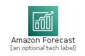
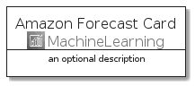
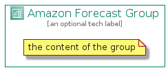

# AmazonForecast


```text
aws-20210730/Architecture/MachineLearning/AmazonForecast
```

```text
include('aws-20210730/Architecture/MachineLearning/AmazonForecast')
```


| Illustration | AmazonForecast | AmazonForecastCard | AmazonForecastGroup |
| :---: | :---: | :---: | :---: |
|  |  |  |  |


## AmazonForecast

### Load remotely
```plantuml
@startuml
' configures the library
!global $LIB_BASE_LOCATION="https://raw.githubusercontent.com/tmorin/plantuml-libs/master/distribution"

' loads the library's bootstrap
!include $LIB_BASE_LOCATION/bootstrap.puml

' loads the package bootstrap
include('aws-20210730/bootstrap')

' loads the Item which embeds the element AmazonForecast
include('aws-20210730/Architecture/MachineLearning/AmazonForecast')

' renders the element
AmazonForecast('AmazonForecast', 'Amazon Forecast', 'an optional tech label')
@enduml
```

### Load locally
```plantuml
@startuml
' configures the library
!global $INCLUSION_MODE="local"
!global $LIB_BASE_LOCATION="../../.."

' loads the library's bootstrap
!include $LIB_BASE_LOCATION/bootstrap.puml

' loads the package bootstrap
include('aws-20210730/bootstrap')

' loads the Item which embeds the element AmazonForecast
include('aws-20210730/Architecture/MachineLearning/AmazonForecast')

' renders the element
AmazonForecast('AmazonForecast', 'Amazon Forecast', 'an optional tech label')
@enduml
```

## AmazonForecastCard

### Load remotely
```plantuml
@startuml
' configures the library
!global $LIB_BASE_LOCATION="https://raw.githubusercontent.com/tmorin/plantuml-libs/master/distribution"

' loads the library's bootstrap
!include $LIB_BASE_LOCATION/bootstrap.puml

' loads the package bootstrap
include('aws-20210730/bootstrap')

' loads the Item which embeds the element AmazonForecastCard
include('aws-20210730/Architecture/MachineLearning/AmazonForecast')

' renders the element
AmazonForecastCard('AmazonForecastCard', 'Amazon Forecast Card', 'an optional description')
@enduml
```

### Load locally
```plantuml
@startuml
' configures the library
!global $INCLUSION_MODE="local"
!global $LIB_BASE_LOCATION="../../.."

' loads the library's bootstrap
!include $LIB_BASE_LOCATION/bootstrap.puml

' loads the package bootstrap
include('aws-20210730/bootstrap')

' loads the Item which embeds the element AmazonForecastCard
include('aws-20210730/Architecture/MachineLearning/AmazonForecast')

' renders the element
AmazonForecastCard('AmazonForecastCard', 'Amazon Forecast Card', 'an optional description')
@enduml
```

## AmazonForecastGroup

### Load remotely
```plantuml
@startuml
' configures the library
!global $LIB_BASE_LOCATION="https://raw.githubusercontent.com/tmorin/plantuml-libs/master/distribution"

' loads the library's bootstrap
!include $LIB_BASE_LOCATION/bootstrap.puml

' loads the package bootstrap
include('aws-20210730/bootstrap')

' loads the Item which embeds the element AmazonForecastGroup
include('aws-20210730/Architecture/MachineLearning/AmazonForecast')

' renders the element
AmazonForecastGroup('AmazonForecastGroup', 'Amazon Forecast Group', 'an optional tech label') {
    note as note
        the content of the group
    end note
}
@enduml
```

### Load locally
```plantuml
@startuml
' configures the library
!global $INCLUSION_MODE="local"
!global $LIB_BASE_LOCATION="../../.."

' loads the library's bootstrap
!include $LIB_BASE_LOCATION/bootstrap.puml

' loads the package bootstrap
include('aws-20210730/bootstrap')

' loads the Item which embeds the element AmazonForecastGroup
include('aws-20210730/Architecture/MachineLearning/AmazonForecast')

' renders the element
AmazonForecastGroup('AmazonForecastGroup', 'Amazon Forecast Group', 'an optional tech label') {
    note as note
        the content of the group
    end note
}
@enduml
```

