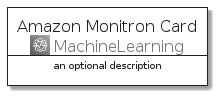
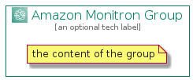

# AmazonMonitron


```text
aws-20210730/Architecture/MachineLearning/AmazonMonitron
```

```text
include('aws-20210730/Architecture/MachineLearning/AmazonMonitron')
```


| Illustration | AmazonMonitron | AmazonMonitronCard | AmazonMonitronGroup |
| :---: | :---: | :---: | :---: |
|  |  |  |  |


## AmazonMonitron

### Load remotely
```plantuml
@startuml
' configures the library
!global $LIB_BASE_LOCATION="https://github.com/tmorin/plantuml-libs/distribution"

' loads the library's bootstrap
!include $LIB_BASE_LOCATION/bootstrap.puml

' loads the package bootstrap
include('aws-20210730/bootstrap')

' loads the Item which embeds the element AmazonMonitron
include('aws-20210730/Architecture/MachineLearning/AmazonMonitron')

' renders the element
AmazonMonitron('AmazonMonitron', 'Amazon Monitron', 'an optional tech label')
@enduml
```

### Load locally
```plantuml
@startuml
' configures the library
!global $INCLUSION_MODE="local"
!global $LIB_BASE_LOCATION="../../.."

' loads the library's bootstrap
!include $LIB_BASE_LOCATION/bootstrap.puml

' loads the package bootstrap
include('aws-20210730/bootstrap')

' loads the Item which embeds the element AmazonMonitron
include('aws-20210730/Architecture/MachineLearning/AmazonMonitron')

' renders the element
AmazonMonitron('AmazonMonitron', 'Amazon Monitron', 'an optional tech label')
@enduml
```

## AmazonMonitronCard

### Load remotely
```plantuml
@startuml
' configures the library
!global $LIB_BASE_LOCATION="https://github.com/tmorin/plantuml-libs/distribution"

' loads the library's bootstrap
!include $LIB_BASE_LOCATION/bootstrap.puml

' loads the package bootstrap
include('aws-20210730/bootstrap')

' loads the Item which embeds the element AmazonMonitronCard
include('aws-20210730/Architecture/MachineLearning/AmazonMonitron')

' renders the element
AmazonMonitronCard('AmazonMonitronCard', 'Amazon Monitron Card', 'an optional description')
@enduml
```

### Load locally
```plantuml
@startuml
' configures the library
!global $INCLUSION_MODE="local"
!global $LIB_BASE_LOCATION="../../.."

' loads the library's bootstrap
!include $LIB_BASE_LOCATION/bootstrap.puml

' loads the package bootstrap
include('aws-20210730/bootstrap')

' loads the Item which embeds the element AmazonMonitronCard
include('aws-20210730/Architecture/MachineLearning/AmazonMonitron')

' renders the element
AmazonMonitronCard('AmazonMonitronCard', 'Amazon Monitron Card', 'an optional description')
@enduml
```

## AmazonMonitronGroup

### Load remotely
```plantuml
@startuml
' configures the library
!global $LIB_BASE_LOCATION="https://github.com/tmorin/plantuml-libs/distribution"

' loads the library's bootstrap
!include $LIB_BASE_LOCATION/bootstrap.puml

' loads the package bootstrap
include('aws-20210730/bootstrap')

' loads the Item which embeds the element AmazonMonitronGroup
include('aws-20210730/Architecture/MachineLearning/AmazonMonitron')

' renders the element
AmazonMonitronGroup('AmazonMonitronGroup', 'Amazon Monitron Group', 'an optional tech label') {
    note as note
        the content of the group
    end note
}
@enduml
```

### Load locally
```plantuml
@startuml
' configures the library
!global $INCLUSION_MODE="local"
!global $LIB_BASE_LOCATION="../../.."

' loads the library's bootstrap
!include $LIB_BASE_LOCATION/bootstrap.puml

' loads the package bootstrap
include('aws-20210730/bootstrap')

' loads the Item which embeds the element AmazonMonitronGroup
include('aws-20210730/Architecture/MachineLearning/AmazonMonitron')

' renders the element
AmazonMonitronGroup('AmazonMonitronGroup', 'Amazon Monitron Group', 'an optional tech label') {
    note as note
        the content of the group
    end note
}
@enduml
```

