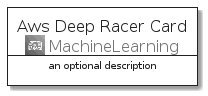
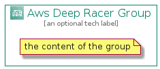

# AwsDeepRacer


```text
aws-20210730/Architecture/MachineLearning/AwsDeepRacer
```

```text
include('aws-20210730/Architecture/MachineLearning/AwsDeepRacer')
```


| Illustration | AwsDeepRacer | AwsDeepRacerCard | AwsDeepRacerGroup |
| :---: | :---: | :---: | :---: |
|  |  |  |  |


## AwsDeepRacer

### Load remotely
```plantuml
@startuml
' configures the library
!global $LIB_BASE_LOCATION="https://raw.githubusercontent.com/tmorin/plantuml-libs/master/distribution"

' loads the library's bootstrap
!include $LIB_BASE_LOCATION/bootstrap.puml

' loads the package bootstrap
include('aws-20210730/bootstrap')

' loads the Item which embeds the element AwsDeepRacer
include('aws-20210730/Architecture/MachineLearning/AwsDeepRacer')

' renders the element
AwsDeepRacer('AwsDeepRacer', 'Aws Deep Racer', 'an optional tech label')
@enduml
```

### Load locally
```plantuml
@startuml
' configures the library
!global $INCLUSION_MODE="local"
!global $LIB_BASE_LOCATION="../../.."

' loads the library's bootstrap
!include $LIB_BASE_LOCATION/bootstrap.puml

' loads the package bootstrap
include('aws-20210730/bootstrap')

' loads the Item which embeds the element AwsDeepRacer
include('aws-20210730/Architecture/MachineLearning/AwsDeepRacer')

' renders the element
AwsDeepRacer('AwsDeepRacer', 'Aws Deep Racer', 'an optional tech label')
@enduml
```

## AwsDeepRacerCard

### Load remotely
```plantuml
@startuml
' configures the library
!global $LIB_BASE_LOCATION="https://raw.githubusercontent.com/tmorin/plantuml-libs/master/distribution"

' loads the library's bootstrap
!include $LIB_BASE_LOCATION/bootstrap.puml

' loads the package bootstrap
include('aws-20210730/bootstrap')

' loads the Item which embeds the element AwsDeepRacerCard
include('aws-20210730/Architecture/MachineLearning/AwsDeepRacer')

' renders the element
AwsDeepRacerCard('AwsDeepRacerCard', 'Aws Deep Racer Card', 'an optional description')
@enduml
```

### Load locally
```plantuml
@startuml
' configures the library
!global $INCLUSION_MODE="local"
!global $LIB_BASE_LOCATION="../../.."

' loads the library's bootstrap
!include $LIB_BASE_LOCATION/bootstrap.puml

' loads the package bootstrap
include('aws-20210730/bootstrap')

' loads the Item which embeds the element AwsDeepRacerCard
include('aws-20210730/Architecture/MachineLearning/AwsDeepRacer')

' renders the element
AwsDeepRacerCard('AwsDeepRacerCard', 'Aws Deep Racer Card', 'an optional description')
@enduml
```

## AwsDeepRacerGroup

### Load remotely
```plantuml
@startuml
' configures the library
!global $LIB_BASE_LOCATION="https://raw.githubusercontent.com/tmorin/plantuml-libs/master/distribution"

' loads the library's bootstrap
!include $LIB_BASE_LOCATION/bootstrap.puml

' loads the package bootstrap
include('aws-20210730/bootstrap')

' loads the Item which embeds the element AwsDeepRacerGroup
include('aws-20210730/Architecture/MachineLearning/AwsDeepRacer')

' renders the element
AwsDeepRacerGroup('AwsDeepRacerGroup', 'Aws Deep Racer Group', 'an optional tech label') {
    note as note
        the content of the group
    end note
}
@enduml
```

### Load locally
```plantuml
@startuml
' configures the library
!global $INCLUSION_MODE="local"
!global $LIB_BASE_LOCATION="../../.."

' loads the library's bootstrap
!include $LIB_BASE_LOCATION/bootstrap.puml

' loads the package bootstrap
include('aws-20210730/bootstrap')

' loads the Item which embeds the element AwsDeepRacerGroup
include('aws-20210730/Architecture/MachineLearning/AwsDeepRacer')

' renders the element
AwsDeepRacerGroup('AwsDeepRacerGroup', 'Aws Deep Racer Group', 'an optional tech label') {
    note as note
        the content of the group
    end note
}
@enduml
```

