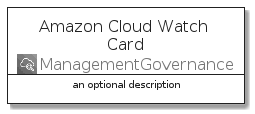
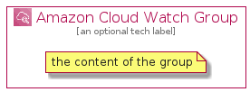

# AmazonCloudWatch


```text
aws-20210730/Architecture/ManagementGovernance/AmazonCloudWatch
```

```text
include('aws-20210730/Architecture/ManagementGovernance/AmazonCloudWatch')
```


| Illustration | AmazonCloudWatch | AmazonCloudWatchCard | AmazonCloudWatchGroup |
| :---: | :---: | :---: | :---: |
|  |  |  |  |


## AmazonCloudWatch

### Load remotely
```plantuml
@startuml
' configures the library
!global $LIB_BASE_LOCATION="https://github.com/tmorin/plantuml-libs/distribution"

' loads the library's bootstrap
!include $LIB_BASE_LOCATION/bootstrap.puml

' loads the package bootstrap
include('aws-20210730/bootstrap')

' loads the Item which embeds the element AmazonCloudWatch
include('aws-20210730/Architecture/ManagementGovernance/AmazonCloudWatch')

' renders the element
AmazonCloudWatch('AmazonCloudWatch', 'Amazon Cloud Watch', 'an optional tech label')
@enduml
```

### Load locally
```plantuml
@startuml
' configures the library
!global $INCLUSION_MODE="local"
!global $LIB_BASE_LOCATION="../../.."

' loads the library's bootstrap
!include $LIB_BASE_LOCATION/bootstrap.puml

' loads the package bootstrap
include('aws-20210730/bootstrap')

' loads the Item which embeds the element AmazonCloudWatch
include('aws-20210730/Architecture/ManagementGovernance/AmazonCloudWatch')

' renders the element
AmazonCloudWatch('AmazonCloudWatch', 'Amazon Cloud Watch', 'an optional tech label')
@enduml
```

## AmazonCloudWatchCard

### Load remotely
```plantuml
@startuml
' configures the library
!global $LIB_BASE_LOCATION="https://github.com/tmorin/plantuml-libs/distribution"

' loads the library's bootstrap
!include $LIB_BASE_LOCATION/bootstrap.puml

' loads the package bootstrap
include('aws-20210730/bootstrap')

' loads the Item which embeds the element AmazonCloudWatchCard
include('aws-20210730/Architecture/ManagementGovernance/AmazonCloudWatch')

' renders the element
AmazonCloudWatchCard('AmazonCloudWatchCard', 'Amazon Cloud Watch Card', 'an optional description')
@enduml
```

### Load locally
```plantuml
@startuml
' configures the library
!global $INCLUSION_MODE="local"
!global $LIB_BASE_LOCATION="../../.."

' loads the library's bootstrap
!include $LIB_BASE_LOCATION/bootstrap.puml

' loads the package bootstrap
include('aws-20210730/bootstrap')

' loads the Item which embeds the element AmazonCloudWatchCard
include('aws-20210730/Architecture/ManagementGovernance/AmazonCloudWatch')

' renders the element
AmazonCloudWatchCard('AmazonCloudWatchCard', 'Amazon Cloud Watch Card', 'an optional description')
@enduml
```

## AmazonCloudWatchGroup

### Load remotely
```plantuml
@startuml
' configures the library
!global $LIB_BASE_LOCATION="https://github.com/tmorin/plantuml-libs/distribution"

' loads the library's bootstrap
!include $LIB_BASE_LOCATION/bootstrap.puml

' loads the package bootstrap
include('aws-20210730/bootstrap')

' loads the Item which embeds the element AmazonCloudWatchGroup
include('aws-20210730/Architecture/ManagementGovernance/AmazonCloudWatch')

' renders the element
AmazonCloudWatchGroup('AmazonCloudWatchGroup', 'Amazon Cloud Watch Group', 'an optional tech label') {
    note as note
        the content of the group
    end note
}
@enduml
```

### Load locally
```plantuml
@startuml
' configures the library
!global $INCLUSION_MODE="local"
!global $LIB_BASE_LOCATION="../../.."

' loads the library's bootstrap
!include $LIB_BASE_LOCATION/bootstrap.puml

' loads the package bootstrap
include('aws-20210730/bootstrap')

' loads the Item which embeds the element AmazonCloudWatchGroup
include('aws-20210730/Architecture/ManagementGovernance/AmazonCloudWatch')

' renders the element
AmazonCloudWatchGroup('AmazonCloudWatchGroup', 'Amazon Cloud Watch Group', 'an optional tech label') {
    note as note
        the content of the group
    end note
}
@enduml
```

