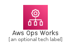
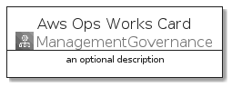
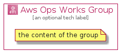

# AwsOpsWorks


```text
aws-20210730/Architecture/ManagementGovernance/AwsOpsWorks
```

```text
include('aws-20210730/Architecture/ManagementGovernance/AwsOpsWorks')
```


| Illustration | AwsOpsWorks | AwsOpsWorksCard | AwsOpsWorksGroup |
| :---: | :---: | :---: | :---: |
|  |  |  |  |


## AwsOpsWorks

### Load remotely
```plantuml
@startuml
' configures the library
!global $LIB_BASE_LOCATION="https://github.com/tmorin/plantuml-libs/distribution"

' loads the library's bootstrap
!include $LIB_BASE_LOCATION/bootstrap.puml

' loads the package bootstrap
include('aws-20210730/bootstrap')

' loads the Item which embeds the element AwsOpsWorks
include('aws-20210730/Architecture/ManagementGovernance/AwsOpsWorks')

' renders the element
AwsOpsWorks('AwsOpsWorks', 'Aws Ops Works', 'an optional tech label')
@enduml
```

### Load locally
```plantuml
@startuml
' configures the library
!global $INCLUSION_MODE="local"
!global $LIB_BASE_LOCATION="../../.."

' loads the library's bootstrap
!include $LIB_BASE_LOCATION/bootstrap.puml

' loads the package bootstrap
include('aws-20210730/bootstrap')

' loads the Item which embeds the element AwsOpsWorks
include('aws-20210730/Architecture/ManagementGovernance/AwsOpsWorks')

' renders the element
AwsOpsWorks('AwsOpsWorks', 'Aws Ops Works', 'an optional tech label')
@enduml
```

## AwsOpsWorksCard

### Load remotely
```plantuml
@startuml
' configures the library
!global $LIB_BASE_LOCATION="https://github.com/tmorin/plantuml-libs/distribution"

' loads the library's bootstrap
!include $LIB_BASE_LOCATION/bootstrap.puml

' loads the package bootstrap
include('aws-20210730/bootstrap')

' loads the Item which embeds the element AwsOpsWorksCard
include('aws-20210730/Architecture/ManagementGovernance/AwsOpsWorks')

' renders the element
AwsOpsWorksCard('AwsOpsWorksCard', 'Aws Ops Works Card', 'an optional description')
@enduml
```

### Load locally
```plantuml
@startuml
' configures the library
!global $INCLUSION_MODE="local"
!global $LIB_BASE_LOCATION="../../.."

' loads the library's bootstrap
!include $LIB_BASE_LOCATION/bootstrap.puml

' loads the package bootstrap
include('aws-20210730/bootstrap')

' loads the Item which embeds the element AwsOpsWorksCard
include('aws-20210730/Architecture/ManagementGovernance/AwsOpsWorks')

' renders the element
AwsOpsWorksCard('AwsOpsWorksCard', 'Aws Ops Works Card', 'an optional description')
@enduml
```

## AwsOpsWorksGroup

### Load remotely
```plantuml
@startuml
' configures the library
!global $LIB_BASE_LOCATION="https://github.com/tmorin/plantuml-libs/distribution"

' loads the library's bootstrap
!include $LIB_BASE_LOCATION/bootstrap.puml

' loads the package bootstrap
include('aws-20210730/bootstrap')

' loads the Item which embeds the element AwsOpsWorksGroup
include('aws-20210730/Architecture/ManagementGovernance/AwsOpsWorks')

' renders the element
AwsOpsWorksGroup('AwsOpsWorksGroup', 'Aws Ops Works Group', 'an optional tech label') {
    note as note
        the content of the group
    end note
}
@enduml
```

### Load locally
```plantuml
@startuml
' configures the library
!global $INCLUSION_MODE="local"
!global $LIB_BASE_LOCATION="../../.."

' loads the library's bootstrap
!include $LIB_BASE_LOCATION/bootstrap.puml

' loads the package bootstrap
include('aws-20210730/bootstrap')

' loads the Item which embeds the element AwsOpsWorksGroup
include('aws-20210730/Architecture/ManagementGovernance/AwsOpsWorks')

' renders the element
AwsOpsWorksGroup('AwsOpsWorksGroup', 'Aws Ops Works Group', 'an optional tech label') {
    note as note
        the content of the group
    end note
}
@enduml
```

