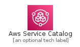
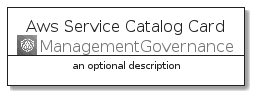
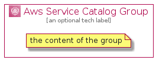

# AwsServiceCatalog


```text
aws-20210730/Architecture/ManagementGovernance/AwsServiceCatalog
```

```text
include('aws-20210730/Architecture/ManagementGovernance/AwsServiceCatalog')
```


| Illustration | AwsServiceCatalog | AwsServiceCatalogCard | AwsServiceCatalogGroup |
| :---: | :---: | :---: | :---: |
|  |  |  |  |


## AwsServiceCatalog

### Load remotely
```plantuml
@startuml
' configures the library
!global $LIB_BASE_LOCATION="https://github.com/tmorin/plantuml-libs/distribution"

' loads the library's bootstrap
!include $LIB_BASE_LOCATION/bootstrap.puml

' loads the package bootstrap
include('aws-20210730/bootstrap')

' loads the Item which embeds the element AwsServiceCatalog
include('aws-20210730/Architecture/ManagementGovernance/AwsServiceCatalog')

' renders the element
AwsServiceCatalog('AwsServiceCatalog', 'Aws Service Catalog', 'an optional tech label')
@enduml
```

### Load locally
```plantuml
@startuml
' configures the library
!global $INCLUSION_MODE="local"
!global $LIB_BASE_LOCATION="../../.."

' loads the library's bootstrap
!include $LIB_BASE_LOCATION/bootstrap.puml

' loads the package bootstrap
include('aws-20210730/bootstrap')

' loads the Item which embeds the element AwsServiceCatalog
include('aws-20210730/Architecture/ManagementGovernance/AwsServiceCatalog')

' renders the element
AwsServiceCatalog('AwsServiceCatalog', 'Aws Service Catalog', 'an optional tech label')
@enduml
```

## AwsServiceCatalogCard

### Load remotely
```plantuml
@startuml
' configures the library
!global $LIB_BASE_LOCATION="https://github.com/tmorin/plantuml-libs/distribution"

' loads the library's bootstrap
!include $LIB_BASE_LOCATION/bootstrap.puml

' loads the package bootstrap
include('aws-20210730/bootstrap')

' loads the Item which embeds the element AwsServiceCatalogCard
include('aws-20210730/Architecture/ManagementGovernance/AwsServiceCatalog')

' renders the element
AwsServiceCatalogCard('AwsServiceCatalogCard', 'Aws Service Catalog Card', 'an optional description')
@enduml
```

### Load locally
```plantuml
@startuml
' configures the library
!global $INCLUSION_MODE="local"
!global $LIB_BASE_LOCATION="../../.."

' loads the library's bootstrap
!include $LIB_BASE_LOCATION/bootstrap.puml

' loads the package bootstrap
include('aws-20210730/bootstrap')

' loads the Item which embeds the element AwsServiceCatalogCard
include('aws-20210730/Architecture/ManagementGovernance/AwsServiceCatalog')

' renders the element
AwsServiceCatalogCard('AwsServiceCatalogCard', 'Aws Service Catalog Card', 'an optional description')
@enduml
```

## AwsServiceCatalogGroup

### Load remotely
```plantuml
@startuml
' configures the library
!global $LIB_BASE_LOCATION="https://github.com/tmorin/plantuml-libs/distribution"

' loads the library's bootstrap
!include $LIB_BASE_LOCATION/bootstrap.puml

' loads the package bootstrap
include('aws-20210730/bootstrap')

' loads the Item which embeds the element AwsServiceCatalogGroup
include('aws-20210730/Architecture/ManagementGovernance/AwsServiceCatalog')

' renders the element
AwsServiceCatalogGroup('AwsServiceCatalogGroup', 'Aws Service Catalog Group', 'an optional tech label') {
    note as note
        the content of the group
    end note
}
@enduml
```

### Load locally
```plantuml
@startuml
' configures the library
!global $INCLUSION_MODE="local"
!global $LIB_BASE_LOCATION="../../.."

' loads the library's bootstrap
!include $LIB_BASE_LOCATION/bootstrap.puml

' loads the package bootstrap
include('aws-20210730/bootstrap')

' loads the Item which embeds the element AwsServiceCatalogGroup
include('aws-20210730/Architecture/ManagementGovernance/AwsServiceCatalog')

' renders the element
AwsServiceCatalogGroup('AwsServiceCatalogGroup', 'Aws Service Catalog Group', 'an optional tech label') {
    note as note
        the content of the group
    end note
}
@enduml
```

