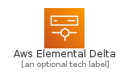
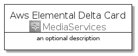
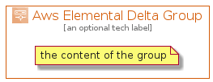

# AwsElementalDelta


```text
aws-20210730/Architecture/MediaServices/AwsElementalDelta
```

```text
include('aws-20210730/Architecture/MediaServices/AwsElementalDelta')
```


| Illustration | AwsElementalDelta | AwsElementalDeltaCard | AwsElementalDeltaGroup |
| :---: | :---: | :---: | :---: |
|  |  |  |  |


## AwsElementalDelta

### Load remotely
```plantuml
@startuml
' configures the library
!global $LIB_BASE_LOCATION="https://raw.githubusercontent.com/tmorin/plantuml-libs/master/distribution"

' loads the library's bootstrap
!include $LIB_BASE_LOCATION/bootstrap.puml

' loads the package bootstrap
include('aws-20210730/bootstrap')

' loads the Item which embeds the element AwsElementalDelta
include('aws-20210730/Architecture/MediaServices/AwsElementalDelta')

' renders the element
AwsElementalDelta('AwsElementalDelta', 'Aws Elemental Delta', 'an optional tech label')
@enduml
```

### Load locally
```plantuml
@startuml
' configures the library
!global $INCLUSION_MODE="local"
!global $LIB_BASE_LOCATION="../../.."

' loads the library's bootstrap
!include $LIB_BASE_LOCATION/bootstrap.puml

' loads the package bootstrap
include('aws-20210730/bootstrap')

' loads the Item which embeds the element AwsElementalDelta
include('aws-20210730/Architecture/MediaServices/AwsElementalDelta')

' renders the element
AwsElementalDelta('AwsElementalDelta', 'Aws Elemental Delta', 'an optional tech label')
@enduml
```

## AwsElementalDeltaCard

### Load remotely
```plantuml
@startuml
' configures the library
!global $LIB_BASE_LOCATION="https://raw.githubusercontent.com/tmorin/plantuml-libs/master/distribution"

' loads the library's bootstrap
!include $LIB_BASE_LOCATION/bootstrap.puml

' loads the package bootstrap
include('aws-20210730/bootstrap')

' loads the Item which embeds the element AwsElementalDeltaCard
include('aws-20210730/Architecture/MediaServices/AwsElementalDelta')

' renders the element
AwsElementalDeltaCard('AwsElementalDeltaCard', 'Aws Elemental Delta Card', 'an optional description')
@enduml
```

### Load locally
```plantuml
@startuml
' configures the library
!global $INCLUSION_MODE="local"
!global $LIB_BASE_LOCATION="../../.."

' loads the library's bootstrap
!include $LIB_BASE_LOCATION/bootstrap.puml

' loads the package bootstrap
include('aws-20210730/bootstrap')

' loads the Item which embeds the element AwsElementalDeltaCard
include('aws-20210730/Architecture/MediaServices/AwsElementalDelta')

' renders the element
AwsElementalDeltaCard('AwsElementalDeltaCard', 'Aws Elemental Delta Card', 'an optional description')
@enduml
```

## AwsElementalDeltaGroup

### Load remotely
```plantuml
@startuml
' configures the library
!global $LIB_BASE_LOCATION="https://raw.githubusercontent.com/tmorin/plantuml-libs/master/distribution"

' loads the library's bootstrap
!include $LIB_BASE_LOCATION/bootstrap.puml

' loads the package bootstrap
include('aws-20210730/bootstrap')

' loads the Item which embeds the element AwsElementalDeltaGroup
include('aws-20210730/Architecture/MediaServices/AwsElementalDelta')

' renders the element
AwsElementalDeltaGroup('AwsElementalDeltaGroup', 'Aws Elemental Delta Group', 'an optional tech label') {
    note as note
        the content of the group
    end note
}
@enduml
```

### Load locally
```plantuml
@startuml
' configures the library
!global $INCLUSION_MODE="local"
!global $LIB_BASE_LOCATION="../../.."

' loads the library's bootstrap
!include $LIB_BASE_LOCATION/bootstrap.puml

' loads the package bootstrap
include('aws-20210730/bootstrap')

' loads the Item which embeds the element AwsElementalDeltaGroup
include('aws-20210730/Architecture/MediaServices/AwsElementalDelta')

' renders the element
AwsElementalDeltaGroup('AwsElementalDeltaGroup', 'Aws Elemental Delta Group', 'an optional tech label') {
    note as note
        the content of the group
    end note
}
@enduml
```

