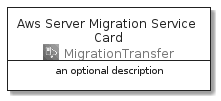

# AwsServerMigrationService


```text
aws-20210730/Architecture/MigrationTransfer/AwsServerMigrationService
```

```text
include('aws-20210730/Architecture/MigrationTransfer/AwsServerMigrationService')
```


| Illustration | AwsServerMigrationService | AwsServerMigrationServiceCard | AwsServerMigrationServiceGroup |
| :---: | :---: | :---: | :---: |
|  |  |  |  |


## AwsServerMigrationService

### Load remotely
```plantuml
@startuml
' configures the library
!global $LIB_BASE_LOCATION="https://github.com/tmorin/plantuml-libs/distribution"

' loads the library's bootstrap
!include $LIB_BASE_LOCATION/bootstrap.puml

' loads the package bootstrap
include('aws-20210730/bootstrap')

' loads the Item which embeds the element AwsServerMigrationService
include('aws-20210730/Architecture/MigrationTransfer/AwsServerMigrationService')

' renders the element
AwsServerMigrationService('AwsServerMigrationService', 'Aws Server Migration Service', 'an optional tech label')
@enduml
```

### Load locally
```plantuml
@startuml
' configures the library
!global $INCLUSION_MODE="local"
!global $LIB_BASE_LOCATION="../../.."

' loads the library's bootstrap
!include $LIB_BASE_LOCATION/bootstrap.puml

' loads the package bootstrap
include('aws-20210730/bootstrap')

' loads the Item which embeds the element AwsServerMigrationService
include('aws-20210730/Architecture/MigrationTransfer/AwsServerMigrationService')

' renders the element
AwsServerMigrationService('AwsServerMigrationService', 'Aws Server Migration Service', 'an optional tech label')
@enduml
```

## AwsServerMigrationServiceCard

### Load remotely
```plantuml
@startuml
' configures the library
!global $LIB_BASE_LOCATION="https://github.com/tmorin/plantuml-libs/distribution"

' loads the library's bootstrap
!include $LIB_BASE_LOCATION/bootstrap.puml

' loads the package bootstrap
include('aws-20210730/bootstrap')

' loads the Item which embeds the element AwsServerMigrationServiceCard
include('aws-20210730/Architecture/MigrationTransfer/AwsServerMigrationService')

' renders the element
AwsServerMigrationServiceCard('AwsServerMigrationServiceCard', 'Aws Server Migration Service Card', 'an optional description')
@enduml
```

### Load locally
```plantuml
@startuml
' configures the library
!global $INCLUSION_MODE="local"
!global $LIB_BASE_LOCATION="../../.."

' loads the library's bootstrap
!include $LIB_BASE_LOCATION/bootstrap.puml

' loads the package bootstrap
include('aws-20210730/bootstrap')

' loads the Item which embeds the element AwsServerMigrationServiceCard
include('aws-20210730/Architecture/MigrationTransfer/AwsServerMigrationService')

' renders the element
AwsServerMigrationServiceCard('AwsServerMigrationServiceCard', 'Aws Server Migration Service Card', 'an optional description')
@enduml
```

## AwsServerMigrationServiceGroup

### Load remotely
```plantuml
@startuml
' configures the library
!global $LIB_BASE_LOCATION="https://github.com/tmorin/plantuml-libs/distribution"

' loads the library's bootstrap
!include $LIB_BASE_LOCATION/bootstrap.puml

' loads the package bootstrap
include('aws-20210730/bootstrap')

' loads the Item which embeds the element AwsServerMigrationServiceGroup
include('aws-20210730/Architecture/MigrationTransfer/AwsServerMigrationService')

' renders the element
AwsServerMigrationServiceGroup('AwsServerMigrationServiceGroup', 'Aws Server Migration Service Group', 'an optional tech label') {
    note as note
        the content of the group
    end note
}
@enduml
```

### Load locally
```plantuml
@startuml
' configures the library
!global $INCLUSION_MODE="local"
!global $LIB_BASE_LOCATION="../../.."

' loads the library's bootstrap
!include $LIB_BASE_LOCATION/bootstrap.puml

' loads the package bootstrap
include('aws-20210730/bootstrap')

' loads the Item which embeds the element AwsServerMigrationServiceGroup
include('aws-20210730/Architecture/MigrationTransfer/AwsServerMigrationService')

' renders the element
AwsServerMigrationServiceGroup('AwsServerMigrationServiceGroup', 'Aws Server Migration Service Group', 'an optional tech label') {
    note as note
        the content of the group
    end note
}
@enduml
```

