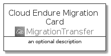
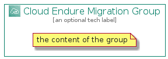

# CloudEndureMigration


```text
aws-20210730/Architecture/MigrationTransfer/CloudEndureMigration
```

```text
include('aws-20210730/Architecture/MigrationTransfer/CloudEndureMigration')
```


| Illustration | CloudEndureMigration | CloudEndureMigrationCard | CloudEndureMigrationGroup |
| :---: | :---: | :---: | :---: |
|  |  |  |  |


## CloudEndureMigration

### Load remotely
```plantuml
@startuml
' configures the library
!global $LIB_BASE_LOCATION="https://github.com/tmorin/plantuml-libs/distribution"

' loads the library's bootstrap
!include $LIB_BASE_LOCATION/bootstrap.puml

' loads the package bootstrap
include('aws-20210730/bootstrap')

' loads the Item which embeds the element CloudEndureMigration
include('aws-20210730/Architecture/MigrationTransfer/CloudEndureMigration')

' renders the element
CloudEndureMigration('CloudEndureMigration', 'Cloud Endure Migration', 'an optional tech label')
@enduml
```

### Load locally
```plantuml
@startuml
' configures the library
!global $INCLUSION_MODE="local"
!global $LIB_BASE_LOCATION="../../.."

' loads the library's bootstrap
!include $LIB_BASE_LOCATION/bootstrap.puml

' loads the package bootstrap
include('aws-20210730/bootstrap')

' loads the Item which embeds the element CloudEndureMigration
include('aws-20210730/Architecture/MigrationTransfer/CloudEndureMigration')

' renders the element
CloudEndureMigration('CloudEndureMigration', 'Cloud Endure Migration', 'an optional tech label')
@enduml
```

## CloudEndureMigrationCard

### Load remotely
```plantuml
@startuml
' configures the library
!global $LIB_BASE_LOCATION="https://github.com/tmorin/plantuml-libs/distribution"

' loads the library's bootstrap
!include $LIB_BASE_LOCATION/bootstrap.puml

' loads the package bootstrap
include('aws-20210730/bootstrap')

' loads the Item which embeds the element CloudEndureMigrationCard
include('aws-20210730/Architecture/MigrationTransfer/CloudEndureMigration')

' renders the element
CloudEndureMigrationCard('CloudEndureMigrationCard', 'Cloud Endure Migration Card', 'an optional description')
@enduml
```

### Load locally
```plantuml
@startuml
' configures the library
!global $INCLUSION_MODE="local"
!global $LIB_BASE_LOCATION="../../.."

' loads the library's bootstrap
!include $LIB_BASE_LOCATION/bootstrap.puml

' loads the package bootstrap
include('aws-20210730/bootstrap')

' loads the Item which embeds the element CloudEndureMigrationCard
include('aws-20210730/Architecture/MigrationTransfer/CloudEndureMigration')

' renders the element
CloudEndureMigrationCard('CloudEndureMigrationCard', 'Cloud Endure Migration Card', 'an optional description')
@enduml
```

## CloudEndureMigrationGroup

### Load remotely
```plantuml
@startuml
' configures the library
!global $LIB_BASE_LOCATION="https://github.com/tmorin/plantuml-libs/distribution"

' loads the library's bootstrap
!include $LIB_BASE_LOCATION/bootstrap.puml

' loads the package bootstrap
include('aws-20210730/bootstrap')

' loads the Item which embeds the element CloudEndureMigrationGroup
include('aws-20210730/Architecture/MigrationTransfer/CloudEndureMigration')

' renders the element
CloudEndureMigrationGroup('CloudEndureMigrationGroup', 'Cloud Endure Migration Group', 'an optional tech label') {
    note as note
        the content of the group
    end note
}
@enduml
```

### Load locally
```plantuml
@startuml
' configures the library
!global $INCLUSION_MODE="local"
!global $LIB_BASE_LOCATION="../../.."

' loads the library's bootstrap
!include $LIB_BASE_LOCATION/bootstrap.puml

' loads the package bootstrap
include('aws-20210730/bootstrap')

' loads the Item which embeds the element CloudEndureMigrationGroup
include('aws-20210730/Architecture/MigrationTransfer/CloudEndureMigration')

' renders the element
CloudEndureMigrationGroup('CloudEndureMigrationGroup', 'Cloud Endure Migration Group', 'an optional tech label') {
    note as note
        the content of the group
    end note
}
@enduml
```

