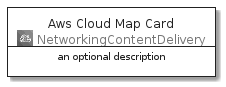
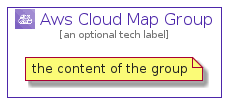

# AwsCloudMap


```text
aws-20210730/Architecture/NetworkingContentDelivery/AwsCloudMap
```

```text
include('aws-20210730/Architecture/NetworkingContentDelivery/AwsCloudMap')
```


| Illustration | AwsCloudMap | AwsCloudMapCard | AwsCloudMapGroup |
| :---: | :---: | :---: | :---: |
|  |  |  |  |


## AwsCloudMap

### Load remotely
```plantuml
@startuml
' configures the library
!global $LIB_BASE_LOCATION="https://github.com/tmorin/plantuml-libs/distribution"

' loads the library's bootstrap
!include $LIB_BASE_LOCATION/bootstrap.puml

' loads the package bootstrap
include('aws-20210730/bootstrap')

' loads the Item which embeds the element AwsCloudMap
include('aws-20210730/Architecture/NetworkingContentDelivery/AwsCloudMap')

' renders the element
AwsCloudMap('AwsCloudMap', 'Aws Cloud Map', 'an optional tech label')
@enduml
```

### Load locally
```plantuml
@startuml
' configures the library
!global $INCLUSION_MODE="local"
!global $LIB_BASE_LOCATION="../../.."

' loads the library's bootstrap
!include $LIB_BASE_LOCATION/bootstrap.puml

' loads the package bootstrap
include('aws-20210730/bootstrap')

' loads the Item which embeds the element AwsCloudMap
include('aws-20210730/Architecture/NetworkingContentDelivery/AwsCloudMap')

' renders the element
AwsCloudMap('AwsCloudMap', 'Aws Cloud Map', 'an optional tech label')
@enduml
```

## AwsCloudMapCard

### Load remotely
```plantuml
@startuml
' configures the library
!global $LIB_BASE_LOCATION="https://github.com/tmorin/plantuml-libs/distribution"

' loads the library's bootstrap
!include $LIB_BASE_LOCATION/bootstrap.puml

' loads the package bootstrap
include('aws-20210730/bootstrap')

' loads the Item which embeds the element AwsCloudMapCard
include('aws-20210730/Architecture/NetworkingContentDelivery/AwsCloudMap')

' renders the element
AwsCloudMapCard('AwsCloudMapCard', 'Aws Cloud Map Card', 'an optional description')
@enduml
```

### Load locally
```plantuml
@startuml
' configures the library
!global $INCLUSION_MODE="local"
!global $LIB_BASE_LOCATION="../../.."

' loads the library's bootstrap
!include $LIB_BASE_LOCATION/bootstrap.puml

' loads the package bootstrap
include('aws-20210730/bootstrap')

' loads the Item which embeds the element AwsCloudMapCard
include('aws-20210730/Architecture/NetworkingContentDelivery/AwsCloudMap')

' renders the element
AwsCloudMapCard('AwsCloudMapCard', 'Aws Cloud Map Card', 'an optional description')
@enduml
```

## AwsCloudMapGroup

### Load remotely
```plantuml
@startuml
' configures the library
!global $LIB_BASE_LOCATION="https://github.com/tmorin/plantuml-libs/distribution"

' loads the library's bootstrap
!include $LIB_BASE_LOCATION/bootstrap.puml

' loads the package bootstrap
include('aws-20210730/bootstrap')

' loads the Item which embeds the element AwsCloudMapGroup
include('aws-20210730/Architecture/NetworkingContentDelivery/AwsCloudMap')

' renders the element
AwsCloudMapGroup('AwsCloudMapGroup', 'Aws Cloud Map Group', 'an optional tech label') {
    note as note
        the content of the group
    end note
}
@enduml
```

### Load locally
```plantuml
@startuml
' configures the library
!global $INCLUSION_MODE="local"
!global $LIB_BASE_LOCATION="../../.."

' loads the library's bootstrap
!include $LIB_BASE_LOCATION/bootstrap.puml

' loads the package bootstrap
include('aws-20210730/bootstrap')

' loads the Item which embeds the element AwsCloudMapGroup
include('aws-20210730/Architecture/NetworkingContentDelivery/AwsCloudMap')

' renders the element
AwsCloudMapGroup('AwsCloudMapGroup', 'Aws Cloud Map Group', 'an optional tech label') {
    note as note
        the content of the group
    end note
}
@enduml
```

