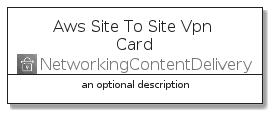
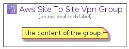

# AwsSiteToSiteVpn


```text
aws-20210730/Architecture/NetworkingContentDelivery/AwsSiteToSiteVpn
```

```text
include('aws-20210730/Architecture/NetworkingContentDelivery/AwsSiteToSiteVpn')
```


| Illustration | AwsSiteToSiteVpn | AwsSiteToSiteVpnCard | AwsSiteToSiteVpnGroup |
| :---: | :---: | :---: | :---: |
|  |  |  |  |


## AwsSiteToSiteVpn

### Load remotely
```plantuml
@startuml
' configures the library
!global $LIB_BASE_LOCATION="https://raw.githubusercontent.com/tmorin/plantuml-libs/master/distribution"

' loads the library's bootstrap
!include $LIB_BASE_LOCATION/bootstrap.puml

' loads the package bootstrap
include('aws-20210730/bootstrap')

' loads the Item which embeds the element AwsSiteToSiteVpn
include('aws-20210730/Architecture/NetworkingContentDelivery/AwsSiteToSiteVpn')

' renders the element
AwsSiteToSiteVpn('AwsSiteToSiteVpn', 'Aws Site To Site Vpn', 'an optional tech label')
@enduml
```

### Load locally
```plantuml
@startuml
' configures the library
!global $INCLUSION_MODE="local"
!global $LIB_BASE_LOCATION="../../.."

' loads the library's bootstrap
!include $LIB_BASE_LOCATION/bootstrap.puml

' loads the package bootstrap
include('aws-20210730/bootstrap')

' loads the Item which embeds the element AwsSiteToSiteVpn
include('aws-20210730/Architecture/NetworkingContentDelivery/AwsSiteToSiteVpn')

' renders the element
AwsSiteToSiteVpn('AwsSiteToSiteVpn', 'Aws Site To Site Vpn', 'an optional tech label')
@enduml
```

## AwsSiteToSiteVpnCard

### Load remotely
```plantuml
@startuml
' configures the library
!global $LIB_BASE_LOCATION="https://raw.githubusercontent.com/tmorin/plantuml-libs/master/distribution"

' loads the library's bootstrap
!include $LIB_BASE_LOCATION/bootstrap.puml

' loads the package bootstrap
include('aws-20210730/bootstrap')

' loads the Item which embeds the element AwsSiteToSiteVpnCard
include('aws-20210730/Architecture/NetworkingContentDelivery/AwsSiteToSiteVpn')

' renders the element
AwsSiteToSiteVpnCard('AwsSiteToSiteVpnCard', 'Aws Site To Site Vpn Card', 'an optional description')
@enduml
```

### Load locally
```plantuml
@startuml
' configures the library
!global $INCLUSION_MODE="local"
!global $LIB_BASE_LOCATION="../../.."

' loads the library's bootstrap
!include $LIB_BASE_LOCATION/bootstrap.puml

' loads the package bootstrap
include('aws-20210730/bootstrap')

' loads the Item which embeds the element AwsSiteToSiteVpnCard
include('aws-20210730/Architecture/NetworkingContentDelivery/AwsSiteToSiteVpn')

' renders the element
AwsSiteToSiteVpnCard('AwsSiteToSiteVpnCard', 'Aws Site To Site Vpn Card', 'an optional description')
@enduml
```

## AwsSiteToSiteVpnGroup

### Load remotely
```plantuml
@startuml
' configures the library
!global $LIB_BASE_LOCATION="https://raw.githubusercontent.com/tmorin/plantuml-libs/master/distribution"

' loads the library's bootstrap
!include $LIB_BASE_LOCATION/bootstrap.puml

' loads the package bootstrap
include('aws-20210730/bootstrap')

' loads the Item which embeds the element AwsSiteToSiteVpnGroup
include('aws-20210730/Architecture/NetworkingContentDelivery/AwsSiteToSiteVpn')

' renders the element
AwsSiteToSiteVpnGroup('AwsSiteToSiteVpnGroup', 'Aws Site To Site Vpn Group', 'an optional tech label') {
    note as note
        the content of the group
    end note
}
@enduml
```

### Load locally
```plantuml
@startuml
' configures the library
!global $INCLUSION_MODE="local"
!global $LIB_BASE_LOCATION="../../.."

' loads the library's bootstrap
!include $LIB_BASE_LOCATION/bootstrap.puml

' loads the package bootstrap
include('aws-20210730/bootstrap')

' loads the Item which embeds the element AwsSiteToSiteVpnGroup
include('aws-20210730/Architecture/NetworkingContentDelivery/AwsSiteToSiteVpn')

' renders the element
AwsSiteToSiteVpnGroup('AwsSiteToSiteVpnGroup', 'Aws Site To Site Vpn Group', 'an optional tech label') {
    note as note
        the content of the group
    end note
}
@enduml
```

