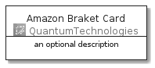
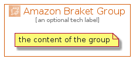

# AmazonBraket


```text
aws-20210730/Architecture/QuantumTechnologies/AmazonBraket
```

```text
include('aws-20210730/Architecture/QuantumTechnologies/AmazonBraket')
```


| Illustration | AmazonBraket | AmazonBraketCard | AmazonBraketGroup |
| :---: | :---: | :---: | :---: |
|  |  |  |  |


## AmazonBraket

### Load remotely
```plantuml
@startuml
' configures the library
!global $LIB_BASE_LOCATION="https://github.com/tmorin/plantuml-libs/distribution"

' loads the library's bootstrap
!include $LIB_BASE_LOCATION/bootstrap.puml

' loads the package bootstrap
include('aws-20210730/bootstrap')

' loads the Item which embeds the element AmazonBraket
include('aws-20210730/Architecture/QuantumTechnologies/AmazonBraket')

' renders the element
AmazonBraket('AmazonBraket', 'Amazon Braket', 'an optional tech label')
@enduml
```

### Load locally
```plantuml
@startuml
' configures the library
!global $INCLUSION_MODE="local"
!global $LIB_BASE_LOCATION="../../.."

' loads the library's bootstrap
!include $LIB_BASE_LOCATION/bootstrap.puml

' loads the package bootstrap
include('aws-20210730/bootstrap')

' loads the Item which embeds the element AmazonBraket
include('aws-20210730/Architecture/QuantumTechnologies/AmazonBraket')

' renders the element
AmazonBraket('AmazonBraket', 'Amazon Braket', 'an optional tech label')
@enduml
```

## AmazonBraketCard

### Load remotely
```plantuml
@startuml
' configures the library
!global $LIB_BASE_LOCATION="https://github.com/tmorin/plantuml-libs/distribution"

' loads the library's bootstrap
!include $LIB_BASE_LOCATION/bootstrap.puml

' loads the package bootstrap
include('aws-20210730/bootstrap')

' loads the Item which embeds the element AmazonBraketCard
include('aws-20210730/Architecture/QuantumTechnologies/AmazonBraket')

' renders the element
AmazonBraketCard('AmazonBraketCard', 'Amazon Braket Card', 'an optional description')
@enduml
```

### Load locally
```plantuml
@startuml
' configures the library
!global $INCLUSION_MODE="local"
!global $LIB_BASE_LOCATION="../../.."

' loads the library's bootstrap
!include $LIB_BASE_LOCATION/bootstrap.puml

' loads the package bootstrap
include('aws-20210730/bootstrap')

' loads the Item which embeds the element AmazonBraketCard
include('aws-20210730/Architecture/QuantumTechnologies/AmazonBraket')

' renders the element
AmazonBraketCard('AmazonBraketCard', 'Amazon Braket Card', 'an optional description')
@enduml
```

## AmazonBraketGroup

### Load remotely
```plantuml
@startuml
' configures the library
!global $LIB_BASE_LOCATION="https://github.com/tmorin/plantuml-libs/distribution"

' loads the library's bootstrap
!include $LIB_BASE_LOCATION/bootstrap.puml

' loads the package bootstrap
include('aws-20210730/bootstrap')

' loads the Item which embeds the element AmazonBraketGroup
include('aws-20210730/Architecture/QuantumTechnologies/AmazonBraket')

' renders the element
AmazonBraketGroup('AmazonBraketGroup', 'Amazon Braket Group', 'an optional tech label') {
    note as note
        the content of the group
    end note
}
@enduml
```

### Load locally
```plantuml
@startuml
' configures the library
!global $INCLUSION_MODE="local"
!global $LIB_BASE_LOCATION="../../.."

' loads the library's bootstrap
!include $LIB_BASE_LOCATION/bootstrap.puml

' loads the package bootstrap
include('aws-20210730/bootstrap')

' loads the Item which embeds the element AmazonBraketGroup
include('aws-20210730/Architecture/QuantumTechnologies/AmazonBraket')

' renders the element
AmazonBraketGroup('AmazonBraketGroup', 'Amazon Braket Group', 'an optional tech label') {
    note as note
        the content of the group
    end note
}
@enduml
```

