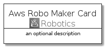
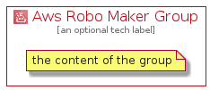

# AwsRoboMaker


```text
aws-20210730/Architecture/Robotics/AwsRoboMaker
```

```text
include('aws-20210730/Architecture/Robotics/AwsRoboMaker')
```


| Illustration | AwsRoboMaker | AwsRoboMakerCard | AwsRoboMakerGroup |
| :---: | :---: | :---: | :---: |
|  |  |  |  |


## AwsRoboMaker

### Load remotely
```plantuml
@startuml
' configures the library
!global $LIB_BASE_LOCATION="https://github.com/tmorin/plantuml-libs/distribution"

' loads the library's bootstrap
!include $LIB_BASE_LOCATION/bootstrap.puml

' loads the package bootstrap
include('aws-20210730/bootstrap')

' loads the Item which embeds the element AwsRoboMaker
include('aws-20210730/Architecture/Robotics/AwsRoboMaker')

' renders the element
AwsRoboMaker('AwsRoboMaker', 'Aws Robo Maker', 'an optional tech label')
@enduml
```

### Load locally
```plantuml
@startuml
' configures the library
!global $INCLUSION_MODE="local"
!global $LIB_BASE_LOCATION="../../.."

' loads the library's bootstrap
!include $LIB_BASE_LOCATION/bootstrap.puml

' loads the package bootstrap
include('aws-20210730/bootstrap')

' loads the Item which embeds the element AwsRoboMaker
include('aws-20210730/Architecture/Robotics/AwsRoboMaker')

' renders the element
AwsRoboMaker('AwsRoboMaker', 'Aws Robo Maker', 'an optional tech label')
@enduml
```

## AwsRoboMakerCard

### Load remotely
```plantuml
@startuml
' configures the library
!global $LIB_BASE_LOCATION="https://github.com/tmorin/plantuml-libs/distribution"

' loads the library's bootstrap
!include $LIB_BASE_LOCATION/bootstrap.puml

' loads the package bootstrap
include('aws-20210730/bootstrap')

' loads the Item which embeds the element AwsRoboMakerCard
include('aws-20210730/Architecture/Robotics/AwsRoboMaker')

' renders the element
AwsRoboMakerCard('AwsRoboMakerCard', 'Aws Robo Maker Card', 'an optional description')
@enduml
```

### Load locally
```plantuml
@startuml
' configures the library
!global $INCLUSION_MODE="local"
!global $LIB_BASE_LOCATION="../../.."

' loads the library's bootstrap
!include $LIB_BASE_LOCATION/bootstrap.puml

' loads the package bootstrap
include('aws-20210730/bootstrap')

' loads the Item which embeds the element AwsRoboMakerCard
include('aws-20210730/Architecture/Robotics/AwsRoboMaker')

' renders the element
AwsRoboMakerCard('AwsRoboMakerCard', 'Aws Robo Maker Card', 'an optional description')
@enduml
```

## AwsRoboMakerGroup

### Load remotely
```plantuml
@startuml
' configures the library
!global $LIB_BASE_LOCATION="https://github.com/tmorin/plantuml-libs/distribution"

' loads the library's bootstrap
!include $LIB_BASE_LOCATION/bootstrap.puml

' loads the package bootstrap
include('aws-20210730/bootstrap')

' loads the Item which embeds the element AwsRoboMakerGroup
include('aws-20210730/Architecture/Robotics/AwsRoboMaker')

' renders the element
AwsRoboMakerGroup('AwsRoboMakerGroup', 'Aws Robo Maker Group', 'an optional tech label') {
    note as note
        the content of the group
    end note
}
@enduml
```

### Load locally
```plantuml
@startuml
' configures the library
!global $INCLUSION_MODE="local"
!global $LIB_BASE_LOCATION="../../.."

' loads the library's bootstrap
!include $LIB_BASE_LOCATION/bootstrap.puml

' loads the package bootstrap
include('aws-20210730/bootstrap')

' loads the Item which embeds the element AwsRoboMakerGroup
include('aws-20210730/Architecture/Robotics/AwsRoboMaker')

' renders the element
AwsRoboMakerGroup('AwsRoboMakerGroup', 'Aws Robo Maker Group', 'an optional tech label') {
    note as note
        the content of the group
    end note
}
@enduml
```

