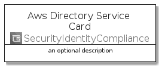
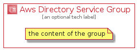

# AwsDirectoryService


```text
aws-20210730/Architecture/SecurityIdentityCompliance/AwsDirectoryService
```

```text
include('aws-20210730/Architecture/SecurityIdentityCompliance/AwsDirectoryService')
```


| Illustration | AwsDirectoryService | AwsDirectoryServiceCard | AwsDirectoryServiceGroup |
| :---: | :---: | :---: | :---: |
|  |  |  |  |


## AwsDirectoryService

### Load remotely
```plantuml
@startuml
' configures the library
!global $LIB_BASE_LOCATION="https://github.com/tmorin/plantuml-libs/distribution"

' loads the library's bootstrap
!include $LIB_BASE_LOCATION/bootstrap.puml

' loads the package bootstrap
include('aws-20210730/bootstrap')

' loads the Item which embeds the element AwsDirectoryService
include('aws-20210730/Architecture/SecurityIdentityCompliance/AwsDirectoryService')

' renders the element
AwsDirectoryService('AwsDirectoryService', 'Aws Directory Service', 'an optional tech label')
@enduml
```

### Load locally
```plantuml
@startuml
' configures the library
!global $INCLUSION_MODE="local"
!global $LIB_BASE_LOCATION="../../.."

' loads the library's bootstrap
!include $LIB_BASE_LOCATION/bootstrap.puml

' loads the package bootstrap
include('aws-20210730/bootstrap')

' loads the Item which embeds the element AwsDirectoryService
include('aws-20210730/Architecture/SecurityIdentityCompliance/AwsDirectoryService')

' renders the element
AwsDirectoryService('AwsDirectoryService', 'Aws Directory Service', 'an optional tech label')
@enduml
```

## AwsDirectoryServiceCard

### Load remotely
```plantuml
@startuml
' configures the library
!global $LIB_BASE_LOCATION="https://github.com/tmorin/plantuml-libs/distribution"

' loads the library's bootstrap
!include $LIB_BASE_LOCATION/bootstrap.puml

' loads the package bootstrap
include('aws-20210730/bootstrap')

' loads the Item which embeds the element AwsDirectoryServiceCard
include('aws-20210730/Architecture/SecurityIdentityCompliance/AwsDirectoryService')

' renders the element
AwsDirectoryServiceCard('AwsDirectoryServiceCard', 'Aws Directory Service Card', 'an optional description')
@enduml
```

### Load locally
```plantuml
@startuml
' configures the library
!global $INCLUSION_MODE="local"
!global $LIB_BASE_LOCATION="../../.."

' loads the library's bootstrap
!include $LIB_BASE_LOCATION/bootstrap.puml

' loads the package bootstrap
include('aws-20210730/bootstrap')

' loads the Item which embeds the element AwsDirectoryServiceCard
include('aws-20210730/Architecture/SecurityIdentityCompliance/AwsDirectoryService')

' renders the element
AwsDirectoryServiceCard('AwsDirectoryServiceCard', 'Aws Directory Service Card', 'an optional description')
@enduml
```

## AwsDirectoryServiceGroup

### Load remotely
```plantuml
@startuml
' configures the library
!global $LIB_BASE_LOCATION="https://github.com/tmorin/plantuml-libs/distribution"

' loads the library's bootstrap
!include $LIB_BASE_LOCATION/bootstrap.puml

' loads the package bootstrap
include('aws-20210730/bootstrap')

' loads the Item which embeds the element AwsDirectoryServiceGroup
include('aws-20210730/Architecture/SecurityIdentityCompliance/AwsDirectoryService')

' renders the element
AwsDirectoryServiceGroup('AwsDirectoryServiceGroup', 'Aws Directory Service Group', 'an optional tech label') {
    note as note
        the content of the group
    end note
}
@enduml
```

### Load locally
```plantuml
@startuml
' configures the library
!global $INCLUSION_MODE="local"
!global $LIB_BASE_LOCATION="../../.."

' loads the library's bootstrap
!include $LIB_BASE_LOCATION/bootstrap.puml

' loads the package bootstrap
include('aws-20210730/bootstrap')

' loads the Item which embeds the element AwsDirectoryServiceGroup
include('aws-20210730/Architecture/SecurityIdentityCompliance/AwsDirectoryService')

' renders the element
AwsDirectoryServiceGroup('AwsDirectoryServiceGroup', 'Aws Directory Service Group', 'an optional tech label') {
    note as note
        the content of the group
    end note
}
@enduml
```

