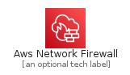
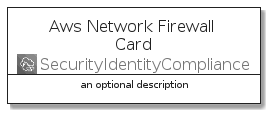
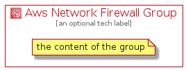

# AwsNetworkFirewall


```text
aws-20210730/Architecture/SecurityIdentityCompliance/AwsNetworkFirewall
```

```text
include('aws-20210730/Architecture/SecurityIdentityCompliance/AwsNetworkFirewall')
```


| Illustration | AwsNetworkFirewall | AwsNetworkFirewallCard | AwsNetworkFirewallGroup |
| :---: | :---: | :---: | :---: |
|  |  |  |  |


## AwsNetworkFirewall

### Load remotely
```plantuml
@startuml
' configures the library
!global $LIB_BASE_LOCATION="https://raw.githubusercontent.com/tmorin/plantuml-libs/master/distribution"

' loads the library's bootstrap
!include $LIB_BASE_LOCATION/bootstrap.puml

' loads the package bootstrap
include('aws-20210730/bootstrap')

' loads the Item which embeds the element AwsNetworkFirewall
include('aws-20210730/Architecture/SecurityIdentityCompliance/AwsNetworkFirewall')

' renders the element
AwsNetworkFirewall('AwsNetworkFirewall', 'Aws Network Firewall', 'an optional tech label')
@enduml
```

### Load locally
```plantuml
@startuml
' configures the library
!global $INCLUSION_MODE="local"
!global $LIB_BASE_LOCATION="../../.."

' loads the library's bootstrap
!include $LIB_BASE_LOCATION/bootstrap.puml

' loads the package bootstrap
include('aws-20210730/bootstrap')

' loads the Item which embeds the element AwsNetworkFirewall
include('aws-20210730/Architecture/SecurityIdentityCompliance/AwsNetworkFirewall')

' renders the element
AwsNetworkFirewall('AwsNetworkFirewall', 'Aws Network Firewall', 'an optional tech label')
@enduml
```

## AwsNetworkFirewallCard

### Load remotely
```plantuml
@startuml
' configures the library
!global $LIB_BASE_LOCATION="https://raw.githubusercontent.com/tmorin/plantuml-libs/master/distribution"

' loads the library's bootstrap
!include $LIB_BASE_LOCATION/bootstrap.puml

' loads the package bootstrap
include('aws-20210730/bootstrap')

' loads the Item which embeds the element AwsNetworkFirewallCard
include('aws-20210730/Architecture/SecurityIdentityCompliance/AwsNetworkFirewall')

' renders the element
AwsNetworkFirewallCard('AwsNetworkFirewallCard', 'Aws Network Firewall Card', 'an optional description')
@enduml
```

### Load locally
```plantuml
@startuml
' configures the library
!global $INCLUSION_MODE="local"
!global $LIB_BASE_LOCATION="../../.."

' loads the library's bootstrap
!include $LIB_BASE_LOCATION/bootstrap.puml

' loads the package bootstrap
include('aws-20210730/bootstrap')

' loads the Item which embeds the element AwsNetworkFirewallCard
include('aws-20210730/Architecture/SecurityIdentityCompliance/AwsNetworkFirewall')

' renders the element
AwsNetworkFirewallCard('AwsNetworkFirewallCard', 'Aws Network Firewall Card', 'an optional description')
@enduml
```

## AwsNetworkFirewallGroup

### Load remotely
```plantuml
@startuml
' configures the library
!global $LIB_BASE_LOCATION="https://raw.githubusercontent.com/tmorin/plantuml-libs/master/distribution"

' loads the library's bootstrap
!include $LIB_BASE_LOCATION/bootstrap.puml

' loads the package bootstrap
include('aws-20210730/bootstrap')

' loads the Item which embeds the element AwsNetworkFirewallGroup
include('aws-20210730/Architecture/SecurityIdentityCompliance/AwsNetworkFirewall')

' renders the element
AwsNetworkFirewallGroup('AwsNetworkFirewallGroup', 'Aws Network Firewall Group', 'an optional tech label') {
    note as note
        the content of the group
    end note
}
@enduml
```

### Load locally
```plantuml
@startuml
' configures the library
!global $INCLUSION_MODE="local"
!global $LIB_BASE_LOCATION="../../.."

' loads the library's bootstrap
!include $LIB_BASE_LOCATION/bootstrap.puml

' loads the package bootstrap
include('aws-20210730/bootstrap')

' loads the Item which embeds the element AwsNetworkFirewallGroup
include('aws-20210730/Architecture/SecurityIdentityCompliance/AwsNetworkFirewall')

' renders the element
AwsNetworkFirewallGroup('AwsNetworkFirewallGroup', 'Aws Network Firewall Group', 'an optional tech label') {
    note as note
        the content of the group
    end note
}
@enduml
```

