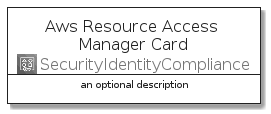
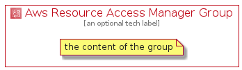

# AwsResourceAccessManager


```text
aws-20210730/Architecture/SecurityIdentityCompliance/AwsResourceAccessManager
```

```text
include('aws-20210730/Architecture/SecurityIdentityCompliance/AwsResourceAccessManager')
```


| Illustration | AwsResourceAccessManager | AwsResourceAccessManagerCard | AwsResourceAccessManagerGroup |
| :---: | :---: | :---: | :---: |
|  |  |  |  |


## AwsResourceAccessManager

### Load remotely
```plantuml
@startuml
' configures the library
!global $LIB_BASE_LOCATION="https://github.com/tmorin/plantuml-libs/distribution"

' loads the library's bootstrap
!include $LIB_BASE_LOCATION/bootstrap.puml

' loads the package bootstrap
include('aws-20210730/bootstrap')

' loads the Item which embeds the element AwsResourceAccessManager
include('aws-20210730/Architecture/SecurityIdentityCompliance/AwsResourceAccessManager')

' renders the element
AwsResourceAccessManager('AwsResourceAccessManager', 'Aws Resource Access Manager', 'an optional tech label')
@enduml
```

### Load locally
```plantuml
@startuml
' configures the library
!global $INCLUSION_MODE="local"
!global $LIB_BASE_LOCATION="../../.."

' loads the library's bootstrap
!include $LIB_BASE_LOCATION/bootstrap.puml

' loads the package bootstrap
include('aws-20210730/bootstrap')

' loads the Item which embeds the element AwsResourceAccessManager
include('aws-20210730/Architecture/SecurityIdentityCompliance/AwsResourceAccessManager')

' renders the element
AwsResourceAccessManager('AwsResourceAccessManager', 'Aws Resource Access Manager', 'an optional tech label')
@enduml
```

## AwsResourceAccessManagerCard

### Load remotely
```plantuml
@startuml
' configures the library
!global $LIB_BASE_LOCATION="https://github.com/tmorin/plantuml-libs/distribution"

' loads the library's bootstrap
!include $LIB_BASE_LOCATION/bootstrap.puml

' loads the package bootstrap
include('aws-20210730/bootstrap')

' loads the Item which embeds the element AwsResourceAccessManagerCard
include('aws-20210730/Architecture/SecurityIdentityCompliance/AwsResourceAccessManager')

' renders the element
AwsResourceAccessManagerCard('AwsResourceAccessManagerCard', 'Aws Resource Access Manager Card', 'an optional description')
@enduml
```

### Load locally
```plantuml
@startuml
' configures the library
!global $INCLUSION_MODE="local"
!global $LIB_BASE_LOCATION="../../.."

' loads the library's bootstrap
!include $LIB_BASE_LOCATION/bootstrap.puml

' loads the package bootstrap
include('aws-20210730/bootstrap')

' loads the Item which embeds the element AwsResourceAccessManagerCard
include('aws-20210730/Architecture/SecurityIdentityCompliance/AwsResourceAccessManager')

' renders the element
AwsResourceAccessManagerCard('AwsResourceAccessManagerCard', 'Aws Resource Access Manager Card', 'an optional description')
@enduml
```

## AwsResourceAccessManagerGroup

### Load remotely
```plantuml
@startuml
' configures the library
!global $LIB_BASE_LOCATION="https://github.com/tmorin/plantuml-libs/distribution"

' loads the library's bootstrap
!include $LIB_BASE_LOCATION/bootstrap.puml

' loads the package bootstrap
include('aws-20210730/bootstrap')

' loads the Item which embeds the element AwsResourceAccessManagerGroup
include('aws-20210730/Architecture/SecurityIdentityCompliance/AwsResourceAccessManager')

' renders the element
AwsResourceAccessManagerGroup('AwsResourceAccessManagerGroup', 'Aws Resource Access Manager Group', 'an optional tech label') {
    note as note
        the content of the group
    end note
}
@enduml
```

### Load locally
```plantuml
@startuml
' configures the library
!global $INCLUSION_MODE="local"
!global $LIB_BASE_LOCATION="../../.."

' loads the library's bootstrap
!include $LIB_BASE_LOCATION/bootstrap.puml

' loads the package bootstrap
include('aws-20210730/bootstrap')

' loads the Item which embeds the element AwsResourceAccessManagerGroup
include('aws-20210730/Architecture/SecurityIdentityCompliance/AwsResourceAccessManager')

' renders the element
AwsResourceAccessManagerGroup('AwsResourceAccessManagerGroup', 'Aws Resource Access Manager Group', 'an optional tech label') {
    note as note
        the content of the group
    end note
}
@enduml
```

