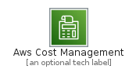
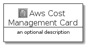
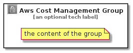

# AwsCostManagement


```text
aws-20210730/Category/AwsCostManagement
```

```text
include('aws-20210730/Category/AwsCostManagement')
```


| Illustration | AwsCostManagement | AwsCostManagementCard | AwsCostManagementGroup |
| :---: | :---: | :---: | :---: |
|  |  |  |  |


## AwsCostManagement

### Load remotely
```plantuml
@startuml
' configures the library
!global $LIB_BASE_LOCATION="https://raw.githubusercontent.com/tmorin/plantuml-libs/master/distribution"

' loads the library's bootstrap
!include $LIB_BASE_LOCATION/bootstrap.puml

' loads the package bootstrap
include('aws-20210730/bootstrap')

' loads the Item which embeds the element AwsCostManagement
include('aws-20210730/Category/AwsCostManagement')

' renders the element
AwsCostManagement('AwsCostManagement', 'Aws Cost Management', 'an optional tech label')
@enduml
```

### Load locally
```plantuml
@startuml
' configures the library
!global $INCLUSION_MODE="local"
!global $LIB_BASE_LOCATION="../.."

' loads the library's bootstrap
!include $LIB_BASE_LOCATION/bootstrap.puml

' loads the package bootstrap
include('aws-20210730/bootstrap')

' loads the Item which embeds the element AwsCostManagement
include('aws-20210730/Category/AwsCostManagement')

' renders the element
AwsCostManagement('AwsCostManagement', 'Aws Cost Management', 'an optional tech label')
@enduml
```

## AwsCostManagementCard

### Load remotely
```plantuml
@startuml
' configures the library
!global $LIB_BASE_LOCATION="https://raw.githubusercontent.com/tmorin/plantuml-libs/master/distribution"

' loads the library's bootstrap
!include $LIB_BASE_LOCATION/bootstrap.puml

' loads the package bootstrap
include('aws-20210730/bootstrap')

' loads the Item which embeds the element AwsCostManagementCard
include('aws-20210730/Category/AwsCostManagement')

' renders the element
AwsCostManagementCard('AwsCostManagementCard', 'Aws Cost Management Card', 'an optional description')
@enduml
```

### Load locally
```plantuml
@startuml
' configures the library
!global $INCLUSION_MODE="local"
!global $LIB_BASE_LOCATION="../.."

' loads the library's bootstrap
!include $LIB_BASE_LOCATION/bootstrap.puml

' loads the package bootstrap
include('aws-20210730/bootstrap')

' loads the Item which embeds the element AwsCostManagementCard
include('aws-20210730/Category/AwsCostManagement')

' renders the element
AwsCostManagementCard('AwsCostManagementCard', 'Aws Cost Management Card', 'an optional description')
@enduml
```

## AwsCostManagementGroup

### Load remotely
```plantuml
@startuml
' configures the library
!global $LIB_BASE_LOCATION="https://raw.githubusercontent.com/tmorin/plantuml-libs/master/distribution"

' loads the library's bootstrap
!include $LIB_BASE_LOCATION/bootstrap.puml

' loads the package bootstrap
include('aws-20210730/bootstrap')

' loads the Item which embeds the element AwsCostManagementGroup
include('aws-20210730/Category/AwsCostManagement')

' renders the element
AwsCostManagementGroup('AwsCostManagementGroup', 'Aws Cost Management Group', 'an optional tech label') {
    note as note
        the content of the group
    end note
}
@enduml
```

### Load locally
```plantuml
@startuml
' configures the library
!global $INCLUSION_MODE="local"
!global $LIB_BASE_LOCATION="../.."

' loads the library's bootstrap
!include $LIB_BASE_LOCATION/bootstrap.puml

' loads the package bootstrap
include('aws-20210730/bootstrap')

' loads the Item which embeds the element AwsCostManagementGroup
include('aws-20210730/Category/AwsCostManagement')

' renders the element
AwsCostManagementGroup('AwsCostManagementGroup', 'Aws Cost Management Group', 'an optional tech label') {
    note as note
        the content of the group
    end note
}
@enduml
```

