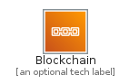
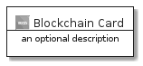
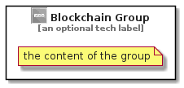

# Blockchain


```text
aws-20210730/Category/Blockchain
```

```text
include('aws-20210730/Category/Blockchain')
```


| Illustration | Blockchain | BlockchainCard | BlockchainGroup |
| :---: | :---: | :---: | :---: |
|  |  |  |  |


## Blockchain

### Load remotely
```plantuml
@startuml
' configures the library
!global $LIB_BASE_LOCATION="https://raw.githubusercontent.com/tmorin/plantuml-libs/master/distribution"

' loads the library's bootstrap
!include $LIB_BASE_LOCATION/bootstrap.puml

' loads the package bootstrap
include('aws-20210730/bootstrap')

' loads the Item which embeds the element Blockchain
include('aws-20210730/Category/Blockchain')

' renders the element
Blockchain('Blockchain', 'Blockchain', 'an optional tech label')
@enduml
```

### Load locally
```plantuml
@startuml
' configures the library
!global $INCLUSION_MODE="local"
!global $LIB_BASE_LOCATION="../.."

' loads the library's bootstrap
!include $LIB_BASE_LOCATION/bootstrap.puml

' loads the package bootstrap
include('aws-20210730/bootstrap')

' loads the Item which embeds the element Blockchain
include('aws-20210730/Category/Blockchain')

' renders the element
Blockchain('Blockchain', 'Blockchain', 'an optional tech label')
@enduml
```

## BlockchainCard

### Load remotely
```plantuml
@startuml
' configures the library
!global $LIB_BASE_LOCATION="https://raw.githubusercontent.com/tmorin/plantuml-libs/master/distribution"

' loads the library's bootstrap
!include $LIB_BASE_LOCATION/bootstrap.puml

' loads the package bootstrap
include('aws-20210730/bootstrap')

' loads the Item which embeds the element BlockchainCard
include('aws-20210730/Category/Blockchain')

' renders the element
BlockchainCard('BlockchainCard', 'Blockchain Card', 'an optional description')
@enduml
```

### Load locally
```plantuml
@startuml
' configures the library
!global $INCLUSION_MODE="local"
!global $LIB_BASE_LOCATION="../.."

' loads the library's bootstrap
!include $LIB_BASE_LOCATION/bootstrap.puml

' loads the package bootstrap
include('aws-20210730/bootstrap')

' loads the Item which embeds the element BlockchainCard
include('aws-20210730/Category/Blockchain')

' renders the element
BlockchainCard('BlockchainCard', 'Blockchain Card', 'an optional description')
@enduml
```

## BlockchainGroup

### Load remotely
```plantuml
@startuml
' configures the library
!global $LIB_BASE_LOCATION="https://raw.githubusercontent.com/tmorin/plantuml-libs/master/distribution"

' loads the library's bootstrap
!include $LIB_BASE_LOCATION/bootstrap.puml

' loads the package bootstrap
include('aws-20210730/bootstrap')

' loads the Item which embeds the element BlockchainGroup
include('aws-20210730/Category/Blockchain')

' renders the element
BlockchainGroup('BlockchainGroup', 'Blockchain Group', 'an optional tech label') {
    note as note
        the content of the group
    end note
}
@enduml
```

### Load locally
```plantuml
@startuml
' configures the library
!global $INCLUSION_MODE="local"
!global $LIB_BASE_LOCATION="../.."

' loads the library's bootstrap
!include $LIB_BASE_LOCATION/bootstrap.puml

' loads the package bootstrap
include('aws-20210730/bootstrap')

' loads the Item which embeds the element BlockchainGroup
include('aws-20210730/Category/Blockchain')

' renders the element
BlockchainGroup('BlockchainGroup', 'Blockchain Group', 'an optional tech label') {
    note as note
        the content of the group
    end note
}
@enduml
```

