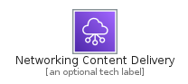
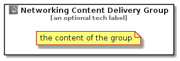

# NetworkingContentDelivery


```text
aws-20210730/Category/NetworkingContentDelivery
```

```text
include('aws-20210730/Category/NetworkingContentDelivery')
```


| Illustration | NetworkingContentDelivery | NetworkingContentDeliveryCard | NetworkingContentDeliveryGroup |
| :---: | :---: | :---: | :---: |
|  |  |  |  |


## NetworkingContentDelivery

### Load remotely
```plantuml
@startuml
' configures the library
!global $LIB_BASE_LOCATION="https://github.com/tmorin/plantuml-libs/distribution"

' loads the library's bootstrap
!include $LIB_BASE_LOCATION/bootstrap.puml

' loads the package bootstrap
include('aws-20210730/bootstrap')

' loads the Item which embeds the element NetworkingContentDelivery
include('aws-20210730/Category/NetworkingContentDelivery')

' renders the element
NetworkingContentDelivery('NetworkingContentDelivery', 'Networking Content Delivery', 'an optional tech label')
@enduml
```

### Load locally
```plantuml
@startuml
' configures the library
!global $INCLUSION_MODE="local"
!global $LIB_BASE_LOCATION="../.."

' loads the library's bootstrap
!include $LIB_BASE_LOCATION/bootstrap.puml

' loads the package bootstrap
include('aws-20210730/bootstrap')

' loads the Item which embeds the element NetworkingContentDelivery
include('aws-20210730/Category/NetworkingContentDelivery')

' renders the element
NetworkingContentDelivery('NetworkingContentDelivery', 'Networking Content Delivery', 'an optional tech label')
@enduml
```

## NetworkingContentDeliveryCard

### Load remotely
```plantuml
@startuml
' configures the library
!global $LIB_BASE_LOCATION="https://github.com/tmorin/plantuml-libs/distribution"

' loads the library's bootstrap
!include $LIB_BASE_LOCATION/bootstrap.puml

' loads the package bootstrap
include('aws-20210730/bootstrap')

' loads the Item which embeds the element NetworkingContentDeliveryCard
include('aws-20210730/Category/NetworkingContentDelivery')

' renders the element
NetworkingContentDeliveryCard('NetworkingContentDeliveryCard', 'Networking Content Delivery Card', 'an optional description')
@enduml
```

### Load locally
```plantuml
@startuml
' configures the library
!global $INCLUSION_MODE="local"
!global $LIB_BASE_LOCATION="../.."

' loads the library's bootstrap
!include $LIB_BASE_LOCATION/bootstrap.puml

' loads the package bootstrap
include('aws-20210730/bootstrap')

' loads the Item which embeds the element NetworkingContentDeliveryCard
include('aws-20210730/Category/NetworkingContentDelivery')

' renders the element
NetworkingContentDeliveryCard('NetworkingContentDeliveryCard', 'Networking Content Delivery Card', 'an optional description')
@enduml
```

## NetworkingContentDeliveryGroup

### Load remotely
```plantuml
@startuml
' configures the library
!global $LIB_BASE_LOCATION="https://github.com/tmorin/plantuml-libs/distribution"

' loads the library's bootstrap
!include $LIB_BASE_LOCATION/bootstrap.puml

' loads the package bootstrap
include('aws-20210730/bootstrap')

' loads the Item which embeds the element NetworkingContentDeliveryGroup
include('aws-20210730/Category/NetworkingContentDelivery')

' renders the element
NetworkingContentDeliveryGroup('NetworkingContentDeliveryGroup', 'Networking Content Delivery Group', 'an optional tech label') {
    note as note
        the content of the group
    end note
}
@enduml
```

### Load locally
```plantuml
@startuml
' configures the library
!global $INCLUSION_MODE="local"
!global $LIB_BASE_LOCATION="../.."

' loads the library's bootstrap
!include $LIB_BASE_LOCATION/bootstrap.puml

' loads the package bootstrap
include('aws-20210730/bootstrap')

' loads the Item which embeds the element NetworkingContentDeliveryGroup
include('aws-20210730/Category/NetworkingContentDelivery')

' renders the element
NetworkingContentDeliveryGroup('NetworkingContentDeliveryGroup', 'Networking Content Delivery Group', 'an optional tech label') {
    note as note
        the content of the group
    end note
}
@enduml
```

