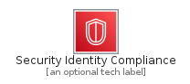
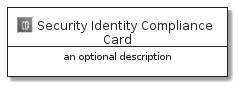
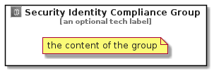

# SecurityIdentityCompliance


```text
aws-20210730/Category/SecurityIdentityCompliance
```

```text
include('aws-20210730/Category/SecurityIdentityCompliance')
```


| Illustration | SecurityIdentityCompliance | SecurityIdentityComplianceCard | SecurityIdentityComplianceGroup |
| :---: | :---: | :---: | :---: |
|  |  |  |  |


## SecurityIdentityCompliance

### Load remotely
```plantuml
@startuml
' configures the library
!global $LIB_BASE_LOCATION="https://github.com/tmorin/plantuml-libs/distribution"

' loads the library's bootstrap
!include $LIB_BASE_LOCATION/bootstrap.puml

' loads the package bootstrap
include('aws-20210730/bootstrap')

' loads the Item which embeds the element SecurityIdentityCompliance
include('aws-20210730/Category/SecurityIdentityCompliance')

' renders the element
SecurityIdentityCompliance('SecurityIdentityCompliance', 'Security Identity Compliance', 'an optional tech label')
@enduml
```

### Load locally
```plantuml
@startuml
' configures the library
!global $INCLUSION_MODE="local"
!global $LIB_BASE_LOCATION="../.."

' loads the library's bootstrap
!include $LIB_BASE_LOCATION/bootstrap.puml

' loads the package bootstrap
include('aws-20210730/bootstrap')

' loads the Item which embeds the element SecurityIdentityCompliance
include('aws-20210730/Category/SecurityIdentityCompliance')

' renders the element
SecurityIdentityCompliance('SecurityIdentityCompliance', 'Security Identity Compliance', 'an optional tech label')
@enduml
```

## SecurityIdentityComplianceCard

### Load remotely
```plantuml
@startuml
' configures the library
!global $LIB_BASE_LOCATION="https://github.com/tmorin/plantuml-libs/distribution"

' loads the library's bootstrap
!include $LIB_BASE_LOCATION/bootstrap.puml

' loads the package bootstrap
include('aws-20210730/bootstrap')

' loads the Item which embeds the element SecurityIdentityComplianceCard
include('aws-20210730/Category/SecurityIdentityCompliance')

' renders the element
SecurityIdentityComplianceCard('SecurityIdentityComplianceCard', 'Security Identity Compliance Card', 'an optional description')
@enduml
```

### Load locally
```plantuml
@startuml
' configures the library
!global $INCLUSION_MODE="local"
!global $LIB_BASE_LOCATION="../.."

' loads the library's bootstrap
!include $LIB_BASE_LOCATION/bootstrap.puml

' loads the package bootstrap
include('aws-20210730/bootstrap')

' loads the Item which embeds the element SecurityIdentityComplianceCard
include('aws-20210730/Category/SecurityIdentityCompliance')

' renders the element
SecurityIdentityComplianceCard('SecurityIdentityComplianceCard', 'Security Identity Compliance Card', 'an optional description')
@enduml
```

## SecurityIdentityComplianceGroup

### Load remotely
```plantuml
@startuml
' configures the library
!global $LIB_BASE_LOCATION="https://github.com/tmorin/plantuml-libs/distribution"

' loads the library's bootstrap
!include $LIB_BASE_LOCATION/bootstrap.puml

' loads the package bootstrap
include('aws-20210730/bootstrap')

' loads the Item which embeds the element SecurityIdentityComplianceGroup
include('aws-20210730/Category/SecurityIdentityCompliance')

' renders the element
SecurityIdentityComplianceGroup('SecurityIdentityComplianceGroup', 'Security Identity Compliance Group', 'an optional tech label') {
    note as note
        the content of the group
    end note
}
@enduml
```

### Load locally
```plantuml
@startuml
' configures the library
!global $INCLUSION_MODE="local"
!global $LIB_BASE_LOCATION="../.."

' loads the library's bootstrap
!include $LIB_BASE_LOCATION/bootstrap.puml

' loads the package bootstrap
include('aws-20210730/bootstrap')

' loads the Item which embeds the element SecurityIdentityComplianceGroup
include('aws-20210730/Category/SecurityIdentityCompliance')

' renders the element
SecurityIdentityComplianceGroup('SecurityIdentityComplianceGroup', 'Security Identity Compliance Group', 'an optional tech label') {
    note as note
        the content of the group
    end note
}
@enduml
```

