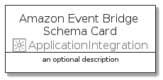

# AmazonEventBridgeSchema


```text
aws-20210730/Resource/ApplicationIntegration/AmazonEventBridgeSchema
```

```text
include('aws-20210730/Resource/ApplicationIntegration/AmazonEventBridgeSchema')
```


| Illustration | AmazonEventBridgeSchema | AmazonEventBridgeSchemaCard | AmazonEventBridgeSchemaGroup |
| :---: | :---: | :---: | :---: |
|  |  |  |  |


## AmazonEventBridgeSchema

### Load remotely
```plantuml
@startuml
' configures the library
!global $LIB_BASE_LOCATION="https://raw.githubusercontent.com/tmorin/plantuml-libs/master/distribution"

' loads the library's bootstrap
!include $LIB_BASE_LOCATION/bootstrap.puml

' loads the package bootstrap
include('aws-20210730/bootstrap')

' loads the Item which embeds the element AmazonEventBridgeSchema
include('aws-20210730/Resource/ApplicationIntegration/AmazonEventBridgeSchema')

' renders the element
AmazonEventBridgeSchema('AmazonEventBridgeSchema', 'Amazon Event Bridge Schema', 'an optional tech label')
@enduml
```

### Load locally
```plantuml
@startuml
' configures the library
!global $INCLUSION_MODE="local"
!global $LIB_BASE_LOCATION="../../.."

' loads the library's bootstrap
!include $LIB_BASE_LOCATION/bootstrap.puml

' loads the package bootstrap
include('aws-20210730/bootstrap')

' loads the Item which embeds the element AmazonEventBridgeSchema
include('aws-20210730/Resource/ApplicationIntegration/AmazonEventBridgeSchema')

' renders the element
AmazonEventBridgeSchema('AmazonEventBridgeSchema', 'Amazon Event Bridge Schema', 'an optional tech label')
@enduml
```

## AmazonEventBridgeSchemaCard

### Load remotely
```plantuml
@startuml
' configures the library
!global $LIB_BASE_LOCATION="https://raw.githubusercontent.com/tmorin/plantuml-libs/master/distribution"

' loads the library's bootstrap
!include $LIB_BASE_LOCATION/bootstrap.puml

' loads the package bootstrap
include('aws-20210730/bootstrap')

' loads the Item which embeds the element AmazonEventBridgeSchemaCard
include('aws-20210730/Resource/ApplicationIntegration/AmazonEventBridgeSchema')

' renders the element
AmazonEventBridgeSchemaCard('AmazonEventBridgeSchemaCard', 'Amazon Event Bridge Schema Card', 'an optional description')
@enduml
```

### Load locally
```plantuml
@startuml
' configures the library
!global $INCLUSION_MODE="local"
!global $LIB_BASE_LOCATION="../../.."

' loads the library's bootstrap
!include $LIB_BASE_LOCATION/bootstrap.puml

' loads the package bootstrap
include('aws-20210730/bootstrap')

' loads the Item which embeds the element AmazonEventBridgeSchemaCard
include('aws-20210730/Resource/ApplicationIntegration/AmazonEventBridgeSchema')

' renders the element
AmazonEventBridgeSchemaCard('AmazonEventBridgeSchemaCard', 'Amazon Event Bridge Schema Card', 'an optional description')
@enduml
```

## AmazonEventBridgeSchemaGroup

### Load remotely
```plantuml
@startuml
' configures the library
!global $LIB_BASE_LOCATION="https://raw.githubusercontent.com/tmorin/plantuml-libs/master/distribution"

' loads the library's bootstrap
!include $LIB_BASE_LOCATION/bootstrap.puml

' loads the package bootstrap
include('aws-20210730/bootstrap')

' loads the Item which embeds the element AmazonEventBridgeSchemaGroup
include('aws-20210730/Resource/ApplicationIntegration/AmazonEventBridgeSchema')

' renders the element
AmazonEventBridgeSchemaGroup('AmazonEventBridgeSchemaGroup', 'Amazon Event Bridge Schema Group', 'an optional tech label') {
    note as note
        the content of the group
    end note
}
@enduml
```

### Load locally
```plantuml
@startuml
' configures the library
!global $INCLUSION_MODE="local"
!global $LIB_BASE_LOCATION="../../.."

' loads the library's bootstrap
!include $LIB_BASE_LOCATION/bootstrap.puml

' loads the package bootstrap
include('aws-20210730/bootstrap')

' loads the Item which embeds the element AmazonEventBridgeSchemaGroup
include('aws-20210730/Resource/ApplicationIntegration/AmazonEventBridgeSchema')

' renders the element
AmazonEventBridgeSchemaGroup('AmazonEventBridgeSchemaGroup', 'Amazon Event Bridge Schema Group', 'an optional tech label') {
    note as note
        the content of the group
    end note
}
@enduml
```

