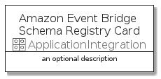

# AmazonEventBridgeSchemaRegistry


```text
aws-20210730/Resource/ApplicationIntegration/AmazonEventBridgeSchemaRegistry
```

```text
include('aws-20210730/Resource/ApplicationIntegration/AmazonEventBridgeSchemaRegistry')
```


| Illustration | AmazonEventBridgeSchemaRegistry | AmazonEventBridgeSchemaRegistryCard | AmazonEventBridgeSchemaRegistryGroup |
| :---: | :---: | :---: | :---: |
|  |  |  |  |


## AmazonEventBridgeSchemaRegistry

### Load remotely
```plantuml
@startuml
' configures the library
!global $LIB_BASE_LOCATION="https://github.com/tmorin/plantuml-libs/distribution"

' loads the library's bootstrap
!include $LIB_BASE_LOCATION/bootstrap.puml

' loads the package bootstrap
include('aws-20210730/bootstrap')

' loads the Item which embeds the element AmazonEventBridgeSchemaRegistry
include('aws-20210730/Resource/ApplicationIntegration/AmazonEventBridgeSchemaRegistry')

' renders the element
AmazonEventBridgeSchemaRegistry('AmazonEventBridgeSchemaRegistry', 'Amazon Event Bridge Schema Registry', 'an optional tech label')
@enduml
```

### Load locally
```plantuml
@startuml
' configures the library
!global $INCLUSION_MODE="local"
!global $LIB_BASE_LOCATION="../../.."

' loads the library's bootstrap
!include $LIB_BASE_LOCATION/bootstrap.puml

' loads the package bootstrap
include('aws-20210730/bootstrap')

' loads the Item which embeds the element AmazonEventBridgeSchemaRegistry
include('aws-20210730/Resource/ApplicationIntegration/AmazonEventBridgeSchemaRegistry')

' renders the element
AmazonEventBridgeSchemaRegistry('AmazonEventBridgeSchemaRegistry', 'Amazon Event Bridge Schema Registry', 'an optional tech label')
@enduml
```

## AmazonEventBridgeSchemaRegistryCard

### Load remotely
```plantuml
@startuml
' configures the library
!global $LIB_BASE_LOCATION="https://github.com/tmorin/plantuml-libs/distribution"

' loads the library's bootstrap
!include $LIB_BASE_LOCATION/bootstrap.puml

' loads the package bootstrap
include('aws-20210730/bootstrap')

' loads the Item which embeds the element AmazonEventBridgeSchemaRegistryCard
include('aws-20210730/Resource/ApplicationIntegration/AmazonEventBridgeSchemaRegistry')

' renders the element
AmazonEventBridgeSchemaRegistryCard('AmazonEventBridgeSchemaRegistryCard', 'Amazon Event Bridge Schema Registry Card', 'an optional description')
@enduml
```

### Load locally
```plantuml
@startuml
' configures the library
!global $INCLUSION_MODE="local"
!global $LIB_BASE_LOCATION="../../.."

' loads the library's bootstrap
!include $LIB_BASE_LOCATION/bootstrap.puml

' loads the package bootstrap
include('aws-20210730/bootstrap')

' loads the Item which embeds the element AmazonEventBridgeSchemaRegistryCard
include('aws-20210730/Resource/ApplicationIntegration/AmazonEventBridgeSchemaRegistry')

' renders the element
AmazonEventBridgeSchemaRegistryCard('AmazonEventBridgeSchemaRegistryCard', 'Amazon Event Bridge Schema Registry Card', 'an optional description')
@enduml
```

## AmazonEventBridgeSchemaRegistryGroup

### Load remotely
```plantuml
@startuml
' configures the library
!global $LIB_BASE_LOCATION="https://github.com/tmorin/plantuml-libs/distribution"

' loads the library's bootstrap
!include $LIB_BASE_LOCATION/bootstrap.puml

' loads the package bootstrap
include('aws-20210730/bootstrap')

' loads the Item which embeds the element AmazonEventBridgeSchemaRegistryGroup
include('aws-20210730/Resource/ApplicationIntegration/AmazonEventBridgeSchemaRegistry')

' renders the element
AmazonEventBridgeSchemaRegistryGroup('AmazonEventBridgeSchemaRegistryGroup', 'Amazon Event Bridge Schema Registry Group', 'an optional tech label') {
    note as note
        the content of the group
    end note
}
@enduml
```

### Load locally
```plantuml
@startuml
' configures the library
!global $INCLUSION_MODE="local"
!global $LIB_BASE_LOCATION="../../.."

' loads the library's bootstrap
!include $LIB_BASE_LOCATION/bootstrap.puml

' loads the package bootstrap
include('aws-20210730/bootstrap')

' loads the Item which embeds the element AmazonEventBridgeSchemaRegistryGroup
include('aws-20210730/Resource/ApplicationIntegration/AmazonEventBridgeSchemaRegistry')

' renders the element
AmazonEventBridgeSchemaRegistryGroup('AmazonEventBridgeSchemaRegistryGroup', 'Amazon Event Bridge Schema Registry Group', 'an optional tech label') {
    note as note
        the content of the group
    end note
}
@enduml
```

