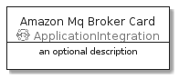
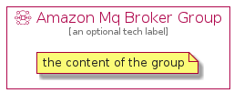

# AmazonMqBroker


```text
aws-20210730/Resource/ApplicationIntegration/AmazonMqBroker
```

```text
include('aws-20210730/Resource/ApplicationIntegration/AmazonMqBroker')
```


| Illustration | AmazonMqBroker | AmazonMqBrokerCard | AmazonMqBrokerGroup |
| :---: | :---: | :---: | :---: |
|  |  |  |  |


## AmazonMqBroker

### Load remotely
```plantuml
@startuml
' configures the library
!global $LIB_BASE_LOCATION="https://raw.githubusercontent.com/tmorin/plantuml-libs/master/distribution"

' loads the library's bootstrap
!include $LIB_BASE_LOCATION/bootstrap.puml

' loads the package bootstrap
include('aws-20210730/bootstrap')

' loads the Item which embeds the element AmazonMqBroker
include('aws-20210730/Resource/ApplicationIntegration/AmazonMqBroker')

' renders the element
AmazonMqBroker('AmazonMqBroker', 'Amazon Mq Broker', 'an optional tech label')
@enduml
```

### Load locally
```plantuml
@startuml
' configures the library
!global $INCLUSION_MODE="local"
!global $LIB_BASE_LOCATION="../../.."

' loads the library's bootstrap
!include $LIB_BASE_LOCATION/bootstrap.puml

' loads the package bootstrap
include('aws-20210730/bootstrap')

' loads the Item which embeds the element AmazonMqBroker
include('aws-20210730/Resource/ApplicationIntegration/AmazonMqBroker')

' renders the element
AmazonMqBroker('AmazonMqBroker', 'Amazon Mq Broker', 'an optional tech label')
@enduml
```

## AmazonMqBrokerCard

### Load remotely
```plantuml
@startuml
' configures the library
!global $LIB_BASE_LOCATION="https://raw.githubusercontent.com/tmorin/plantuml-libs/master/distribution"

' loads the library's bootstrap
!include $LIB_BASE_LOCATION/bootstrap.puml

' loads the package bootstrap
include('aws-20210730/bootstrap')

' loads the Item which embeds the element AmazonMqBrokerCard
include('aws-20210730/Resource/ApplicationIntegration/AmazonMqBroker')

' renders the element
AmazonMqBrokerCard('AmazonMqBrokerCard', 'Amazon Mq Broker Card', 'an optional description')
@enduml
```

### Load locally
```plantuml
@startuml
' configures the library
!global $INCLUSION_MODE="local"
!global $LIB_BASE_LOCATION="../../.."

' loads the library's bootstrap
!include $LIB_BASE_LOCATION/bootstrap.puml

' loads the package bootstrap
include('aws-20210730/bootstrap')

' loads the Item which embeds the element AmazonMqBrokerCard
include('aws-20210730/Resource/ApplicationIntegration/AmazonMqBroker')

' renders the element
AmazonMqBrokerCard('AmazonMqBrokerCard', 'Amazon Mq Broker Card', 'an optional description')
@enduml
```

## AmazonMqBrokerGroup

### Load remotely
```plantuml
@startuml
' configures the library
!global $LIB_BASE_LOCATION="https://raw.githubusercontent.com/tmorin/plantuml-libs/master/distribution"

' loads the library's bootstrap
!include $LIB_BASE_LOCATION/bootstrap.puml

' loads the package bootstrap
include('aws-20210730/bootstrap')

' loads the Item which embeds the element AmazonMqBrokerGroup
include('aws-20210730/Resource/ApplicationIntegration/AmazonMqBroker')

' renders the element
AmazonMqBrokerGroup('AmazonMqBrokerGroup', 'Amazon Mq Broker Group', 'an optional tech label') {
    note as note
        the content of the group
    end note
}
@enduml
```

### Load locally
```plantuml
@startuml
' configures the library
!global $INCLUSION_MODE="local"
!global $LIB_BASE_LOCATION="../../.."

' loads the library's bootstrap
!include $LIB_BASE_LOCATION/bootstrap.puml

' loads the package bootstrap
include('aws-20210730/bootstrap')

' loads the Item which embeds the element AmazonMqBrokerGroup
include('aws-20210730/Resource/ApplicationIntegration/AmazonMqBroker')

' renders the element
AmazonMqBrokerGroup('AmazonMqBrokerGroup', 'Amazon Mq Broker Group', 'an optional tech label') {
    note as note
        the content of the group
    end note
}
@enduml
```

