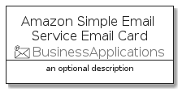

# AmazonSimpleEmailServiceEmail


```text
aws-20210730/Resource/BusinessApplications/AmazonSimpleEmailServiceEmail
```

```text
include('aws-20210730/Resource/BusinessApplications/AmazonSimpleEmailServiceEmail')
```


| Illustration | AmazonSimpleEmailServiceEmail | AmazonSimpleEmailServiceEmailCard | AmazonSimpleEmailServiceEmailGroup |
| :---: | :---: | :---: | :---: |
|  |  |  |  |


## AmazonSimpleEmailServiceEmail

### Load remotely
```plantuml
@startuml
' configures the library
!global $LIB_BASE_LOCATION="https://github.com/tmorin/plantuml-libs/distribution"

' loads the library's bootstrap
!include $LIB_BASE_LOCATION/bootstrap.puml

' loads the package bootstrap
include('aws-20210730/bootstrap')

' loads the Item which embeds the element AmazonSimpleEmailServiceEmail
include('aws-20210730/Resource/BusinessApplications/AmazonSimpleEmailServiceEmail')

' renders the element
AmazonSimpleEmailServiceEmail('AmazonSimpleEmailServiceEmail', 'Amazon Simple Email Service Email', 'an optional tech label')
@enduml
```

### Load locally
```plantuml
@startuml
' configures the library
!global $INCLUSION_MODE="local"
!global $LIB_BASE_LOCATION="../../.."

' loads the library's bootstrap
!include $LIB_BASE_LOCATION/bootstrap.puml

' loads the package bootstrap
include('aws-20210730/bootstrap')

' loads the Item which embeds the element AmazonSimpleEmailServiceEmail
include('aws-20210730/Resource/BusinessApplications/AmazonSimpleEmailServiceEmail')

' renders the element
AmazonSimpleEmailServiceEmail('AmazonSimpleEmailServiceEmail', 'Amazon Simple Email Service Email', 'an optional tech label')
@enduml
```

## AmazonSimpleEmailServiceEmailCard

### Load remotely
```plantuml
@startuml
' configures the library
!global $LIB_BASE_LOCATION="https://github.com/tmorin/plantuml-libs/distribution"

' loads the library's bootstrap
!include $LIB_BASE_LOCATION/bootstrap.puml

' loads the package bootstrap
include('aws-20210730/bootstrap')

' loads the Item which embeds the element AmazonSimpleEmailServiceEmailCard
include('aws-20210730/Resource/BusinessApplications/AmazonSimpleEmailServiceEmail')

' renders the element
AmazonSimpleEmailServiceEmailCard('AmazonSimpleEmailServiceEmailCard', 'Amazon Simple Email Service Email Card', 'an optional description')
@enduml
```

### Load locally
```plantuml
@startuml
' configures the library
!global $INCLUSION_MODE="local"
!global $LIB_BASE_LOCATION="../../.."

' loads the library's bootstrap
!include $LIB_BASE_LOCATION/bootstrap.puml

' loads the package bootstrap
include('aws-20210730/bootstrap')

' loads the Item which embeds the element AmazonSimpleEmailServiceEmailCard
include('aws-20210730/Resource/BusinessApplications/AmazonSimpleEmailServiceEmail')

' renders the element
AmazonSimpleEmailServiceEmailCard('AmazonSimpleEmailServiceEmailCard', 'Amazon Simple Email Service Email Card', 'an optional description')
@enduml
```

## AmazonSimpleEmailServiceEmailGroup

### Load remotely
```plantuml
@startuml
' configures the library
!global $LIB_BASE_LOCATION="https://github.com/tmorin/plantuml-libs/distribution"

' loads the library's bootstrap
!include $LIB_BASE_LOCATION/bootstrap.puml

' loads the package bootstrap
include('aws-20210730/bootstrap')

' loads the Item which embeds the element AmazonSimpleEmailServiceEmailGroup
include('aws-20210730/Resource/BusinessApplications/AmazonSimpleEmailServiceEmail')

' renders the element
AmazonSimpleEmailServiceEmailGroup('AmazonSimpleEmailServiceEmailGroup', 'Amazon Simple Email Service Email Group', 'an optional tech label') {
    note as note
        the content of the group
    end note
}
@enduml
```

### Load locally
```plantuml
@startuml
' configures the library
!global $INCLUSION_MODE="local"
!global $LIB_BASE_LOCATION="../../.."

' loads the library's bootstrap
!include $LIB_BASE_LOCATION/bootstrap.puml

' loads the package bootstrap
include('aws-20210730/bootstrap')

' loads the Item which embeds the element AmazonSimpleEmailServiceEmailGroup
include('aws-20210730/Resource/BusinessApplications/AmazonSimpleEmailServiceEmail')

' renders the element
AmazonSimpleEmailServiceEmailGroup('AmazonSimpleEmailServiceEmailGroup', 'Amazon Simple Email Service Email Group', 'an optional tech label') {
    note as note
        the content of the group
    end note
}
@enduml
```

