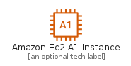
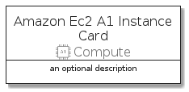
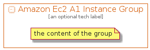

# AmazonEc2A1Instance


```text
aws-20210730/Resource/Compute/AmazonEc2A1Instance
```

```text
include('aws-20210730/Resource/Compute/AmazonEc2A1Instance')
```


| Illustration | AmazonEc2A1Instance | AmazonEc2A1InstanceCard | AmazonEc2A1InstanceGroup |
| :---: | :---: | :---: | :---: |
|  |  |  |  |


## AmazonEc2A1Instance

### Load remotely
```plantuml
@startuml
' configures the library
!global $LIB_BASE_LOCATION="https://github.com/tmorin/plantuml-libs/distribution"

' loads the library's bootstrap
!include $LIB_BASE_LOCATION/bootstrap.puml

' loads the package bootstrap
include('aws-20210730/bootstrap')

' loads the Item which embeds the element AmazonEc2A1Instance
include('aws-20210730/Resource/Compute/AmazonEc2A1Instance')

' renders the element
AmazonEc2A1Instance('AmazonEc2A1Instance', 'Amazon Ec2 A1 Instance', 'an optional tech label')
@enduml
```

### Load locally
```plantuml
@startuml
' configures the library
!global $INCLUSION_MODE="local"
!global $LIB_BASE_LOCATION="../../.."

' loads the library's bootstrap
!include $LIB_BASE_LOCATION/bootstrap.puml

' loads the package bootstrap
include('aws-20210730/bootstrap')

' loads the Item which embeds the element AmazonEc2A1Instance
include('aws-20210730/Resource/Compute/AmazonEc2A1Instance')

' renders the element
AmazonEc2A1Instance('AmazonEc2A1Instance', 'Amazon Ec2 A1 Instance', 'an optional tech label')
@enduml
```

## AmazonEc2A1InstanceCard

### Load remotely
```plantuml
@startuml
' configures the library
!global $LIB_BASE_LOCATION="https://github.com/tmorin/plantuml-libs/distribution"

' loads the library's bootstrap
!include $LIB_BASE_LOCATION/bootstrap.puml

' loads the package bootstrap
include('aws-20210730/bootstrap')

' loads the Item which embeds the element AmazonEc2A1InstanceCard
include('aws-20210730/Resource/Compute/AmazonEc2A1Instance')

' renders the element
AmazonEc2A1InstanceCard('AmazonEc2A1InstanceCard', 'Amazon Ec2 A1 Instance Card', 'an optional description')
@enduml
```

### Load locally
```plantuml
@startuml
' configures the library
!global $INCLUSION_MODE="local"
!global $LIB_BASE_LOCATION="../../.."

' loads the library's bootstrap
!include $LIB_BASE_LOCATION/bootstrap.puml

' loads the package bootstrap
include('aws-20210730/bootstrap')

' loads the Item which embeds the element AmazonEc2A1InstanceCard
include('aws-20210730/Resource/Compute/AmazonEc2A1Instance')

' renders the element
AmazonEc2A1InstanceCard('AmazonEc2A1InstanceCard', 'Amazon Ec2 A1 Instance Card', 'an optional description')
@enduml
```

## AmazonEc2A1InstanceGroup

### Load remotely
```plantuml
@startuml
' configures the library
!global $LIB_BASE_LOCATION="https://github.com/tmorin/plantuml-libs/distribution"

' loads the library's bootstrap
!include $LIB_BASE_LOCATION/bootstrap.puml

' loads the package bootstrap
include('aws-20210730/bootstrap')

' loads the Item which embeds the element AmazonEc2A1InstanceGroup
include('aws-20210730/Resource/Compute/AmazonEc2A1Instance')

' renders the element
AmazonEc2A1InstanceGroup('AmazonEc2A1InstanceGroup', 'Amazon Ec2 A1 Instance Group', 'an optional tech label') {
    note as note
        the content of the group
    end note
}
@enduml
```

### Load locally
```plantuml
@startuml
' configures the library
!global $INCLUSION_MODE="local"
!global $LIB_BASE_LOCATION="../../.."

' loads the library's bootstrap
!include $LIB_BASE_LOCATION/bootstrap.puml

' loads the package bootstrap
include('aws-20210730/bootstrap')

' loads the Item which embeds the element AmazonEc2A1InstanceGroup
include('aws-20210730/Resource/Compute/AmazonEc2A1Instance')

' renders the element
AmazonEc2A1InstanceGroup('AmazonEc2A1InstanceGroup', 'Amazon Ec2 A1 Instance Group', 'an optional tech label') {
    note as note
        the content of the group
    end note
}
@enduml
```

