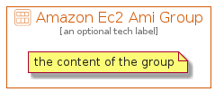

# AmazonEc2Ami


```text
aws-20210730/Resource/Compute/AmazonEc2Ami
```

```text
include('aws-20210730/Resource/Compute/AmazonEc2Ami')
```


| Illustration | AmazonEc2Ami | AmazonEc2AmiCard | AmazonEc2AmiGroup |
| :---: | :---: | :---: | :---: |
|  |  |  |  |


## AmazonEc2Ami

### Load remotely
```plantuml
@startuml
' configures the library
!global $LIB_BASE_LOCATION="https://github.com/tmorin/plantuml-libs/distribution"

' loads the library's bootstrap
!include $LIB_BASE_LOCATION/bootstrap.puml

' loads the package bootstrap
include('aws-20210730/bootstrap')

' loads the Item which embeds the element AmazonEc2Ami
include('aws-20210730/Resource/Compute/AmazonEc2Ami')

' renders the element
AmazonEc2Ami('AmazonEc2Ami', 'Amazon Ec2 Ami', 'an optional tech label')
@enduml
```

### Load locally
```plantuml
@startuml
' configures the library
!global $INCLUSION_MODE="local"
!global $LIB_BASE_LOCATION="../../.."

' loads the library's bootstrap
!include $LIB_BASE_LOCATION/bootstrap.puml

' loads the package bootstrap
include('aws-20210730/bootstrap')

' loads the Item which embeds the element AmazonEc2Ami
include('aws-20210730/Resource/Compute/AmazonEc2Ami')

' renders the element
AmazonEc2Ami('AmazonEc2Ami', 'Amazon Ec2 Ami', 'an optional tech label')
@enduml
```

## AmazonEc2AmiCard

### Load remotely
```plantuml
@startuml
' configures the library
!global $LIB_BASE_LOCATION="https://github.com/tmorin/plantuml-libs/distribution"

' loads the library's bootstrap
!include $LIB_BASE_LOCATION/bootstrap.puml

' loads the package bootstrap
include('aws-20210730/bootstrap')

' loads the Item which embeds the element AmazonEc2AmiCard
include('aws-20210730/Resource/Compute/AmazonEc2Ami')

' renders the element
AmazonEc2AmiCard('AmazonEc2AmiCard', 'Amazon Ec2 Ami Card', 'an optional description')
@enduml
```

### Load locally
```plantuml
@startuml
' configures the library
!global $INCLUSION_MODE="local"
!global $LIB_BASE_LOCATION="../../.."

' loads the library's bootstrap
!include $LIB_BASE_LOCATION/bootstrap.puml

' loads the package bootstrap
include('aws-20210730/bootstrap')

' loads the Item which embeds the element AmazonEc2AmiCard
include('aws-20210730/Resource/Compute/AmazonEc2Ami')

' renders the element
AmazonEc2AmiCard('AmazonEc2AmiCard', 'Amazon Ec2 Ami Card', 'an optional description')
@enduml
```

## AmazonEc2AmiGroup

### Load remotely
```plantuml
@startuml
' configures the library
!global $LIB_BASE_LOCATION="https://github.com/tmorin/plantuml-libs/distribution"

' loads the library's bootstrap
!include $LIB_BASE_LOCATION/bootstrap.puml

' loads the package bootstrap
include('aws-20210730/bootstrap')

' loads the Item which embeds the element AmazonEc2AmiGroup
include('aws-20210730/Resource/Compute/AmazonEc2Ami')

' renders the element
AmazonEc2AmiGroup('AmazonEc2AmiGroup', 'Amazon Ec2 Ami Group', 'an optional tech label') {
    note as note
        the content of the group
    end note
}
@enduml
```

### Load locally
```plantuml
@startuml
' configures the library
!global $INCLUSION_MODE="local"
!global $LIB_BASE_LOCATION="../../.."

' loads the library's bootstrap
!include $LIB_BASE_LOCATION/bootstrap.puml

' loads the package bootstrap
include('aws-20210730/bootstrap')

' loads the Item which embeds the element AmazonEc2AmiGroup
include('aws-20210730/Resource/Compute/AmazonEc2Ami')

' renders the element
AmazonEc2AmiGroup('AmazonEc2AmiGroup', 'Amazon Ec2 Ami Group', 'an optional tech label') {
    note as note
        the content of the group
    end note
}
@enduml
```

